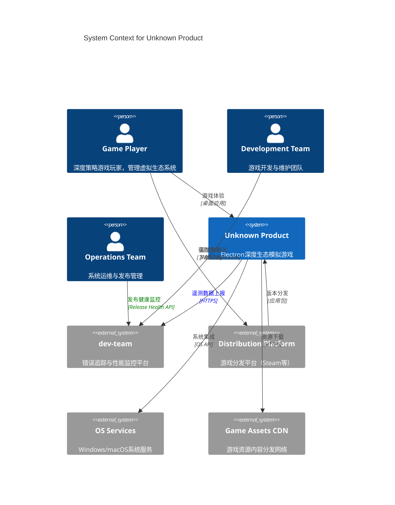
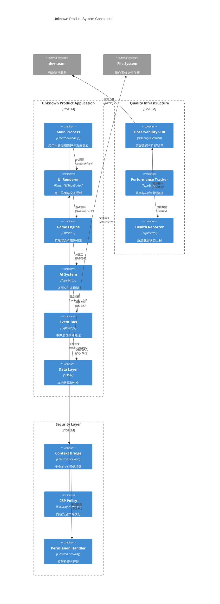

<!--
THIS IS THE V2 SKELETON "BASE" VERSION.
All domain-specific terms replaced with ${DOMAIN_*} placeholders.
Stable anchors preserved for cross-references.
-->

# 01 约束与目标（v2 骨架）- arc42 §1 对齐版本

> **目的**: 提供系统约束与质量目标的结构化定义，建立 **SLO → 质量门禁** 的可执行映射，作为后续章节的权威锚点。

> **v2 改进**: 对齐 arc42 §1 结构，强化可追踪性矩阵，整合 Sentry Release Health 门禁体系。

---

## 1.1 背景与范围（Requirements Background）

<!-- sec:1.1 -->

### 系统定位

- **产品类型**: 深度生态模拟游戏 - 玩家作为 ${DOMAIN_GUILD} ${DOMAIN_LEADER} 管理完整虚拟生态系统
- **技术栈核心**: Electron + React 19 + Phaser 3 + Vite + TypeScript + Tailwind CSS v4
- **平台约束**: Windows（主要）、macOS（次要），桌面端发行

### 核心边界

**包含范围（In-Scope）**:

- 完整的 ${DOMAIN_GUILD} 管理模拟系统
- 多层AI生态（${DOMAIN_MEMBER}AI + NPC${DOMAIN_GUILD}AI + 环境AI）
- 事件池系统（200+ 基础事件）
- 本地数据持久化（SQLite）

**排除范围（Out-of-Scope）**:

- 多人在线功能
- 实时网络同步
- 服务器端基础设施

### 目标用户群体

- **主要用户**: MMO资深玩家（25-40岁，具备${DOMAIN_GUILD}管理经验）
- **次要用户**: 深度策略游戏爱好者（Football Manager、Crusader Kings 玩家）

---

## 0.1 系统上下文架构（C4 Context）



## 0.2 系统容器架构（C4 Container）



## 1.2 质量目标（TOP 3-5 NFR 优先级）

#### 质量树（概览）

- 可靠性
  - 崩溃率（Crash-Free）
  - 错误密度
- 性能效率
  - 帧率（FPS）
  - 事件处理 TP95
  - 关键交互 TP95
- 可观测性
  - 覆盖率（错误/日志/Sentry 采样）
- 安全性
  - Electron 基线（Node/Context/Sandbox/CSP/Policy）

<!-- sec:1.2 -->

> 仅保留 **TOP 3–5** 质量目标，并用可衡量的 SLO 表达（TP95/TP99、阈值与观测来源）。

| 编号  | 质量目标         | 指标（Metric）      | 目标（SLO）              | 采集与度量              | 适用范围    |
| ----- | ---------------- | ------------------- | ------------------------ | ----------------------- | ----------- |
| NFR-1 | **可靠性**       | Crash-Free Sessions | `>= 99.5%`（滚动24h）    | Sentry Release Health   | 全局        |
| NFR-2 | **性能效率**     | 帧率                | 60 FPS（≈ 16.7ms/frame） | 内置性能计与自定义埋点  | 游戏循环    |
| NFR-3 | **事件处理时延** | TP95                | `<= 50ms`                | 自定义事件总线计量      | 事件处理    |
| NFR-4 | **关键交互时延** | TP95                | `<= 100ms`               | Playwright E2E + 自埋点 | UI 关键操作 |
| NFR-5 | **可观测性**     | 错误上报覆盖率      | `>= 95%`（关键路径）     | Sentry/日志             | 全局        |

**说明**

- 这些 SLO 会在 §1.4 放量门禁中作为 **CI 门禁** 条件。
- 完整质量需求树与次要场景参见 arc42 §10（在本项目的 §10 章节）。

### 1.2.a 与 ISO/IEC 25010 的映射

> 将我们的 NFR 映射到 ISO/IEC 25010 质量特性，便于后续审计与跨项目复用。

| NFR                | ISO/IEC 25010 质量特性           | 子特性（示例）                          |
| ------------------ | -------------------------------- | --------------------------------------- |
| NFR-1 可靠性       | Reliability                      | Maturity, Availability, Fault tolerance |
| NFR-2 性能效率     | Performance efficiency           | Time behavior, Resource utilization     |
| NFR-3 事件处理时延 | Performance efficiency           | Time behavior                           |
| NFR-4 关键交互时延 | Performance efficiency/Usability | Time behavior/Operability               |
| NFR-5 可观测性     | Maintainability/Quality in use   | Modularity/Effectiveness                |

### 1.2.b 质量场景（QAS，示例）

> 用 _刺激–环境–响应–度量_ 的格式简述（详稿请放 §10）。

- **QAS-1 可靠性**：当“发布 vX”后 24h 内，在**正式环境**，系统 **Crash-Free Sessions ≥ 99.5%**（Sentry Release Health 度量）。
- **QAS-2 事件处理**：当**任意事件**进入事件总线，在**常规负载**下，**TP95 ≤ 50ms**（自研埋点 + 03 章仪表度量）。
- **QAS-3 关键交互**：当用户在**对局界面**执行“开始游戏”，在**常规设备**上，**TP95 ≤ 100ms**（E2E + 埋点）。

## 1.3 业务目标 ↔ PRD 映射框架

<!-- sec:1.3 -->

### 映射规则

- **业务目标** 必须可追溯到具体 PRD 章节
- **质量属性** 必须关联到可测量的 SLO 指标
- **架构决策** 必须引用相应的 ADR 记录

### 核心业务目标框架（占位符模式）

```yaml
business_goals:
  strategic_depth:
    description: '媲美 Football Manager 的策略深度体验'
    prd_mapping: ['${PRD_CHUNK_001}', '${PRD_CHUNK_003}']
    quality_attributes: ['usability', 'maintainability']

  ecosystem_simulation:
    description: '多主体 AI 生态模拟创新'
    prd_mapping: ['${PRD_CHUNK_002}', '${PRD_CHUNK_004}']
    quality_attributes: ['performance', 'reliability']

  long_term_playability:
    description: '复杂 AI 互动提供持续新鲜体验'
    prd_mapping: ['${PRD_CHUNK_005}', '${PRD_CHUNK_006}']
    quality_attributes: ['maintainability', 'usability']
```

### PRD 对齐验证机制

- **前向追踪**: 每个业务目标 → PRD 需求 → 架构组件
- **后向追踪**: 每个架构决策 → 业务价值 → 用户故事
- **影响分析**: 需求变更 → 受影响组件 → 测试范围

---

## 1.4 放量门禁（SLO/Release Health）

<!-- sec:1.4 -->

### Release Health 门禁与阈值（ENV 可配）

| 变量                         | 默认值  | 含义                                     |
| ---------------------------- | ------- | ---------------------------------------- |
| `RH_WINDOW_HOURS`            | `24`    | 统计窗口（小时）                         |
| `RH_MIN_ADOPTION`            | `0.05`  | 最小放量占比，用于计算 crash-free 可信度 |
| `RH_CRASH_FREE_SESSIONS_MIN` | `0.995` | Crash-Free Sessions 下限                 |
| `RH_CRASH_FREE_USERS_MIN`    | `0.995` | Crash-Free Users 下限                    |
| `RH_NO_REGRESSION`           | `true`  | 相比上一 release 不允许回退              |

### CI 阶段脚本（占位）

```bash
node scripts/release-health-gate.js   --window %RH_WINDOW_HOURS%   --adoption %RH_MIN_ADOPTION%   --min-cfs %RH_CRASH_FREE_SESSIONS_MIN%   --min-cfu %RH_CRASH_FREE_USERS_MIN%   --no-regression %RH_NO_REGRESSION%
```

> 数据来源：Sentry Release Health API；若无足够样本量（adoption 过低），则推迟放量。

### 错误预算（Error Budget）与策略（Policy）

- **错误预算** = 1 − SLO。例如 SLO=99.5% ⇒ 可容忍错误 0.5%。
- **Burn Rate 监控**：在 §03/§07 报警中监控预算燃尽速度；当短窗/长窗同时超阈，即触发高优先级告警。
- **策略示例**：
  - **耗尽/超速**：冻结新功能发布，转入缺陷修复（P1）；恢复到预算内并连续 7 天稳定后解冻。
  - **接近下限**：进入“黄色”状态，放量≤ X%；必要时拉长观察窗。
  - **健康**：按计划推进，允许正常放量。

> 说明：具体阈值与窗口在 §07 门禁与 §03 报警模板中落地，且需干系人（PM/Dev/Ops）共同批准。

## 1.5 硬约束（含 Electron 安全基线）

<!-- sec:1.5 -->

### Electron 安全基线（强制）

- `nodeIntegration=false`、`contextIsolation=true`、`sandbox=true`
- 严格 `Content-Security-Policy`（生产通过**响应头**注入；开发可 `meta` 兜底）
- 默认 **Permissions-Policy** 拒绝高危能力（例如 `geolocation=(), camera=(), microphone=()`）
- `Cross-Origin-Opener-Policy: same-origin`；`Cross-Origin-Embedder-Policy: require-corp`（按特性开关）
- IPC **白名单 + 双处理器**：`setPermissionCheckHandler` + `setPermissionRequestHandler`

### 技术栈与版本约束

- Electron/Node/Chromium 主版本下限由 §7 质量门禁脚本校验
- 前端栈：Electron + React 18 + Vite + TypeScript + Tailwind CSS + Phaser 3

## 1.6 干系人（Stakeholders）

<!-- sec:1.6 -->

### RACI（架构与放量门禁）

| 事项                    | R               | A          | C         | I    |
| ----------------------- | --------------- | ---------- | --------- | ---- |
| ADR 变更/新增           | 架构负责人      | 产品负责人 | 开发/测试 | 全体 |
| Release Health 放量决策 | 运维/发布负责人 | 产品负责人 | 架构/QA   | 全体 |
| 安全基线变更            | 架构负责人      | 产品负责人 | 安全/开发 | 全体 |
| 性能 SLO 变更           | 架构负责人      | 产品负责人 | 开发/QA   | 全体 |

### RACI（SLO/错误预算治理）

| 事项             | R         | A          | C       | I    |
| ---------------- | --------- | ---------- | ------- | ---- |
| SLO 设定/修订    | 架构/后端 | 产品负责人 | SRE/QA  | 全体 |
| 错误预算策略审批 | 架构/运维 | 产品负责人 | 安全/QA | 全体 |
| 放量节奏与冻结   | 运维/发布 | 产品负责人 | 架构/QA | 全体 |

## 1.7 风险与假设（Risks & Assumptions）

<!-- sec:1.7 -->

### 风险（示例）

| 风险ID | 描述                                               | 影响 | 概率 | 缓解/应对                                            |
| ------ | -------------------------------------------------- | ---- | ---- | ---------------------------------------------------- |
| R-01   | 第三方依赖安全缺陷导致被动升版                     | 高   | 中   | §07 流水线开启 `npm audit` 严格模式 + 例外白名单评审 |
| R-02   | COEP 打开后第三方资源未带 CORS/CORP 导致功能不可用 | 中   | 中   | 以**特性旗标**灰度 COEP，提供回退                    |
| R-03   | Sentry 采样或上报策略不当影响 Crash-Free 可信度    | 中   | 低   | 校准采样率，低使用量阶段用更长观测窗                 |
| R-04   | 跨平台差异（Windows/macOS/Linux）导致行为不一致    | 中   | 中   | 在 §07 引入三平台矩阵 E2E 冒烟                       |
| R-05   | 性能回退（帧率/TP95）未被及时发现                  | 中   | 中   | §03 可观测+§07 门禁双重监控，回退自动阻断            |

### 核心假设

- 允许在发布管道中拉取 Sentry Release Health 指标
- 允许在 Electron 主进程注入响应头（自定义 `app://` 协议）

## 1.8 术语表（Glossary）

<!-- sec:1.8 -->

- **TP95**：95 百分位的响应时间/时延，表示 95% 的请求不超过该值
- **Crash-Free Sessions/Users**：在统计时间窗内未发生崩溃的会话/用户占比（Sentry 定义）
- **Release Health**：Sentry 对版本维度的健康度度量（崩溃率、采纳率、趋势等）
- **ADR**：Architecture Decision Record，架构决策记录
- **SLO**：Service Level Objective，服务级目标（可量化）
- **Overlay**：Overlay 文档层，按 ${PRD_ID} 纵切补充领域细节

## 1.9 可追踪关系（Traceability Matrix）

<!-- sec:1.9 -->

### ${PRD_ID} ↔ NFR/SLO ↔ ADR ↔ 测试追踪表

| ${PRD_ID} | 业务目标       | 对应 NFR/SLO          | 相关 ADR               | 测试引用（unit/contract/e2e） |
| --------- | -------------- | --------------------- | ---------------------- | ----------------------------- |
| ${PRD_ID} | 示例：登录流程 | NFR-3 事件 TP95<=50ms | ADR-0005 Quality Gates | tests/e2e/auth.spec.ts#L10    |

### 双向可追踪性验证

- 变更 ${PRD_ID} 必须更新本表；PR 审核检查引用完整性
- CI 中增加追踪一致性检查脚本占位

### ${PRD_ID} ↔ NFR/SLO ↔ ADR ↔ 测试 ↔ Owner ↔ 证据

| ${PRD_ID} | 业务目标 | 对应 NFR/SLO    | 相关 ADR | 测试引用                   | Owner | 证据（Dashboard/Report）        |
| --------- | -------- | --------------- | -------- | -------------------------- | ----- | ------------------------------- |
| ${PRD_ID} | 登录流程 | NFR-3 TP95≤50ms | ADR-0005 | tests/e2e/auth.spec.ts#L10 | QA    | Sentry Release Health / Grafana |

## 1.10 文档验收清单（Document Acceptance Checklist）

<!-- sec:1.10 -->

- [ ] 小节完整（1.1–1.10）且 **锚点齐全**（`<!-- sec:X.X -->`）
- [ ] **NFR/SLO 可量化**，并与 §1.4 放量门禁联动
- [ ] **硬约束清晰**（Electron 安全基线、策略头、IPC 白名单）
- [ ] **追踪矩阵**可双向检索（PRD ↔ NFR/SLO ↔ ADR ↔ 测试）
- [ ] **契约代码/测试占位**存在并能 `pnpm test` 通过

**补充检查项**

- [ ] §1.2 含 **ISO 25010 映射**与**至少3个 QAS** 示例
- [ ] §1.4 含 **错误预算策略** 摘要（并与 §03/§07 对齐）
- [ ] 追踪矩阵包含 **Owner** 与 **证据链接**

## 附录：TypeScript 契约与测试占位

<!-- sec:appendix -->

### src/shared/contracts/quality.ts

```typescript
export type QualityId =
  | 'reliability'
  | 'perf'
  | 'event-latency'
  | 'ux-latency'
  | 'observability';

export interface SLO {
  id: string;
  metric: 'crash_free_sessions' | 'fps' | 'tp95' | 'coverage';
  target: number;
  windowHours?: number;
}

export interface QualityGoal {
  id: QualityId;
  title: string;
  slos: SLO[];
}

export const QUALITY_GOALS: QualityGoal[] = [
  {
    id: 'reliability',
    title: '可靠性',
    slos: [
      {
        id: 'CFS',
        metric: 'crash_free_sessions',
        target: 0.995,
        windowHours: 24,
      },
    ],
  },
  {
    id: 'perf',
    title: '帧率',
    slos: [{ id: 'FPS', metric: 'fps', target: 60 }],
  },
  {
    id: 'event-latency',
    title: '事件处理时延',
    slos: [{ id: 'EV_TP95', metric: 'tp95', target: 50 }],
  },
  {
    id: 'ux-latency',
    title: '关键交互时延',
    slos: [{ id: 'UX_TP95', metric: 'tp95', target: 100 }],
  },
  {
    id: 'observability',
    title: '可观测性',
    slos: [{ id: 'ERR_COV', metric: 'coverage', target: 0.95 }],
  },
];
```

### tests/unit/quality.spec.ts

```ts
import { describe, it, expect } from 'vitest';
import { QUALITY_GOALS } from '../../src/shared/contracts/quality';

describe('quality goals', () => {
  it('has crash-free sessions SLO >= 0.995', () => {
    const cfs = QUALITY_GOALS.find(g => g.id === 'reliability')!.slos[0];
    expect(cfs.target).toBeGreaterThanOrEqual(0.995);
  });
});
```
