> 本稿是 **Base-Clean 可复用** 的微调版：默认**零耦合、零业务、默认安全**。把“重能力”用 **Feature Flags（默认 OFF）** 承载，满足 arc42/§3 的上下文聚焦与精炼撰写原则。

## T0 微调摘要（相对上一版的三处变化）

- **默认关闭的开关**（不破坏可移植性）：`TRACES_SAMPLER_ENABLED`、`EVENT_BUDGETS_ENABLED`、`SELF_CHECK_ENABLED`、`OBS_ENV_VERIFY` 全部 **默认 OFF**；任何项目可按需开启而不影响基线。
- **门禁接口最小化**：仅定义 Release Health 的 **JSON 输入格式** 与命令行入口签名（provider-neutral），避免绑定到某一 CI/平台。
- **外置长文内容**：Runbook 与环境差异矩阵以链接占位：`docs/ops/runbook.md`、`docs/ops/env-matrix.md`，03 章正文保持短而聚焦。

---

## 0.1 可观测性上下文视图（C4 Context）

```mermaid
C4Context
    title Observability Context for Unknown Product
    Person(user, "End User", "使用应用程序")
    Person(ops, "Operations Team", "监控系统健康状态")
    Person(dev, "Development Team", "调试与性能分析")
    System(app, "Unknown Product", "Electron桌面应用")
    System_Ext(sentry, "dev-team", "错误追踪与性能监控")
    System_Ext(logs, "Log Storage", "结构化日志存储")
    System_Ext(alerts, "Alert System", "告警通知系统")
    System_Ext(ci, "CI/CD Pipeline", "自动化发布流水线")

    Rel(user, app, "使用应用", "GUI交互")
    Rel(app, sentry, "发送遥测数据", "HTTPS")
    Rel(app, logs, "写入结构化日志", "File/Network")
    Rel(sentry, alerts, "触发告警", "Webhook")
    Rel(ops, sentry, "监控Dashboard", "Web UI")
    Rel(dev, sentry, "调试与分析", "Web UI")
    Rel(ci, sentry, "Release Health检查", "API")
    UpdateRelStyle(app, sentry, $textColor="blue", $offsetX="-10")
    UpdateRelStyle(sentry, alerts, $textColor="red", $offsetY="-10")
```



## 0.2 可观测性容器架构（C4 Container）

```mermaid
C4Container
    title Observability Containers for Unknown Product
    System_Boundary(app_boundary, "Unknown Product Application") {
        Container(main_process, "Main Process", "Node.js/Electron", "应用主进程")
        Container(renderer, "Renderer Process", "React 19", "UI渲染进程")
        Container(self_check, "Self Check", "TypeScript", "启动时配置验证")
        Container(sampler, "Traces Sampler", "TypeScript", "动态采样策略")
        Container(privacy, "PII Scrubber", "TypeScript", "数据去敏处理")
        Container(rate_limiter, "Rate Limiter", "TypeScript", "事件限流控制")
    }
    System_Boundary(monitoring, "Monitoring Infrastructure") {
        Container(sentry_sdk, "Sentry SDK", "@sentry/electron", "错误与性能追踪")
        Container(health_gate, "Health Gate", "Node.js Script", "Release Health检查")
        Container(env_verify, "Env Verifier", "Node.js Script", "环境一致性校验")
    }
    System_Ext(sentry_cloud, "dev-team", "Sentry云服务")
    System_Ext(log_storage, "Log Storage", "日志存储系统")

    Rel(main_process, self_check, "启动验证", "函数调用")
    Rel(main_process, sentry_sdk, "初始化SDK", "配置")
    Rel(renderer, sentry_sdk, "UI错误上报", "API调用")
    Rel(sentry_sdk, sampler, "采样决策", "回调")
    Rel(sentry_sdk, privacy, "数据去敏", "beforeSend钩子")
    Rel(sentry_sdk, rate_limiter, "限流检查", "函数调用")
    Rel(sentry_sdk, sentry_cloud, "遥测数据", "HTTPS")
    Rel(health_gate, sentry_cloud, "获取健康指标", "API调用")
    Rel(env_verify, env_verify, "环境配置检查", "环境变量")
    Rel(main_process, log_storage, "结构化日志", "文件/网络")
```



## A. 运行时自检（SELF_CHECK_ENABLED）

> 目的：在启动 ≤3s 内验证 SDK 配置是否可用（DSN、Release 标识、Tracing 钩子）。

```ts
// src/shared/observability/self-check.ts
import * as Sentry from '@sentry/electron';
export type SelfCheckReport = {
  initialized: boolean;
  env?: string;
  release?: string;
  performanceEnabled: boolean;
  recommendations: string[];
};
export async function sentrySelfCheck(): Promise<SelfCheckReport> {
  const hub = Sentry.getCurrentHub();
  const client: any = hub.getClient();
  const o: any = client?.getOptions?.() ?? {};
  const rec: string[] = [];
  if (!o?.dsn) rec.push('缺少 DSN');
  if (!o?.release) rec.push('建议设置 release 以启用 Release Health');
  if ((o?.tracesSampleRate ?? 0) === 0 && !o?.tracesSampler)
    rec.push('未启用性能采样，建议 0.1–0.3 起步');
  return {
    initialized: !!client,
    env: o.environment,
    release: o.release,
    performanceEnabled: !!(o.tracesSampler || o.tracesSampleRate),
    recommendations: rec,
  };
}
```

> **默认 OFF**：仅当 `process.env.SELF_CHECK_ENABLED === 'true'` 时在启动阶段调用自检。

---

## B. 动态采样（TRACES_SAMPLER_ENABLED）

> 目标：优先保留高价值样本（关键交互/启动路径），减少常见噪音（healthcheck/poll）。Sentry 支持 `tracesSampler` 与后端“动态采样”协作。

```ts
// src/shared/observability/sampling.ts
export function tracesSampler(ctx: any): number {
  const op = ctx.transactionContext?.op ?? '';
  const name = ctx.transactionContext?.name ?? '';
  if (/ui\.action|navigation|startup|coldstart|warmstart/i.test(op + name))
    return 0.8; // 强化关键路径
  if (/healthcheck|heartbeat|poll/i.test(name)) return 0.0; // 丢弃噪音
  return Number(process.env.TRACES_SAMPLE_BASE ?? 0.1);
}
```

> **默认 OFF**：仅当 `TRACES_SAMPLER_ENABLED==='true'` 时在 `Sentry.init({ tracesSampler })` 挂载。

---

## C. 数据治理（最小 PII 清洗）

> 遵循“本地去敏优先”与 `beforeSend` 钩子，避免敏感数据外发（可与 Sentry 端数据清洗结合）。

```ts
// src/shared/observability/privacy.ts
const SENSITIVE_KEYS = [
  /password/i,
  /token/i,
  /secret/i,
  /authorization/i,
  /cookie/i,
];
const SENSITIVE_VALUE = [
  /[A-Za-z0-9_-]{20,}\.[A-Za-z0-9_-]{20,}\.[A-Za-z0-9_-]{20,}/,
  /\b\d{16}\b/,
  /\b\w+@\w+\.[A-Za-z]{2,}\b/,
];
export function scrubPII(o: any): any {
  if (!o || typeof o !== 'object') return o;
  for (const k of Object.keys(o)) {
    const v = o[k];
    if (SENSITIVE_KEYS.some(rx => rx.test(k))) o[k] = '[REDACTED]';
    else if (typeof v === 'string' && SENSITIVE_VALUE.some(rx => rx.test(v)))
      o[k] = '[REDACTED]';
    else if (typeof v === 'object') o[k] = scrubPII(v);
  }
  return o;
}
```

> 初始化建议：`sendDefaultPii=false`，并在 `beforeSend` 对 `request/extra/contexts` 进行去敏处理。

---

## D. Release Health CI门禁集成（增强版）

> Crash-Free Sessions / Users 作为CI门禁输入；支持实时查询、趋势分析、自动回滚触发。

**D.1 增强JSON输入格式**

```json
{
  "metadata": {
    "windowHours": 24,
    "release": "dev@0.0.0",
    "environment": "production",
    "timestamp": "2024-12-01T10:00:00Z"
  },
  "metrics": {
    "sessions": {
      "crashFreeRate": 99.2,
      "adoption": 36.4,
      "total": 15420,
      "crashed": 123
    },
    "users": {
      "crashFreeRate": 99.0,
      "adoption": 28.1,
      "total": 8950,
      "crashed": 89
    },
    "performance": {
      "p95LoadTime": 1200,
      "errorRate": 0.15,
      "apdexScore": 0.94
    }
  },
  "thresholds": {
    "sessions": { "crashFree": 99.0, "minAdoption": 20 },
    "users": { "crashFree": 98.5, "minAdoption": 15 },
    "performance": { "maxP95": 2000, "maxErrorRate": 0.5, "minApdex": 0.85 }
  },
  "releaseHealthDefinitions": {
    "crashFreeSessions": {
      "formula": "(totalSessions - crashedSessions) / totalSessions * 100",
      "description": "Crash-Free Sessions: 未发生崩溃的会话占总会话数的百分比",
      "threshold": "${CRASH_FREE_SESSIONS_MIN:-99.0}",
      "samplingStrategy": {
        "samplingRate": 0.1,
        "rationale": "避免采样偏差，确保统计显著性",
        "minSampleSize": 1000
      },
      "sessionDefinition": "从应用启动到关闭的完整生命周期，包含页面导航和交互"
    },
    "crashFreeUsers": {
      "formula": "(totalUsers - usersWithCrashes) / totalUsers * 100",
      "description": "Crash-Free Users: 未遇到崩溃的用户占总用户数的百分比",
      "threshold": "${CRASH_FREE_USERS_MIN:-98.5}",
      "samplingStrategy": {
        "samplingRate": 0.1,
        "rationale": "避免低活跃用户误判，确保指标准确性",
        "minSampleSize": 500
      },
      "userDefinition": "24小时窗口内有活跃行为的唯一用户标识"
    },
    "calculationNotes": [
      "崩溃定义：导致应用异常终止的未捕获异常或系统错误",
      "时区处理：所有时间戳统一使用UTC，避免跨时区计算偏差",
      "数据延迟：考虑离线用户的延迟上报，建议等待6小时后计算最终指标",
      "采样配置：通过环境变量SENTRY_SAMPLING_RATE控制采样率"
    ]
  },
  "trendAnalysis": {
    "enabled": true,
    "comparisonPeriod": "7d",
    "regressionThreshold": 2.0
  }
}
```

**D.2 CI集成脚本（全功能版）**

```typescript
// scripts/policy/health-gate-ci.mjs
import fs from 'node:fs';
import { exec } from 'node:child_process';
import { promisify } from 'node:util';

const execAsync = promisify(exec);

export interface ReleaseHealthGateOptions {
  configPath?: string;
  sentryOrg?: string;
  sentryProject?: string;
  sentryToken?: string;
  dryRun?: boolean;
  verbose?: boolean;
}

export class ReleaseHealthGate {
  constructor(private options: ReleaseHealthGateOptions) {}

  async checkHealth(): Promise<{
    passed: boolean;
    exitCode: number;
    report: ReleaseHealthReport;
    recommendations: string[];
  }> {
    const config = this.loadConfig();
    const liveMetrics = await this.fetchLiveMetrics(config);
    const trendAnalysis = config.trendAnalysis.enabled
      ? await this.analyzeTrends(liveMetrics, config)
      : null;

    const report: ReleaseHealthReport = {
      timestamp: new Date().toISOString(),
      release: config.metadata.release,
      environment: config.metadata.environment,
      metrics: liveMetrics,
      thresholds: config.thresholds,
      trendAnalysis,
      verdict: 'PENDING',
    };

    // 多层健康检查
    const checks = [
      this.checkCrashFreeRates(liveMetrics, config.thresholds),
      this.checkAdoptionRates(liveMetrics, config.thresholds),
      this.checkPerformanceMetrics(liveMetrics, config.thresholds),
      ...(trendAnalysis
        ? [this.checkTrendRegression(trendAnalysis, config)]
        : []),
    ];

    const failedChecks = checks.filter(c => !c.passed);
    const criticalFailures = failedChecks.filter(
      c => c.severity === 'CRITICAL'
    );

    // 决策逻辑
    if (criticalFailures.length > 0) {
      report.verdict = 'BLOCKED';
      return {
        passed: false,
        exitCode: 3,
        report,
        recommendations: this.generateRecommendations(failedChecks),
      };
    }

    if (failedChecks.length > 0) {
      report.verdict = 'WARNING';
      return {
        passed: true,
        exitCode: 2,
        report,
        recommendations: this.generateRecommendations(failedChecks),
      };
    }

    report.verdict = 'PASSED';
    return { passed: true, exitCode: 0, report, recommendations: [] };
  }

  private async fetchLiveMetrics(config: any): Promise<any> {
    if (!this.options.sentryToken) {
      console.warn('⚠️ SENTRY_TOKEN未配置，使用本地数据');
      return config.metrics;
    }

    // 实时查询Sentry Release Health API
    const baseUrl = `https://${DOMAIN_OBSERVABILITY}/api/0`;
    const { sentryOrg, sentryProject } = this.options;

    try {
      const sessionStatsUrl = `${baseUrl}/projects/${sentryOrg}/${sentryProject}/sessions/`;
      const { stdout } = await execAsync(
        `curl -H "Authorization: Bearer ${this.options.sentryToken}" "${sessionStatsUrl}"`
      );
      const sessionData = JSON.parse(stdout);

      // 转换Sentry API响应到标准格式
      return this.transformSentryMetrics(sessionData);
    } catch (error) {
      console.error('❌ Sentry API查询失败，回退到本地数据:', error.message);
      return config.metrics;
    }
  }

  private checkCrashFreeRates(metrics: any, thresholds: any): HealthCheck {
    const sessionsCrashFree = metrics.sessions.crashFreeRate;
    const usersCrashFree = metrics.users.crashFreeRate;

    const sessionsPassed = sessionsCrashFree >= thresholds.sessions.crashFree;
    const usersPassed = usersCrashFree >= thresholds.users.crashFree;

    return {
      name: 'crash-free-rates',
      passed: sessionsPassed && usersPassed,
      severity: 'CRITICAL',
      details: {
        sessions: {
          actual: sessionsCrashFree,
          threshold: thresholds.sessions.crashFree,
          passed: sessionsPassed,
        },
        users: {
          actual: usersCrashFree,
          threshold: thresholds.users.crashFree,
          passed: usersPassed,
        },
      },
    };
  }

  private async analyzeTrends(
    currentMetrics: any,
    config: any
  ): Promise<TrendAnalysis> {
    // 获取历史数据并分析趋势
    const historicalData = await this.fetchHistoricalMetrics(
      config.trendAnalysis.comparisonPeriod
    );

    const sessionsTrend = this.calculateTrend(
      historicalData.sessions.crashFreeRate,
      currentMetrics.sessions.crashFreeRate
    );

    const usersTrend = this.calculateTrend(
      historicalData.users.crashFreeRate,
      currentMetrics.users.crashFreeRate
    );

    return {
      sessions: sessionsTrend,
      users: usersTrend,
      regressionDetected:
        Math.abs(sessionsTrend.changePercent) >
          config.trendAnalysis.regressionThreshold ||
        Math.abs(usersTrend.changePercent) >
          config.trendAnalysis.regressionThreshold,
    };
  }
}

// CLI接口
export async function runHealthGateCLI(): Promise<void> {
  const args = process.argv.slice(2);
  const options: ReleaseHealthGateOptions = {
    configPath: getArgValue(args, '--input', '.release-health.json'),
    sentryToken: process.env.SENTRY_AUTH_TOKEN,
    sentryOrg: process.env.SENTRY_ORG,
    sentryProject: process.env.SENTRY_PROJECT,
    dryRun: args.includes('--dry-run'),
    verbose: args.includes('--verbose'),
  };

  const gate = new ReleaseHealthGate(options);
  const result = await gate.checkHealth();

  // 输出结果
  console.log(`🔍 Release Health检查完成: ${result.report.verdict}`);

  if (result.recommendations.length > 0) {
    console.log('\n📋 建议行动:');
    result.recommendations.forEach(rec => console.log(`  - ${rec}`));
  }

  if (options.verbose) {
    console.log('\n📊 详细报告:', JSON.stringify(result.report, null, 2));
  }

  // 写入报告文件
  fs.writeFileSync(
    '.release-health-report.json',
    JSON.stringify(result.report, null, 2)
  );

  process.exit(result.exitCode);
}

// 如果直接执行
if (import.meta.url === `file://${process.argv[1]}`) {
  runHealthGateCLI().catch(console.error);
}
```

**D.3 CI集成示例（GitHub Actions）**

```yaml
# .github/workflows/release-health-gate.yml
name: Release Health Gate

on:
  push:
    branches: [main]
  pull_request:
    types: [opened, synchronize]

jobs:
  health-gate:
    runs-on: ubuntu-latest
    steps:
      - uses: actions/checkout@v4

      - name: Setup Node.js
        uses: actions/setup-node@v4
        with:
          node-version: '20'

      - name: Install dependencies
        run: npm ci

      - name: Run Release Health Gate
        env:
          SENTRY_AUTH_TOKEN: ${{ secrets.SENTRY_AUTH_TOKEN }}
          SENTRY_ORG: ${{ vars.SENTRY_ORG }}
          SENTRY_PROJECT: ${{ vars.SENTRY_PROJECT }}
        run: |
          node scripts/policy/health-gate-ci.mjs \
            --input .release-health.json \
            --verbose
        continue-on-error: true
        id: health_check

      - name: Upload Health Report
        uses: actions/upload-artifact@v4
        if: always()
        with:
          name: release-health-report
          path: .release-health-report.json

      - name: Comment Health Status
        if: github.event_name == 'pull_request'
        uses: actions/github-script@v7
        with:
          script: |
            const fs = require('fs');
            const report = JSON.parse(fs.readFileSync('.release-health-report.json', 'utf8'));

            const statusIcon = {
              'PASSED': '✅',
              'WARNING': '⚠️',
              'BLOCKED': '❌'
            }[report.verdict];

            const comment = `${statusIcon} **Release Health Gate**: ${report.verdict}

            **Metrics Summary:**
            - Sessions Crash-Free: ${report.metrics.sessions.crashFreeRate}%
            - Users Crash-Free: ${report.metrics.users.crashFreeRate}%
            - Adoption Rate: ${report.metrics.sessions.adoption}%

            [View Full Report](https://${DOMAIN_GIT_HOST}/${{ github.repository }}/actions/runs/${{ github.run_id }})`;

            github.rest.issues.createComment({
              issue_number: context.issue.number,
              owner: context.repo.owner,
              repo: context.repo.repo,
              body: comment
            });
```

> **集成说明**：CI门禁支持实时Sentry API查询、趋势分析、多级告警（PASSED/WARNING/BLOCKED）和自动报告生成。

---

## E. 多环境一致性校验（OBS_ENV_VERIFY）

> Dev/Staging/Prod 三元一致（`NODE_ENV` 与 `SENTRY_ENVIRONMENT` 必须一致）；仅定义**最小脚本**与输出。

```js
// scripts/verify_observability_env.mjs
import fs from 'node:fs';
const keys = ['SENTRY_DSN', 'RELEASE_PREFIX', 'TRACES_SAMPLE_BASE'];
const envs = ['dev', 'staging', 'prod'];
const report = {};
for (const e of envs) {
  report[e] = keys.reduce(
    (m, k) => ({
      ...m,
      [k]: process.env[`${k}_${e.toUpperCase()}`] ? 'present' : 'missing',
    }),
    {}
  );
}
fs.writeFileSync('.obs-env-report.json', JSON.stringify(report, null, 2));
process.exit(
  Object.values(report).some(r => Object.values(r).includes('missing')) ? 2 : 0
);
```

> **默认 OFF**：仅当 `OBS_ENV_VERIFY==='true'` 在 CI 中运行。

---

## F. 成本/配额（EVENT_BUDGETS_ENABLED）

> 可选的三桶限速（error/perf/log），防止短时洪峰；默认关闭。

```ts
// src/shared/observability/rate-limit.ts
type Buckets = {
  [k in 'error' | 'perf' | 'log']: { ts: number; count: number };
};
const buckets: Buckets = {
  error: { ts: 0, count: 0 },
  perf: { ts: 0, count: 0 },
  log: { ts: 0, count: 0 },
};
const LIMITS = {
  error: Number(process.env.SENTRY_ERR_PER_MIN ?? 300),
  perf: Number(process.env.SENTRY_TX_PER_MIN ?? 1200),
  log: Number(process.env.LOG_EVENTS_PER_MIN ?? 5000),
};
export const within = (kind: keyof Buckets) => {
  const now = Date.now();
  const b = buckets[kind];
  if (now - b.ts > 60_000) {
    b.ts = now;
    b.count = 0;
  }
  b.count++;
  return b.count <= LIMITS[kind];
};
```

---

## G. 回滚与降级（接口化）

- **触发条件（接口）**：任一指标达到 Critical（Crash-Free Sessions/Users 低于阈值；Error Velocity 激增；关键事务 P95 超阈）。
- **动作（接口）**：冻结后续部署；执行回滚脚本；标记问题 Release；告警升级。
- **落地**：将动作实现放到 `scripts/policy/auto-revert.*`，正文仅保留阈值与触发口径。

---

## H. 契约与测试

```ts
// src/shared/contracts/observability/contracts.ts
export type OpsEvent = `${string}.ops.telemetry_downgraded`;
export interface SelfCheckReport {
  initialized: boolean;
  env?: string;
  release?: string;
  performanceEnabled: boolean;
  recommendations: string[];
}
```

```ts
// tests/unit/selfcheck.test.ts
import { sentrySelfCheck } from '@/shared/observability/self-check';
import { test, expect } from 'vitest';
test('self check returns minimal fields', async () => {
  const r = await sentrySelfCheck();
  expect(r).toHaveProperty('initialized');
  expect(r).toHaveProperty('performanceEnabled');
});
```

---

## I. 外链（长文占位）

- Runbook（长版）：`docs/ops/runbook.md`
- 环境差异矩阵（长版）：`docs/ops/env-matrix.md`

> 注：03 章保持“上下文与接口”聚焦；长文以链接承载，符合 arc42 精炼原则。
