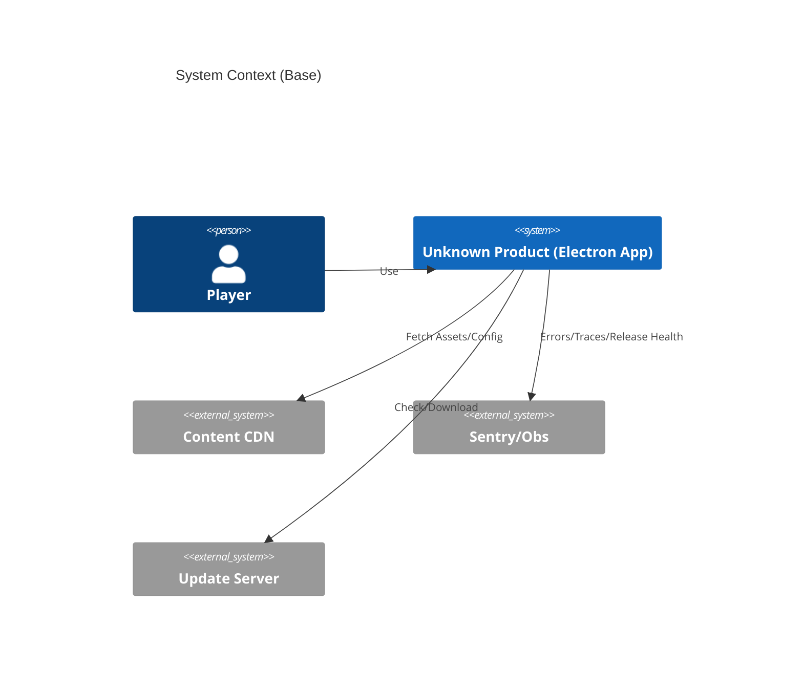
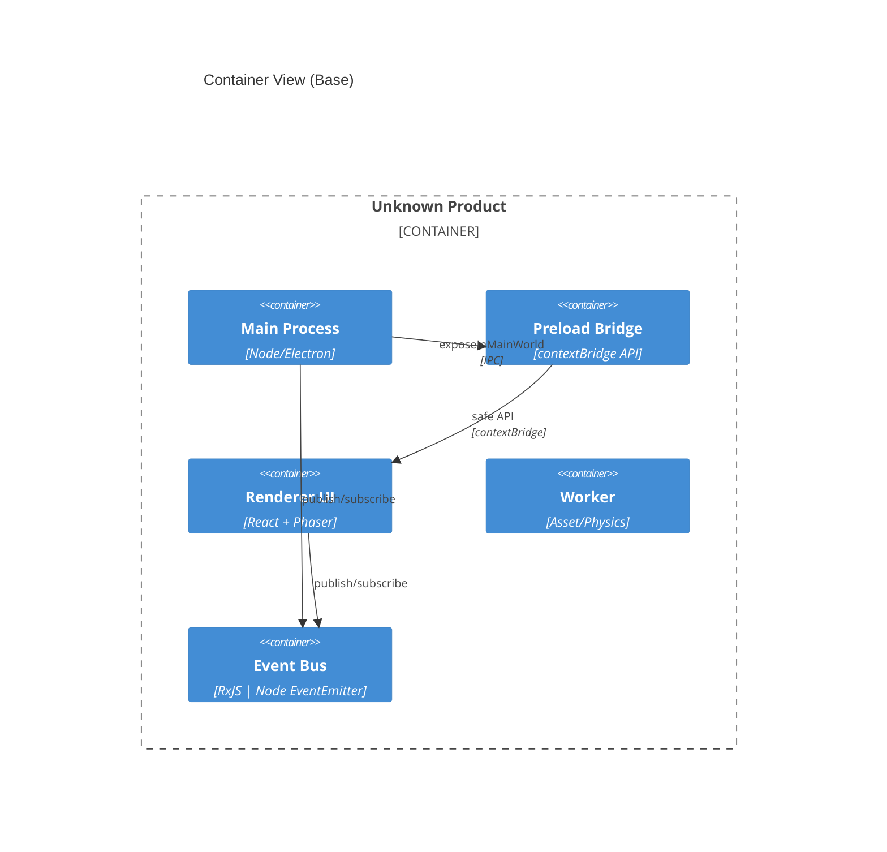
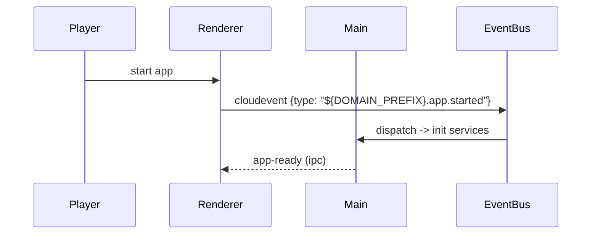

> 目标：用 **最小可复用** 的 C4 + 事件骨架表达“系统边界/容器/关键流”，与 Ch02 安全、Ch03 可观测 **引用对齐**；业务细节放 **overlays/08**。

## 0. 章节定位（与 arc42 §4 对齐）

- 本章给出**解决方案策略的精炼视图**：技术选型、顶层分解、达成质量目标的关键措施（详见 ADR）。
- 只保留可复用骨架：**System Context、Container** 与一条**关键事件流**；更多组件/部署图放 05/07。

## 1. System Context（最小）

- Actors：Player、Updater、Telemetry（Sentry）、Content CDN、Crash Reporter。
- 系统边界：Electron App（Main/Renderer）、Local Store、Extension Sandbox。



> 安全边界仅**引用** Ch02：`nodeIntegration=false`、`contextIsolation=true`、`sandbox=true`、预加载白名单导出。

## 2. Container（最小）

- Main（进程）/ Renderer（Web 框架）/ Preload（桥接）/ Worker（资产处理）/ Event Bus（进程内）。
- 跨容器通信：IPC（主↔渲染/预加载）、HTTP(s)（远端）、文件系统（本地）。



## 3. 事件骨架（CloudEvents 1.0 兼容）

> 事件以 **CloudEvents 1.0 JSON** 为最小约定；字段：`id, source, type, time, specversion, datacontenttype, data`。

### 跨平台互操作价值

**CloudEvents 1.0 标准**确保事件在不同云平台间的互操作性：

- **AWS**: EventBridge原生支持CloudEvents，通过`aws-events`直接路由
- **Azure**: Event Grid完全兼容CloudEvents schema，支持HTTP/AMQP投递
- **GCP**: Cloud Pub/Sub和Cloud Functions支持CloudEvents触发器
- **本地部署**: 标准JSON格式便于与Kafka、RabbitMQ等消息中间件集成

```ts
// src/shared/contracts/cloudevents-core.ts
export interface CloudEventV1<T = unknown> {
  id: string;
  source: string;
  type: string;
  time: string;
  specversion: '1.0';
  datacontenttype?: 'application/json';
  data?: T;
  // CloudEvents扩展属性（跨平台兼容）
  subject?: string; // 事件主题标识，便于路由过滤
  traceparent?: string; // W3C分布式追踪，与Sentry等APM集成
}

// 域事件类型定义（符合CloudEvents命名规范）
export type DomainEvent =
  | `${DOMAIN_PREFIX}.app.started`
  | `gamedev.asset.loaded`
  | `gamedev.user.action`
  | `gamedev.performance.degraded`
  | `gamedev.runtime.frame_overrun`;

// 跨平台事件源标识（便于云原生集成）
export const EVENT_SOURCES = {
  ELECTRON_MAIN: 'electron://main-process',
  ELECTRON_RENDERER: 'electron://renderer-process',
  PHASER_ENGINE: 'phaser://game-engine',
  REACT_UI: 'react://ui-components',
} as const;

// CloudEvents 1.0构建器和验证函数
export function createCloudEvent<T>(params: {
  type: DomainEvent;
  source: keyof typeof EVENT_SOURCES;
  data?: T;
  subject?: string;
}): CloudEventV1<T> {
  const event: CloudEventV1<T> = {
    id: crypto.randomUUID(),
    source: EVENT_SOURCES[params.source],
    type: params.type,
    time: new Date().toISOString(),
    specversion: '1.0',
    datacontenttype: 'application/json',
    data: params.data,
    subject: params.subject,
  };

  // 强制验证CloudEvents 1.0规范
  validateCloudEvent(event);
  return event;
}

export function validateCloudEvent(event: CloudEventV1<any>): void {
  const requiredFields = ['id', 'source', 'type', 'specversion'] as const;
  const missingFields = requiredFields.filter(field => !event[field]);

  if (missingFields.length > 0) {
    throw new Error(
      `CloudEvent validation failed: missing required fields [${missingFields.join(', ')}]`
    );
  }

  if (event.specversion !== '1.0') {
    throw new Error(
      `CloudEvent validation failed: unsupported specversion '${event.specversion}', expected '1.0'`
    );
  }

  // 验证事件源格式
  const validSources = Object.values(EVENT_SOURCES);
  if (!validSources.includes(event.source as any)) {
    console.warn(
      `CloudEvent warning: source '${event.source}' not in predefined EVENT_SOURCES`
    );
  }
}

// 类型安全的事件发布辅助函数
export function publishDomainEvent<T>(
  eventType: DomainEvent,
  source: keyof typeof EVENT_SOURCES,
  data?: T,
  subject?: string
): CloudEventV1<T> {
  return createCloudEvent({
    type: eventType,
    source,
    data,
    subject,
  });
}
```

### 示例（渲染 → 总线）

```ts
// src/runtime/events/publish.ts
import { Subject } from 'rxjs';
export const eventBus = new Subject<CloudEventV1<any>>();
export function publish<T>(e: CloudEventV1<T>) {
  eventBus.next(e);
}
```

## 4. 关键事件流（启动冷/热）



## 5. 背压/批处理（最小策略，Base）

- 统一在总线侧提供**批处理开关**：`BATCH_MAX=100`、`BATCH_MS=50`；默认关闭。
- 渲染侧避免同步阻塞；Main 侧对磁盘/网络 IO 采用**队列 + 节流**（每 tick N 条）。

```ts
// src/runtime/events/batching.ts
import { bufferTime, filter } from 'rxjs/operators';
import { eventBus } from './publish';
import type { CloudEventV1 } from '@/shared/contracts/events/CloudEvent';

export function enableBatching(ms = 50, max = 100) {
  return eventBus.pipe(
    bufferTime(ms, undefined, max),
    filter(batch => batch.length > 0)
  );
}

// 云平台兼容的批处理格式（AWS EventBridge/Azure Event Grid）
export function formatCloudEventsBatch(events: CloudEventV1[]): {
  events: CloudEventV1[];
  batchId: string;
  timestamp: string;
  platform: 'aws' | 'azure' | 'gcp' | 'local';
} {
  return {
    events,
    batchId: crypto.randomUUID(),
    timestamp: new Date().toISOString(),
    platform: (process.env.CLOUD_PLATFORM as any) || 'local',
  };
}
```

## 6. 就地验收（占位）

```ts
// tests/unit/events.schema.test.ts - CloudEvents 1.0合规验证
import { expect, test } from 'vitest';
import type { CloudEvent } from '@/shared/contracts/cloudevents-core';
import { mkEvent, assertCe } from '@/shared/contracts/cloudevents-core';

test('CloudEvents 1.0 minimal fields compliance', () => {
  const event = mkEvent({
    type: 'app.test.demo',
    source: 'app://vitegame/test',
  });

  expect(event.specversion).toBe('1.0');
  expect(event.id).toBeDefined();
  expect(event.time).toBeDefined();
  expect(event.type).toBe('app.test.demo');
  expect(event.source).toBe('app://vitegame/test');

  // 验证CloudEvents 1.0规范合规性
  assertCe(event);
});
```

```ts
// tests/unit/events.batch.test.ts
import { expect, test } from 'vitest';
test('batching switches exist', () =>
  expect(process.env.BATCH_MAX ?? '100').toBeDefined());
```

## 7. 运维/门禁（对齐 Ch03）

- Release Health 作为可观测入口（Crash-Free Sessions/Users）；事件量与成本在 Ch03 控制。
- CI 入口：`node scripts/policy/health-gate.mjs --input .release-health.json --min-sessions 0.990 --min-users 0.995`
