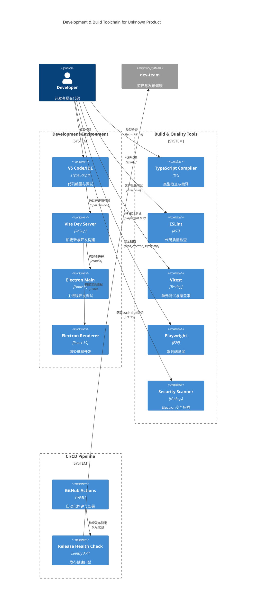
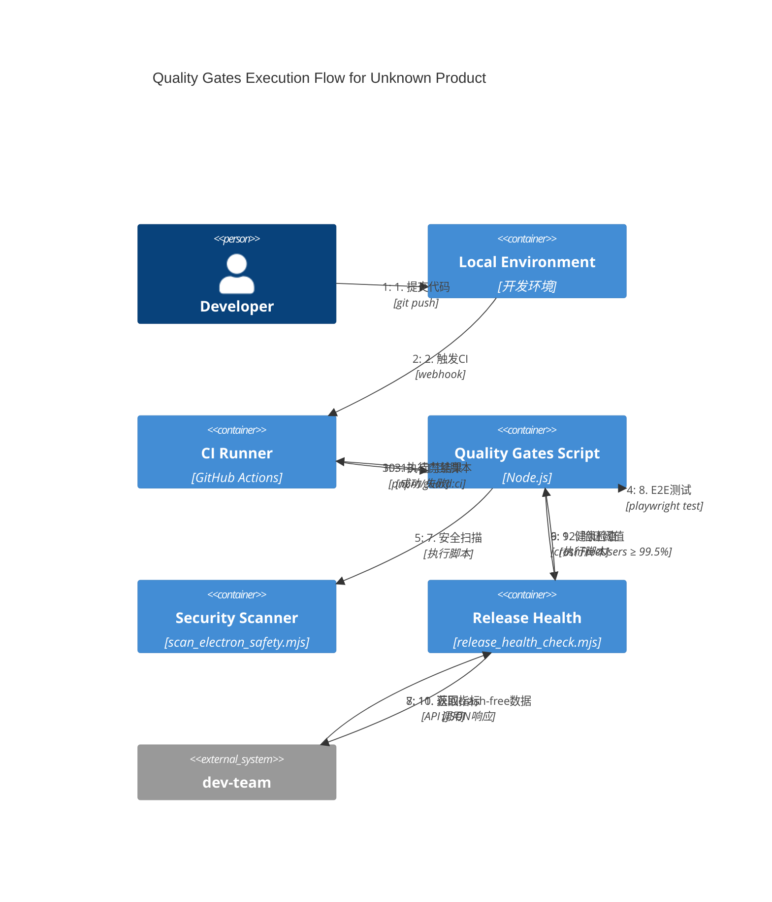

> 目标：在 optimized 基础上引入**可执行门禁矩阵**、**Windows 兼容脚本**与**可追溯矩阵**，对齐 03 章 Release Health 放量口径。

## 0.1 开发构建容器视图（C4 Container）



### B.1 Windows 单测稳定脚本与日志归档

- 使用 `npm run test:unit:ps` 调用 `scripts/windows/test-unit.ps1`，在 Windows 环境下稳定运行 Vitest，避免 PowerShell 将下游进程的 stderr 误判为错误。
- 所有测试与门禁输出统一归档至 `logs/<日期>/<模块>/`，例如：`logs/20251004/unit/test-unit-ps-<time>.log`。
- 本地与 CI 推荐一致使用该脚本或等效参数，确保可重复与可追溯。

## 0.2 质量门禁执行流程（C4 Dynamic）



## A) 质量门禁矩阵（最小可执行）

| Gate          | 工具                       | 阈值/策略                     | 失败动作 |
| ------------- | -------------------------- | ----------------------------- | -------- |
| TS            | `tsc --noEmit`             | 严格模式                      | fail     |
| Lint          | `eslint`                   | `maxWarnings:0`               | fail     |
| Unit          | `vitest --coverage`        | lines≥90%/branches≥85%        | fail     |
| E2E           | `playwright`               | retries=2（CI）               | fail     |
| Security      | `scan_electron_safety.mjs` | nodeIntegration=false 等      | fail     |
| Base          | `verify_base_clean.mjs`    | 禁业务耦合/占位符齐全         | fail     |
| ReleaseHealth | `release_health_check.mjs` | crash‑free 用户/会话 + 采用率 | fail     |

## B) Windows 兼容（.ps1 变体）

```bash
# Node-first 聚合示例（建议在 CI 与本地统一使用）
npm run typecheck
npm run lint
npm run test:unit:node
npm run guard:electron
npm run test:e2e
node scripts/release_health_check.mjs
npm run guard:base
```

## C) Electron 安全基线 & CSP 验证

```js
// scripts/verify_csp.mjs（片段）
import fs from 'node:fs';
import { JSDOM } from 'jsdom';
const html = fs.readFileSync('dist/index.html', 'utf-8');
const csp = new JSDOM(html).window.document.querySelector(
  'meta[http-equiv="Content-Security-Policy"]'
);
if (!csp) throw new Error('Missing CSP meta');
if (!/default-src 'self'/.test(csp.getAttribute('content')))
  throw new Error("CSP must restrict to 'self'");
```

## D) Release Health（含 ENV 覆盖）

```json
// src/config/sentry-gate.json（示例）
{
  "crashFreeSessionsThreshold": 0.99,
  "crashFreeUsersThreshold": 0.995,
  "minAdoptionRate": 0.2,
  "releaseFormat": "dev@0.0.0"
}
```

## E) 可追溯矩阵（变更→ADR/测试）

| 变更项              | 关联 ADR | 覆盖测试   |
| ------------------- | -------- | ---------- |
| 安全基线扫描        | ADR-0002 | T07-SEC-01 |
| Release Health Gate | ADR-0003 | T07-RH-01  |
| 质量门禁聚合        | ADR-0005 | T07-QG-01  |

## F) Playwright官方API升级（Windows兼容性）

```typescript
// tests/e2e/utils/electron-launcher.ts（官方API模式）
import { _electron as electron, ElectronApplication } from '@playwright/test';

export async function launchApp(
  extraArgs: string[] = []
): Promise<ElectronApplication> {
  const appEntry = path.resolve(__dirname, '../../../dist-electron/main.js');

  return electron.launch({
    args: [appEntry, ...extraArgs],
    timeout: 30000, // 30秒启动超时

    // Windows兼容性配置
    env: {
      ...process.env,
      // Windows需要此配置避免Chrome沙箱问题
      ELECTRON_DISABLE_SANDBOX: 'true',
      // 测试模式标识
      NODE_ENV: 'test',
      // 禁用GPU加速（CI环境兼容）
      ELECTRON_DISABLE_GPU: 'true',
    },

    // 开发调试选项（仅非CI环境）
    ...(process.env.CI
      ? {}
      : {
          headless: false,
          devtools: true,
        }),
  });
}
```

### F.1) Windows E2E测试优化策略

| 配置项                     | Windows值     | 说明                      |
| -------------------------- | ------------- | ------------------------- |
| `ELECTRON_DISABLE_SANDBOX` | `'true'`      | 避免Chrome沙箱权限问题    |
| `ELECTRON_DISABLE_GPU`     | `'true'`      | CI环境GPU加速兼容         |
| `timeout`                  | `30000ms`     | Windows启动较慢，增加超时 |
| `workers`                  | `1`（CI环境） | 避免Electron进程冲突      |

### F.2) 测试启动器种类（按场景优化）

```typescript
// 安全测试专用启动器
export async function launchAppForSecurity(
  extraArgs: string[] = []
): Promise<ElectronApplication> {
  return launchApp([
    '--test-mode',
    '--enable-features=ElectronSerialChooser',
    '--disable-features=VizDisplayCompositor',
    ...extraArgs,
  ]);
}

// 性能测试专用启动器
export async function launchAppForPerformance(
  extraArgs: string[] = []
): Promise<ElectronApplication> {
  return launchApp([
    '--disable-web-security', // 仅测试环境
    '--disable-extensions',
    '--disable-default-apps',
    '--test-mode',
    ...extraArgs,
  ]);
}
```

## G) 验收清单（合并前）

- [ ] `pnpm guard:ci` 全绿（本地与 CI）
- [ ] `.ps1` 变体可在 Windows 运行
- [ ] `.release-health.json` 的 crash-free 与 adoption 达标
- [ ] `index.html` 含 CSP meta 且限制 `default-src 'self'`
- [ ] 所有E2E测试使用官方 `_electron as electron` API
- [ ] `tests/e2e/utils/electron-launcher.ts` 提供跨平台启动器
- [ ] Windows环境下 `ELECTRON_DISABLE_SANDBOX=true` 生效

## 7.x 性能门禁（Electron 环境）

为 Electron 渲染路径的 FCP P95 测试提供“软/硬门禁 + 环境阈值 + 稳定采样”。策略在 ADR‑0015 附注中定义，这里给出可执行脚本与环境变量。

- 运行脚本（Windows 兼容，使用 cross-env）
  - `npm run perf:fcp:dev:soft`：开发环境软门禁（默认 5 次采样）
  - `npm run perf:fcp:dev:hard`：开发环境硬门禁
  - `npm run perf:fcp:staging:soft`：预发软门禁
  - `npm run perf:fcp:staging:hard`：预发硬门禁
  - `npm run perf:fcp:prod:soft`：生产软门禁（仅告警）
  - `npm run perf:fcp:prod:hard`：生产硬门禁（阈值不达直接失败）
  - `npm run perf:fcp:ci`：CI 默认（软门禁，单 worker，稳定配置）

- 环境变量（可覆盖默认）
  - `FP_P95_THRESHOLD_MS`：覆盖阈值（默认按环境：dev≤400 / staging≤300 / prod≤200）
  - `FP_RUNS`：采样次数（默认 5）
  - `FP_SOFT_GATE` 或 `PERF_GATE_MODE`：`soft|hard`（CI 推荐 soft；预发/生产使用 hard）

- 采样稳定化（测试侧）
  - 复用单个 Electron 实例，多轮 `page.reload()`
  - 业务就绪信号（`data-app-ready=true`）后，执行两帧 `requestAnimationFrame` 预热
  - 报告输出：`logs/e2e/<YYYY-MM-DD>/performance-first-paint/fcp-performance.json`

详见：`docs/adr/ADR-0015-performance-budgets-and-gates.md` 的“Electron 环境附注”与“门禁策略”。
