> 目标：在 optimized 基础上补齐 **基线快照/回归断言**、**场景权重** 与 **性能债务登记**，形成端到端闭环（Dev→CI→Prod）。

## 0.1 性能监控上下文视图（C4 Context）

```mermaid
C4Context
    title Performance Monitoring Context for Unknown Product
    Person(dev, "Developer", "性能测试与优化")
    Person(qa, "QA Engineer", "性能验证与基准测试")
    Person(ops, "Operations", "生产性能监控")
    System(app, "Unknown Product", "Electron游戏应用")
    System_Ext(perf_tools, "Performance Tools", "Lighthouse/Perfetto/Chrome DevTools")
    System_Ext(ci_system, "CI/CD System", "自动化性能门禁")
    System_Ext(monitoring, "APM System", "应用性能监控平台")
    System_Ext(baseline_store, "Baseline Storage", "性能基线数据存储")

    Rel(dev, app, "本地性能测试", "npm run perf")
    Rel(qa, app, "基准测试", "自动化测试套件")
    Rel(app, perf_tools, "性能数据采集", "Chrome API")
    Rel(app, monitoring, "运行时性能上报", "遥测数据")
    Rel(ci_system, app, "性能门禁检查", "自动化脚本")
    Rel(ci_system, baseline_store, "基线对比", "JSON文件")
    Rel(ops, monitoring, "生产性能监控", "Dashboard")
    UpdateRelStyle(app, perf_tools, $textColor="blue", $offsetX="-10")
    UpdateRelStyle(ci_system, baseline_store, $textColor="green", $offsetY="-10")
```



## 0.2 性能监控容器架构（C4 Container）

```mermaid
C4Container
    title Performance Monitoring Containers for Unknown Product
    System_Boundary(app_boundary, "Unknown Product Application") {
        Container(game_engine, "Game Engine", "Phaser 3", "游戏渲染与逻辑")
        Container(ui_layer, "UI Layer", "React 19", "用户界面渲染")
        Container(perf_tracker, "Performance Tracker", "TypeScript", "性能指标追踪")
        Container(scenario_runner, "Scenario Runner", "TypeScript", "场景权重执行")
    }
    System_Boundary(perf_infra, "Performance Infrastructure") {
        Container(perf_gate, "Performance Gate", "Node.js Script", "性能门禁脚本")
        Container(baseline_mgr, "Baseline Manager", "JSON Files", "基线快照管理")
        Container(debt_tracker, "Debt Tracker", "TypeScript", "性能债务追踪")
        Container(budget_enforcer, "Budget Enforcer", "TypeScript", "预算阶梯执行")
    }
    System_Boundary(tools_boundary, "Performance Tools") {
        Container(lighthouse, "Lighthouse CI", "Node.js", "Web性能测试")
        Container(perfetto, "Perfetto Tracer", "Chrome", "深度性能追踪")
        Container(vitest_perf, "Vitest Perf", "Testing", "性能单元测试")
    }
    System_Ext(sentry_perf, "Sentry Performance", "性能监控云服务")

    Rel(game_engine, perf_tracker, "上报FPS/内存", "事件发射")
    Rel(ui_layer, perf_tracker, "上报交互延迟", "React Profiler")
    Rel(perf_tracker, scenario_runner, "场景性能测量", "API调用")
    Rel(scenario_runner, budget_enforcer, "预算检查", "阈值验证")
    Rel(perf_gate, baseline_mgr, "基线对比", "文件读写")
    Rel(perf_gate, debt_tracker, "债务登记", "数据写入")
    Rel(lighthouse, perf_gate, "Web性能数据", "CLI输出")
    Rel(perfetto, perf_gate, "追踪数据", "JSON导出")
    Rel(vitest_perf, perf_gate, "单元性能数据", "测试报告")
    Rel(perf_tracker, sentry_perf, "运行时性能", "遥测上报")
```



## A) 统一预算 & 阶梯阈值（Dev/Staging/Prod）

```ts
export interface BudgetTier {
  name: 'dev' | 'staging' | 'prod';
  weight: number;
  frameMs: number;
  eventP95: number;
  interactP95: number;
}
export const TIERS: BudgetTier[] = [
  { name: 'dev', weight: 0.2, frameMs: 18.0, eventP95: 60, interactP95: 120 },
  {
    name: 'staging',
    weight: 0.3,
    frameMs: 17.5,
    eventP95: 55,
    interactP95: 110,
  },
  { name: 'prod', weight: 0.5, frameMs: 16.7, eventP95: 50, interactP95: 100 },
];
```

## B) 场景权重与容量预测

```ts
export interface Scenario {
  id: string;
  weight: number;
  entities: number;
  effects: number;
  ui: number;
}
export const SCENARIOS: Scenario[] = [
  { id: 'menu', weight: 0.2, entities: 50, effects: 5, ui: 1 },
  { id: 'play-base', weight: 0.5, entities: 300, effects: 40, ui: 2 },
  { id: 'play-heavy', weight: 0.3, entities: 1000, effects: 120, ui: 3 },
];
// 容量估算（示意）：CPU≈Σ(weight*(base.cpu + k.entity*entities + k.effects*effects))
```

## C) 追踪与上报（规范化结构）

```ts
export interface PerfMetric {
  name: `${string}.perf.${string}`;
  value: number;
  unit: 'ms' | 'mb' | 'fps' | 'percent';
  ts: number;
  ctx: {
    release?: string;
    environment?: string;
    ua?: string;
    scenario?: string;
  };
}
```

## D) 基线快照管理与智能漂移检测（增强版）

```typescript
// scripts/perf/baseline-manager.mjs - 基线快照管理器
import fs from 'node:fs';
import path from 'path';
import crypto from 'crypto';

export interface BaselineSnapshot {
  version: string;
  commit: string;
  timestamp: string;
  environment: 'dev' | 'staging' | 'prod';
  metrics: Record<string, PerformanceMetric>;
  metadata: {
    nodeVersion: string;
    electronVersion: string;
    os: string;
    cpu: string;
    memory: string;
  };
  checksum: string;
}

export interface PerformanceMetric {
  value: number;
  unit: 'ms' | 'mb' | 'fps' | 'percent';
  samples: number;
  stdDev: number;
  p50: number;
  p90: number;
  p95: number;
  p99: number;
}

export interface DriftRule {
  key: string;
  maxDriftPct: number;
  warningDriftPct: number;
  trendWindow: number; // 天数
  environment?: 'dev' | 'staging' | 'prod';
  severity: 'low' | 'medium' | 'high' | 'critical';
}

export class BaselineManager {
  private baselineDir = '.perf-baselines';
  private currentSnapshot: string = '.perf-current.json';

  constructor(
    private environment: 'dev' | 'staging' | 'prod' = 'dev',
    private config = this.loadConfig()
  ) {}

  // 创建基线快照
  async captureBaseline(
    metrics: Record<string, PerformanceMetric>
  ): Promise<BaselineSnapshot> {
    const snapshot: BaselineSnapshot = {
      version: process.env.npm_package_version || '1.0.0',
      commit: await this.getCurrentCommit(),
      timestamp: new Date().toISOString(),
      environment: this.environment,
      metrics,
      metadata: await this.collectSystemMetadata(),
      checksum: '',
    };

    // 计算快照校验和
    snapshot.checksum = this.calculateChecksum(snapshot);

    // 保存快照
    await this.saveBaseline(snapshot);

    console.log(
      `📊 基线快照已创建: ${this.environment}@${snapshot.version} (${Object.keys(metrics).length}个指标)`
    );
    return snapshot;
  }

  // 智能漂移检测与分析
  async detectDrift(
    currentMetrics: Record<string, PerformanceMetric>
  ): Promise<{
    passed: boolean;
    violations: DriftViolation[];
    warnings: DriftWarning[];
    trends: TrendAnalysis[];
    recommendation: string;
  }> {
    const baseline = await this.getLatestBaseline();
    if (!baseline) {
      throw new Error('未找到基线数据，请先运行 npm run perf:capture-baseline');
    }

    const rules = this.getDriftRules();
    const violations: DriftViolation[] = [];
    const warnings: DriftWarning[] = [];
    const trends: TrendAnalysis[] = [];

    for (const rule of rules) {
      if (rule.environment && rule.environment !== this.environment) {
        continue; // 跳过不适用的环境规则
      }

      const baselineValue = baseline.metrics[rule.key];
      const currentValue = currentMetrics[rule.key];

      if (!baselineValue || !currentValue) {
        continue; // 跳过缺失的指标
      }

      // 计算漂移百分比
      const driftPct = this.calculateDrift(baselineValue, currentValue);
      const absDrift = Math.abs(driftPct);

      // 趋势分析
      const trend = await this.analyzeTrend(rule.key, rule.trendWindow);
      trends.push(trend);

      // 违规检查
      if (absDrift > rule.maxDriftPct) {
        violations.push({
          rule: rule.key,
          severity: rule.severity,
          drift: driftPct,
          threshold: rule.maxDriftPct,
          baseline: baselineValue,
          current: currentValue,
          trend: trend.direction,
          message: this.generateViolationMessage(rule, driftPct, trend),
        });
      } else if (absDrift > rule.warningDriftPct) {
        warnings.push({
          rule: rule.key,
          drift: driftPct,
          threshold: rule.warningDriftPct,
          trend: trend.direction,
          message: `性能指标 ${rule.key} 接近阈值 (${driftPct.toFixed(1)}%)`,
        });
      }
    }

    // 生成建议
    const recommendation = this.generateRecommendation(
      violations,
      warnings,
      trends
    );

    return {
      passed: violations.length === 0,
      violations,
      warnings,
      trends,
      recommendation,
    };
  }

  private calculateDrift(
    baseline: PerformanceMetric,
    current: PerformanceMetric
  ): number {
    // 使用P95值进行比较（更稳定）
    const baseValue = baseline.p95 || baseline.value;
    const currValue = current.p95 || current.value;

    if (baseValue === 0) return 0;

    return ((currValue - baseValue) / baseValue) * 100;
  }

  private async analyzeTrend(
    metricKey: string,
    windowDays: number
  ): Promise<TrendAnalysis> {
    const snapshots = await this.getHistoricalSnapshots(windowDays);
    const values = snapshots
      .map(s => s.metrics[metricKey]?.p95 || s.metrics[metricKey]?.value)
      .filter(v => v !== undefined);

    if (values.length < 2) {
      return {
        direction: 'unknown',
        slope: 0,
        confidence: 0,
        samples: values.length,
      };
    }

    // 简单线性趋势分析
    const slope = this.calculateLinearSlope(values);
    const confidence = Math.min(values.length / 7, 1); // 7天以上数据置信度较高

    return {
      direction: slope > 5 ? 'worsening' : slope < -5 ? 'improving' : 'stable',
      slope,
      confidence,
      samples: values.length,
    };
  }

  private calculateLinearSlope(values: number[]): number {
    if (values.length < 2) return 0;

    const n = values.length;
    const sumX = (n * (n - 1)) / 2; // 0+1+2+...+(n-1)
    const sumY = values.reduce((a, b) => a + b, 0);
    const sumXY = values.reduce((sum, y, x) => sum + x * y, 0);
    const sumX2 = (n * (n - 1) * (2 * n - 1)) / 6;

    const slope = (n * sumXY - sumX * sumY) / (n * sumX2 - sumX * sumX);
    return slope * 100; // 转换为百分比变化率
  }

  private generateRecommendation(
    violations: DriftViolation[],
    warnings: DriftWarning[],
    trends: TrendAnalysis[]
  ): string {
    if (violations.length === 0 && warnings.length === 0) {
      return '✅ 所有性能指标均在预期范围内，继续保持！';
    }

    const recommendations = [];

    if (violations.some(v => v.severity === 'critical')) {
      recommendations.push('🚨 发现严重性能回归，建议立即回滚或修复');
    }

    const worseningTrends = trends.filter(
      t => t.direction === 'worsening' && t.confidence > 0.7
    );
    if (worseningTrends.length > 0) {
      recommendations.push(
        `📈 检测到${worseningTrends.length}个恶化趋势，建议安排性能优化任务`
      );
    }

    if (violations.some(v => v.rule.includes('startup'))) {
      recommendations.push('⚡ 启动性能回归，检查初始化逻辑和资源加载');
    }

    if (violations.some(v => v.rule.includes('memory'))) {
      recommendations.push('🧠 内存使用异常，检查内存泄漏和对象池管理');
    }

    return recommendations.join('；') || '⚠️ 发现性能异常，建议进一步分析';
  }

  // 性能门禁执行
  async runPerformanceGate(): Promise<{
    passed: boolean;
    exitCode: number;
    report: string;
  }> {
    try {
      const currentMetrics = await this.loadCurrentMetrics();
      const analysis = await this.detectDrift(currentMetrics);

      // 生成报告
      const report = this.generateReport(analysis);

      // 保存分析结果
      await this.saveAnalysisResult(analysis);

      // 决定门禁结果
      const criticalViolations = analysis.violations.filter(
        v => v.severity === 'critical'
      );
      const highViolations = analysis.violations.filter(
        v => v.severity === 'high'
      );

      if (criticalViolations.length > 0) {
        return { passed: false, exitCode: 3, report }; // 阻断部署
      } else if (highViolations.length > 0) {
        return { passed: true, exitCode: 2, report }; // 警告但放行
      } else {
        return { passed: true, exitCode: 0, report }; // 通过
      }
    } catch (error) {
      const errorReport = `❌ 性能门禁执行失败: ${error instanceof Error ? error.message : error}`;
      return { passed: false, exitCode: 1, report: errorReport };
    }
  }

  private getDriftRules(): DriftRule[] {
    return [
      // 启动性能规则
      {
        key: 'startup.cold.p95',
        maxDriftPct: 15,
        warningDriftPct: 10,
        trendWindow: 7,
        severity: 'high',
      },
      {
        key: 'startup.warm.p95',
        maxDriftPct: 10,
        warningDriftPct: 5,
        trendWindow: 7,
        severity: 'medium',
      },

      // 交互性能规则
      {
        key: 'interaction.click.p95',
        maxDriftPct: 20,
        warningDriftPct: 10,
        trendWindow: 3,
        severity: 'high',
      },
      {
        key: 'interaction.scroll.p95',
        maxDriftPct: 25,
        warningDriftPct: 15,
        trendWindow: 3,
        severity: 'medium',
      },

      // 内存规则
      {
        key: 'memory.heap.max',
        maxDriftPct: 30,
        warningDriftPct: 20,
        trendWindow: 7,
        severity: 'medium',
      },
      {
        key: 'memory.rss.avg',
        maxDriftPct: 25,
        warningDriftPct: 15,
        trendWindow: 7,
        severity: 'low',
      },

      // 渲染性能规则
      {
        key: 'render.fps.p5',
        maxDriftPct: -10,
        warningDriftPct: -5,
        trendWindow: 3,
        severity: 'high',
      }, // 负值表示下降
      {
        key: 'render.frame.p95',
        maxDriftPct: 15,
        warningDriftPct: 10,
        trendWindow: 3,
        severity: 'medium',
      },

      // 环境特定规则
      {
        key: 'e2e.load.p95',
        maxDriftPct: 20,
        warningDriftPct: 10,
        trendWindow: 7,
        environment: 'staging',
        severity: 'medium',
      },
      {
        key: 'production.p95',
        maxDriftPct: 10,
        warningDriftPct: 5,
        trendWindow: 14,
        environment: 'prod',
        severity: 'critical',
      },
    ];
  }

  // Helper方法实现
  private loadConfig() {
    return {
      driftThresholds: {
        critical: 30,
        high: 20,
        medium: 15,
        low: 10,
      },
      trendConfidenceThreshold: 0.7,
      minSamplesForTrend: 3,
      snapshotRetentionDays: 30,
      reportFormat: 'console' as 'console' | 'json' | 'html',
    };
  }

  private async getCurrentCommit(): Promise<string> {
    try {
      // 尝试从环境变量获取 (CI/CD)
      if (process.env.GITHUB_SHA) return process.env.GITHUB_SHA.substring(0, 7);
      if (process.env.GIT_COMMIT) return process.env.GIT_COMMIT.substring(0, 7);

      // 本地开发环境通过git命令获取
      const { execSync } = require('child_process');
      const commit = execSync('git rev-parse --short HEAD', {
        encoding: 'utf8',
      }).trim();
      return commit;
    } catch {
      return 'unknown';
    }
  }

  private async collectSystemMetadata() {
    const os = require('os');
    return {
      nodeVersion: process.version,
      platform: process.platform,
      arch: process.arch,
      cpuCount: os.cpus().length,
      totalMemory: os.totalmem(),
      environment: process.env.NODE_ENV || 'development',
      timestamp: new Date().toISOString(),
    };
  }

  private calculateChecksum(snapshot: BaselineSnapshot): string {
    const crypto = require('crypto');
    const data = JSON.stringify({
      version: snapshot.version,
      commit: snapshot.commit,
      metrics: snapshot.metrics,
      metadata: snapshot.metadata,
    });
    return crypto
      .createHash('sha256')
      .update(data)
      .digest('hex')
      .substring(0, 8);
  }

  private async saveBaseline(snapshot: BaselineSnapshot): Promise<void> {
    const fs = require('fs').promises;
    const path = require('path');

    // 确保目录存在
    await fs.mkdir(this.baselineDir, { recursive: true });

    // 保存快照文件
    const filename = `baseline-${snapshot.environment}-${snapshot.version}-${snapshot.commit}.json`;
    const filepath = path.join(this.baselineDir, filename);

    await fs.writeFile(filepath, JSON.stringify(snapshot, null, 2));

    // 更新latest链接
    const latestPath = path.join(
      this.baselineDir,
      `baseline-${this.environment}-latest.json`
    );
    await fs.writeFile(latestPath, JSON.stringify(snapshot, null, 2));
  }

  private async getLatestBaseline(): Promise<BaselineSnapshot | null> {
    try {
      const fs = require('fs').promises;
      const path = require('path');
      const latestPath = path.join(
        this.baselineDir,
        `baseline-${this.environment}-latest.json`
      );

      const content = await fs.readFile(latestPath, 'utf8');
      return JSON.parse(content);
    } catch {
      return null;
    }
  }

  private async getHistoricalSnapshots(
    windowDays: number
  ): Promise<BaselineSnapshot[]> {
    try {
      const fs = require('fs').promises;
      const path = require('path');

      const files = await fs.readdir(this.baselineDir);
      const snapshotFiles = files
        .filter(
          f =>
            f.startsWith(`baseline-${this.environment}-`) &&
            f.endsWith('.json') &&
            !f.includes('latest')
        )
        .sort()
        .reverse(); // 最新的在前

      const cutoffDate = new Date();
      cutoffDate.setDate(cutoffDate.getDate() - windowDays);

      const snapshots: BaselineSnapshot[] = [];

      for (const file of snapshotFiles.slice(0, 50)) {
        // 最多取50个快照
        try {
          const content = await fs.readFile(
            path.join(this.baselineDir, file),
            'utf8'
          );
          const snapshot: BaselineSnapshot = JSON.parse(content);

          if (new Date(snapshot.timestamp) >= cutoffDate) {
            snapshots.push(snapshot);
          }
        } catch {
          continue; // 跳过损坏的快照文件
        }
      }

      return snapshots.reverse(); // 按时间正序返回
    } catch {
      return [];
    }
  }

  private async loadCurrentMetrics(): Promise<
    Record<string, PerformanceMetric>
  > {
    try {
      const fs = require('fs').promises;
      const content = await fs.readFile(this.currentSnapshot, 'utf8');
      const data = JSON.parse(content);
      return data.metrics || data; // 兼容不同格式
    } catch (error) {
      throw new Error(
        `无法加载当前性能数据: ${error instanceof Error ? error.message : error}`
      );
    }
  }

  private generateReport(analysis: any): string {
    const { passed, violations, warnings, trends, recommendation } = analysis;

    let report = '\n📊 性能基线漂移分析报告\n';
    report += '═'.repeat(50) + '\n';

    // 整体状态
    report += `状态: ${passed ? '✅ 通过' : '❌ 失败'}\n`;
    report += `时间: ${new Date().toISOString()}\n`;
    report += `环境: ${this.environment}\n\n`;

    // 违规报告
    if (violations.length > 0) {
      report += '🚨 性能违规:\n';
      violations.forEach((v: any, i: number) => {
        report += `  ${i + 1}. [${v.severity.toUpperCase()}] ${v.rule}\n`;
        report += `     漂移: ${v.drift.toFixed(1)}% (阈值: ±${v.threshold}%)\n`;
        report += `     趋势: ${v.trend} | ${v.message}\n`;
      });
      report += '\n';
    }

    // 警告报告
    if (warnings.length > 0) {
      report += '⚠️  性能警告:\n';
      warnings.forEach((w: any, i: number) => {
        report += `  ${i + 1}. ${w.rule}: ${w.drift.toFixed(1)}% (${w.trend})\n`;
      });
      report += '\n';
    }

    // 趋势分析
    if (trends.length > 0) {
      report += '📈 趋势分析:\n';
      const worseningTrends = trends.filter(
        (t: any) => t.direction === 'worsening' && t.confidence > 0.5
      );
      const improvingTrends = trends.filter(
        (t: any) => t.direction === 'improving' && t.confidence > 0.5
      );

      if (worseningTrends.length > 0) {
        report += `  恶化趋势: ${worseningTrends.length}个指标\n`;
      }
      if (improvingTrends.length > 0) {
        report += `  改善趋势: ${improvingTrends.length}个指标\n`;
      }
      report += '\n';
    }

    // 建议
    report += '💡 建议:\n';
    report += `  ${recommendation}\n\n`;

    return report;
  }

  private async saveAnalysisResult(analysis: any): Promise<void> {
    try {
      const fs = require('fs').promises;
      const path = require('path');

      const result = {
        timestamp: new Date().toISOString(),
        environment: this.environment,
        analysis,
        metadata: {
          version: process.env.npm_package_version || '1.0.0',
          commit: await this.getCurrentCommit(),
        },
      };

      // 保存到结果目录
      const resultsDir = '.perf-results';
      await fs.mkdir(resultsDir, { recursive: true });

      const filename = `analysis-${this.environment}-${Date.now()}.json`;
      await fs.writeFile(
        path.join(resultsDir, filename),
        JSON.stringify(result, null, 2)
      );

      // 保存最新结果
      await fs.writeFile(
        path.join(resultsDir, `analysis-${this.environment}-latest.json`),
        JSON.stringify(result, null, 2)
      );
    } catch (error) {
      console.warn(
        '⚠️ 保存分析结果失败:',
        error instanceof Error ? error.message : error
      );
    }
  }

  private generateViolationMessage(
    rule: DriftRule,
    drift: number,
    trend: TrendAnalysis
  ): string {
    const direction = drift > 0 ? '上升' : '下降';
    const severity = Math.abs(drift) > 25 ? '严重' : '中等';

    let message = `性能指标 ${rule.key} ${direction} ${Math.abs(drift).toFixed(1)}%，超出 ${severity} 阈值`;

    if (trend.confidence > 0.7) {
      const trendDesc =
        trend.direction === 'worsening'
          ? '持续恶化'
          : trend.direction === 'improving'
            ? '正在改善'
            : '趋势稳定';
      message += `，${trendDesc} (置信度: ${(trend.confidence * 100).toFixed(0)}%)`;
    }

    // 添加具体建议
    if (rule.key.includes('startup')) {
      message += '。建议检查初始化逻辑和资源预加载策略';
    } else if (rule.key.includes('memory')) {
      message += '。建议检查内存泄漏和对象池管理';
    } else if (rule.key.includes('render')) {
      message += '。建议检查渲染优化和GPU加速配置';
    }

    return message;
  }
}

// 类型定义
export interface DriftViolation {
  rule: string;
  severity: 'low' | 'medium' | 'high' | 'critical';
  drift: number;
  threshold: number;
  baseline: PerformanceMetric;
  current: PerformanceMetric;
  trend: 'improving' | 'stable' | 'worsening' | 'unknown';
  message: string;
}

export interface DriftWarning {
  rule: string;
  drift: number;
  threshold: number;
  trend: 'improving' | 'stable' | 'worsening' | 'unknown';
  message: string;
}

export interface TrendAnalysis {
  direction: 'improving' | 'stable' | 'worsening' | 'unknown';
  slope: number;
  confidence: number;
  samples: number;
}
```

## E) Lighthouse/Tracing 集成（可选）

- Web 目标页引入 **Lighthouse CI** 断言；桌面应用用 **Chromium/Perfetto tracing** 进行深挖。

## F) 性能债务登记（可审计）

```ts
export interface PerfDebt {
  id: string;
  sys: string;
  desc: string;
  impact: 'low' | 'med' | 'high';
  owner: string;
  plan: string;
}
```

## G) CLI集成脚本（性能门禁）

### 性能门禁脚本: `scripts/performance_gate.mjs`

```javascript
#!/usr/bin/env node
import { BaselineManager } from '../docs/architecture/base/09-performance-and-capacity-v2.md';
import fs from 'fs/promises';
import path from 'path';

class PerformanceGateRunner {
  constructor() {
    this.environment = process.env.NODE_ENV || 'dev';
    this.manager = new BaselineManager(this.environment);
  }

  async run(args) {
    const command = args[0];

    try {
      switch (command) {
        case 'capture':
          await this.captureBaseline();
          break;
        case 'check':
          await this.checkDrift();
          break;
        case 'gate':
          await this.runGate();
          break;
        case 'cleanup':
          await this.cleanupOldSnapshots();
          break;
        default:
          this.showHelp();
      }
    } catch (error) {
      console.error('❌ 性能门禁执行失败:', error.message);
      process.exit(1);
    }
  }

  async captureBaseline() {
    console.log('📊 开始采集性能基线...');

    // 等待性能数据文件生成
    await this.waitForMetricsFile();

    const metricsFile = '.perf-current.json';
    const content = await fs.readFile(metricsFile, 'utf8');
    const metrics = JSON.parse(content);

    const snapshot = await this.manager.captureBaseline(metrics);
    console.log(`✅ 基线快照已保存: ${snapshot.version}@${snapshot.commit}`);
  }

  async checkDrift() {
    console.log('🔍 检查性能漂移...');

    await this.waitForMetricsFile();
    const metricsFile = '.perf-current.json';
    const content = await fs.readFile(metricsFile, 'utf8');
    const metrics = JSON.parse(content);

    const analysis = await this.manager.detectDrift(metrics);

    // 输出检查结果
    console.log(this.formatAnalysisResult(analysis));

    if (!analysis.passed) {
      console.log('⚠️  检测到性能回归，建议检查具体原因');
    } else {
      console.log('✅ 性能指标正常，无显著漂移');
    }
  }

  async runGate() {
    console.log('🚪 执行性能门禁...');

    const result = await this.manager.runPerformanceGate();

    // 输出门禁报告
    console.log(result.report);

    // 设置适当的退出码
    if (result.exitCode === 3) {
      console.log('🚫 性能门禁失败，阻断部署');
    } else if (result.exitCode === 2) {
      console.log('⚠️  性能警告但允许部署');
    } else if (result.exitCode === 0) {
      console.log('✅ 性能门禁通过');
    }

    process.exit(result.exitCode);
  }

  async cleanupOldSnapshots() {
    console.log('🧹 清理过期快照...');

    const snapshotsDir = '.perf-baselines';
    const retentionDays = 30;
    const cutoffDate = new Date();
    cutoffDate.setDate(cutoffDate.getDate() - retentionDays);

    try {
      const files = await fs.readdir(snapshotsDir);
      let cleanedCount = 0;

      for (const file of files) {
        if (file.includes('latest')) continue; // 保留latest文件

        const filepath = path.join(snapshotsDir, file);
        const stats = await fs.stat(filepath);

        if (stats.mtime < cutoffDate) {
          await fs.unlink(filepath);
          cleanedCount++;
        }
      }

      console.log(`✅ 清理完成，删除了 ${cleanedCount} 个过期快照`);
    } catch (error) {
      console.log('⚠️  清理过程中出现问题:', error.message);
    }
  }

  async waitForMetricsFile(timeout = 30000) {
    const metricsFile = '.perf-current.json';
    const startTime = Date.now();

    while (Date.now() - startTime < timeout) {
      try {
        await fs.access(metricsFile);
        return; // 文件存在，退出等待
      } catch {
        // 文件不存在，继续等待
        await new Promise(resolve => setTimeout(resolve, 1000));
      }
    }

    throw new Error(`性能数据文件 ${metricsFile} 在 ${timeout}ms 内未生成`);
  }

  formatAnalysisResult(analysis) {
    let output = '\n📊 性能漂移分析结果\n';
    output += '─'.repeat(40) + '\n';

    if (analysis.violations.length > 0) {
      output += '🚨 发现性能违规:\n';
      analysis.violations.forEach((v, i) => {
        output += `  ${i + 1}. [${v.severity}] ${v.rule}\n`;
        output += `     漂移: ${v.drift.toFixed(1)}%，趋势: ${v.trend}\n`;
      });
    }

    if (analysis.warnings.length > 0) {
      output += '\n⚠️  性能警告:\n';
      analysis.warnings.forEach((w, i) => {
        output += `  ${i + 1}. ${w.rule}: ${w.drift.toFixed(1)}%\n`;
      });
    }

    output += `\n💡 建议: ${analysis.recommendation}\n`;

    return output;
  }

  showHelp() {
    console.log(`
📊 性能基线管理工具

用法:
  node scripts/performance_gate.mjs <command>

命令:
  capture  - 采集当前性能作为基线
  check    - 检查性能漂移（不影响退出码）
  gate     - 执行性能门禁（CI使用）
  cleanup  - 清理过期的快照文件

环境变量:
  NODE_ENV - 运行环境 (dev/staging/prod)

示例:
  # 在CI中采集基线
  NODE_ENV=staging node scripts/performance_gate.mjs capture
  
  # 在部署前检查性能门禁
  NODE_ENV=prod node scripts/performance_gate.mjs gate
`);
  }
}

// 执行脚本
if (import.meta.url === `file://${process.argv[1]}`) {
  const runner = new PerformanceGateRunner();
  const args = process.argv.slice(2);
  runner.run(args);
}

export { PerformanceGateRunner };
```

### package.json 集成

```json
{
  "scripts": {
    "perf:capture-baseline": "node scripts/performance_gate.mjs capture",
    "perf:check": "node scripts/performance_gate.mjs check",
    "perf:gate": "node scripts/performance_gate.mjs gate",
    "perf:cleanup": "node scripts/performance_gate.mjs cleanup",
    "guard:performance": "npm run perf:gate"
  }
}
```

### GitHub Actions 集成

```yaml
# .github/workflows/performance-gate.yml
name: Performance Gate

on:
  pull_request:
    branches: [main, staging]
  push:
    branches: [main]

jobs:
  performance-gate:
    runs-on: ubuntu-latest
    steps:
      - uses: actions/checkout@v3

      - name: Setup Node.js
        uses: actions/setup-node@v3
        with:
          node-version: '18'
          cache: 'npm'

      - name: Install dependencies
        run: npm ci

      - name: Run E2E tests (生成性能数据)
        run: |
          npm run test:e2e:performance
          # 确保生成了 .perf-current.json

      - name: Check performance baseline exists
        run: |
          if [ ! -f .perf-baselines/baseline-${{ env.NODE_ENV }}-latest.json ]; then
            echo "⚠️ 未找到性能基线，尝试采集..."
            npm run perf:capture-baseline
          fi
        env:
          NODE_ENV: staging

      - name: Run performance gate
        run: npm run perf:gate
        env:
          NODE_ENV: staging

      - name: Archive performance results
        if: always()
        uses: actions/upload-artifact@v3
        with:
          name: performance-results
          path: |
            .perf-results/
            .perf-current.json
          retention-days: 7
```

## H) 验收清单（含债务与告警）

- [ ] TIERS/SCENARIOS 常量存在并被测试引用
- [ ] `.perf-baseline.json` 与 `.perf-current.json` 可生成对比报告
- [ ] Release Health 启用且配置告警（crash‑free 阈值）
- [ ] 性能债务登记表条目具备 owner/plan/期望版位
- [ ] BaselineManager 类可独立运行性能门禁
- [ ] CLI脚本支持 capture/check/gate/cleanup 命令
- [ ] GitHub Actions 工作流集成性能门禁
- [ ] 性能回归可自动阻断部署（exitCode=3）
