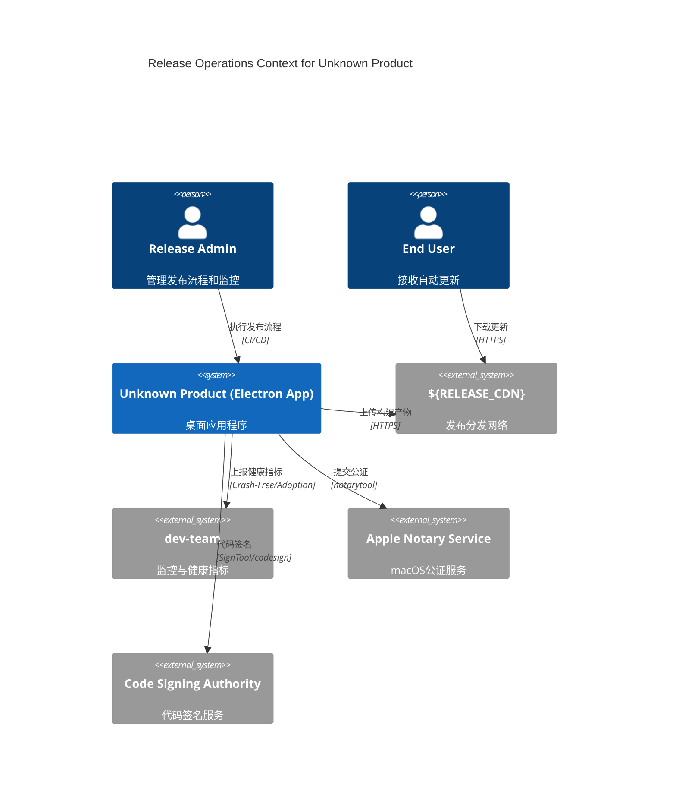
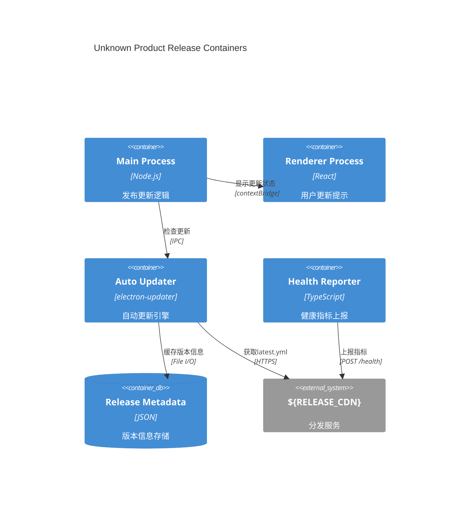

> 目标：在 optimized 基础上补齐 **通道矩阵（Dev/Staging/Prod）**、**签名/公证失败的降级与告警**、**更新回退策略** 与 **i18n 发布前质量门禁**，确保工程闭环。

## 0.1 发布上下文视图（C4 Context）



## 0.2 发布容器视图（C4 Container）



## A) 通道矩阵与放量策略

```ts
export interface RolloutGate {
  metric: 'crashFreeUsers' | 'crashFreeSessions' | 'adoptionRate';
  threshold: number;
  waitMs: number;
  action: 'block' | 'warn' | 'rollback';
}
export const CHANNELS = {
  dev: {
    url: '${RELEASE_CDN}/dev',
    gates: [
      { metric: 'adoptionRate', threshold: 0.1, waitMs: 0, action: 'warn' },
    ],
  },
  staging: {
    url: '${RELEASE_CDN}/staging',
    gates: [
      {
        metric: 'crashFreeUsers',
        threshold: 99.0,
        waitMs: 3600000,
        action: 'block',
      },
    ],
  },
  prod: {
    url: '${RELEASE_CDN}/prod',
    gates: [
      {
        metric: 'crashFreeUsers',
        threshold: 99.5,
        waitMs: 3600000,
        action: 'rollback',
      },
    ],
  },
} as const;
```

## B) 签名/公证失败的降级与可观测

```ts
export interface SigNotarizeResult {
  platform: 'win' | 'mac';
  step: 'sign' | 'notarize' | 'staple' | 'verify';
  ok: boolean;
  msg?: string;
}
export function onSigNotarizeFailure(r: SigNotarizeResult) {
  /* 上报 Sentry & 触发告警（与 03 章一致） */
}
```

## C) 更新回退（版本保护）

```ts
export interface RollbackPlan {
  maxAutoRollbacks: number;
  cooldownMs: number;
  channels: ReadonlyArray<keyof typeof CHANNELS>;
}
export class AutoRollback {
  private count = 0;
  constructor(private plan: RollbackPlan) {}
  async maybeRollback(metric: 'crashFreeUsers', value: number) {
    if (value < 99.5 && this.count < this.plan.maxAutoRollbacks) {
      this.count++; /* 执行回退 */
    }
  }
}
```

## D) i18n 发布门禁（Key Debt）

```ts
export interface I18nDebt {
  locale: string;
  missing: number;
  ratio: number;
  criticalMissing: string[];
}
export function detectMissingTranslations(): Promise<I18nDebt[]> {
  return Promise.resolve([]);
} // 占位

// 发布事件契约
export interface ReleaseEvent {
  type:
    | 'gamedev.release.started'
    | 'gamedev.release.completed'
    | 'gamedev.release.failed';
  version: string;
  channel: keyof typeof CHANNELS;
  timestamp: number;
}
export interface HealthEvent {
  type: 'gamedev.health.threshold_breached';
  metric: string;
  value: number;
  threshold: number;
  channel: string;
}
export interface I18nEvent {
  type: 'gamedev.i18n.validation_failed';
  locale: string;
  missingKeys: string[];
  completeness: number;
}
```

## E) CI 片段（签名/公证/健康门禁）

```yaml
# .github/workflows/release.yml（摘要）
name: Release Pipeline
on:
  push: { tags: ['v*'] }
  workflow_dispatch:
    {
      inputs:
        {
          channel:
            { required: true, type: choice, options: [dev, staging, prod] },
        },
    }

jobs:
  build:
    strategy: { matrix: { os: [windows-latest, macos-latest] } }
    steps:
      - name: Build & Package
        run: npm run build && npm run package:${{ matrix.os }}
      - name: Sign (Windows)
        if: matrix.os == 'windows-latest'
        # 推荐 Node 入口（当前代理到 PowerShell；TODO: 实现原生 Node 签名流程）
        run: node scripts/release/windows-sign.mjs
        env:
          {
            WINDOWS_CERT_FILE: '${{ secrets.WIN_CERT }}',
            WINDOWS_CERT_PASSWORD: '${{ secrets.WIN_CERT_PASS }}',
          }
      - name: Notarize (macOS)
        if: matrix.os == 'macos-latest'
        run: node scripts/release/macos-notarize.mjs
        env:
          {
            APPLE_ID: '${{ secrets.APPLE_ID }}',
            APPLE_PASSWORD: '${{ secrets.APPLE_PASSWORD }}',
          }
      - name: Health Gate
        run: node scripts/release/health-gate-check.mjs --channel=${{ github.event.inputs.channel || 'prod' }}
        env: { SENTRY_ORG: 'dev-team', SENTRY_PROJECT: 'dev-project' }
      - name: Upload to CDN
        run: node scripts/release/upload-artifacts.mjs --target=${RELEASE_CDN}/${{ github.event.inputs.channel }}
```

```bash
# scripts/release/health-gate-check.mjs（关键片段）
const thresholds = {
  dev: { crashFreeUsers: 98.0, adoptionRate: 0.1 },
  staging: { crashFreeUsers: 99.0, crashFreeSessions: 99.5 },
  prod: { crashFreeUsers: 99.5, crashFreeSessions: 99.8 }
};
```

## F) 验收清单（含回滚）

- [ ] HEALTH_GATES 生效且可触发**自动回滚**；
- [ ] 通道矩阵与阈值可通过 ENV 覆盖；
- [ ] 签名/公证失败进入降级路径并**产生告警**；
- [ ] i18n 完整度 ≥95%，**关键 keys 不得缺失**；
- [ ] 与 02/03/07 章节的策略引用**就近可见**。
