> 在 optimized 基础上，补齐 **连续评估（SLO/错误/性能）**、**Sentry 风险事件**、**CI 风险门禁** 与 **追踪矩阵校验**，形成工程闭环。

## 系统上下文架构（C4 Context）

```mermaid
C4Context
    title unknown-app Risk Management System Context

    Person(developer, "Developer", "开发人员，识别和报告风险")
    Person(devops, "DevOps Engineer", "运维工程师，监控风险门禁")

    System(risk_mgmt, "unknown-app Risk Management", "风险识别、评估、缓解和监控系统")

    System_Ext(sentry, "Sentry Platform", "错误监控和性能追踪平台")
    System_Ext(ci_system, "CI/CD System", "持续集成和部署系统")
    System_Ext(slo_monitor, "SLO Monitoring", "服务级别目标监控系统")

    Rel(developer, risk_mgmt, "识别和评估风险", "Risk API")
    Rel(devops, risk_mgmt, "监控风险状态", "Dashboard")

    Rel(risk_mgmt, sentry, "发送风险事件", "SDK/API")
    Rel(risk_mgmt, ci_system, "阻断高风险构建", "Gate Script")
    Rel(risk_mgmt, slo_monitor, "获取SLO健康状态", "Metrics API")

    Rel(sentry, risk_mgmt, "返回监控数据", "Webhook")
    Rel(slo_monitor, risk_mgmt, "提供性能指标", "Query API")
```



## A) 连续评估（P×I 动态化）

### 风险评估核心算法

```ts
// src/services/risk-assessor.ts（摘要）
export class RiskAssessor {
  constructor(
    private slo: {
      get: (
        id: string
      ) => Promise<{ target: number; actual: number; healthy: boolean }>;
    }
  ) {}

  async assess(p: number, sloId: string) {
    const s = await this.slo.get(sloId);
    const impact = !s.healthy
      ? Math.abs(s.actual - s.target) / Math.max(s.target, 1) > 0.5
        ? 5
        : 3
      : 1;
    const riskScore = p * impact;
    const riskLevel =
      riskScore >= 21
        ? 'critical'
        : riskScore >= 13
          ? 'high'
          : riskScore >= 7
            ? 'medium'
            : 'low';
    return { impact, riskScore, riskLevel };
  }

  // 批量评估优化
  async assessBatch(
    risks: Array<{ id: string; probability: number; sloId: string }>
  ) {
    const results = await Promise.allSettled(
      risks.map(r => this.assess(r.probability, r.sloId))
    );
    return results.map((r, i) => ({
      riskId: risks[i].id,
      result: r.status === 'fulfilled' ? r.value : null,
      error: r.status === 'rejected' ? r.reason : null,
    }));
  }
}
```

### 环境变量配置

```bash
# .env.risk-assessment
RISK_ASSESSMENT_INTERVAL=300000  # 5分钟评估间隔
RISK_SLO_TIMEOUT=5000           # SLO查询超时
RISK_BATCH_SIZE=10              # 批量评估大小
RISK_CACHE_TTL=60000            # 缓存时间1分钟
```

## 技术容器架构（C4 Container）

```mermaid
C4Container
    title unknown-app Risk Management - Container Architecture

    Person(developer, "Developer")
    Person(devops, "DevOps Engineer")

    Container_Boundary(risk_system, "unknown-app Risk Management System") {
        Container(risk_api, "Risk Assessment API", "Node.js/Express", "RESTful API for risk operations")
        Container(risk_engine, "Risk Assessment Engine", "TypeScript Service", "Core P×I calculation and SLO integration")
        Container(sentry_adapter, "Sentry Integration", "TypeScript Service", "Risk event sampling and telemetry")
        Container(ci_gate, "CI Gate Script", "Node.js Script", "Automated risk threshold validation")
        Container(trace_validator, "Traceability Validator", "TypeScript Service", "Risk-ADR-SLO-Test matrix validation")
        Container(risk_storage, "Risk Database", "JSON Files/SQLite", "Persistent risk and TDR storage")
        Container(config_mgmt, "Configuration Manager", "TypeScript Service", "Environment-specific risk thresholds")
    }

    System_Ext(sentry, "Sentry Platform")
    System_Ext(ci_system, "CI/CD System")
    System_Ext(slo_monitor, "SLO Monitoring")

    Rel(developer, risk_api, "Submit/Query risks", "HTTPS/REST")
    Rel(devops, risk_api, "Monitor dashboard", "HTTPS/REST")

    Rel(risk_api, risk_engine, "Request assessment", "Internal API")
    Rel(risk_engine, sentry_adapter, "Send risk events", "Function call")
    Rel(risk_engine, risk_storage, "Store/Retrieve risks", "File I/O")
    Rel(risk_engine, config_mgmt, "Get thresholds", "Config API")

    Rel(ci_gate, risk_storage, "Read risk data", "File I/O")
    Rel(ci_gate, ci_system, "Block/Allow build", "Exit codes")

    Rel(trace_validator, risk_storage, "Validate matrix", "File I/O")
    Rel(sentry_adapter, sentry, "Telemetry data", "SDK")
    Rel(risk_engine, slo_monitor, "Query SLOs", "HTTP API")
```



## B) Sentry 风险事件与采样

### 增强版风险遥测

```ts
// src/services/sentry-risk.ts（对齐 §03）
import * as Sentry from '@sentry/electron/renderer';

export interface RiskTelemetryConfig {
  dsn: string;
  environment: string;
  release: string;
  riskSamplingRates: Record<RiskLevel, number>;
  enablePerformanceRisk: boolean;
}

export function initRiskTelemetry(config?: Partial<RiskTelemetryConfig>) {
  const defaultConfig: RiskTelemetryConfig = {
    dsn: process.env.SENTRY_DSN!,
    environment: process.env.NODE_ENV || 'development',
    release: process.env.RELEASE_PREFIX + process.env.VERSION,
    riskSamplingRates: { critical: 1.0, high: 0.8, medium: 0.3, low: 0.1 },
    enablePerformanceRisk: true,
  };

  const finalConfig = { ...defaultConfig, ...config };

  Sentry.init({
    dsn: finalConfig.dsn,
    environment: finalConfig.environment,
    release: finalConfig.release,
    tracesSampler: ctx => {
      const risk = ctx['riskLevel'] as RiskLevel | undefined;
      return risk ? finalConfig.riskSamplingRates[risk] : 0.1;
    },
    beforeSend(event) {
      // 为风险事件添加上下文标签
      if (event.tags?.category === 'risk') {
        event.tags.product = process.env.PRODUCT_SLUG;
        event.tags.domain = process.env.DOMAIN_PREFIX;
      }
      return event;
    },
  });
}

export function captureRisk(
  msg: string,
  level: RiskLevel,
  extra?: Record<string, any>
) {
  Sentry.addBreadcrumb({
    category: 'risk',
    message: msg,
    level:
      level === 'critical' ? 'error' : level === 'high' ? 'warning' : 'info',
    data: extra,
  });

  if (level === 'critical' || level === 'high') {
    Sentry.captureMessage(`[RISK] ${msg}`, {
      level: 'warning',
      tags: { riskLevel: level, category: 'risk' },
      extra: extra,
    });
  }
}

type RiskLevel = 'low' | 'medium' | 'high' | 'critical';
```

## C) CI 风险门禁（聚合指标）

### 增强版门禁脚本

```js
// scripts/ci/risk-gate.mjs（增强版）
import fs from 'node:fs/promises';
import path from 'node:path';

// 可配置的风险阈值
const CONFIG = {
  thresholds: {
    maxCritical: parseInt(process.env.RISK_MAX_CRITICAL || '0'),
    maxHigh: parseInt(process.env.RISK_MAX_HIGH || '3'),
    maxScore: parseInt(process.env.RISK_MAX_SCORE || '15'),
    maxTotalRisks: parseInt(process.env.RISK_MAX_TOTAL || '20'),
  },
  paths: {
    riskData: process.env.RISK_DATA_PATH || 'var/risks.json',
    reportOutput: process.env.RISK_REPORT_PATH || 'reports/risk-gate.json',
  },
  exitOnFailure: process.env.RISK_GATE_ENFORCE !== 'false',
};

try {
  const risks = JSON.parse(await fs.readFile(CONFIG.paths.riskData, 'utf8'));
  const stats = calculateRiskStats(risks);
  const result = evaluateRiskGate(stats, CONFIG.thresholds);

  // 生成详细报告
  await generateRiskReport(result, stats, risks);

  console.log(`🔍 Risk Gate Analysis: ${risks.length} risks evaluated`);
  console.log(
    `📊 Stats: Critical=${stats.critical}, High=${stats.high}, Max Score=${stats.maxScore}`
  );

  if (!result.passed) {
    console.error('❌ Risk gate failed:', result.failures);
    if (CONFIG.exitOnFailure) process.exit(1);
  } else {
    console.log('✅ Risk gate passed - all thresholds met');
  }
} catch (error) {
  console.error('💥 Risk gate error:', error.message);
  if (CONFIG.exitOnFailure) process.exit(1);
}

function calculateRiskStats(risks) {
  const stats = {
    critical: 0,
    high: 0,
    medium: 0,
    low: 0,
    maxScore: 0,
    total: risks.length,
  };
  for (const r of risks) {
    stats[r.riskLevel]++;
    stats.maxScore = Math.max(stats.maxScore, r.riskScore);
  }
  return stats;
}

function evaluateRiskGate(stats, thresholds) {
  const failures = [];
  if (stats.critical > thresholds.maxCritical)
    failures.push(
      `Critical risks: ${stats.critical} > ${thresholds.maxCritical}`
    );
  if (stats.high > thresholds.maxHigh)
    failures.push(`High risks: ${stats.high} > ${thresholds.maxHigh}`);
  if (stats.maxScore > thresholds.maxScore)
    failures.push(`Max score: ${stats.maxScore} > ${thresholds.maxScore}`);
  if (stats.total > thresholds.maxTotalRisks)
    failures.push(`Total risks: ${stats.total} > ${thresholds.maxTotalRisks}`);

  return { passed: failures.length === 0, failures, stats };
}

async function generateRiskReport(result, stats, risks) {
  const report = {
    timestamp: new Date().toISOString(),
    gatePassed: result.passed,
    statistics: stats,
    failures: result.failures,
    riskBreakdown: risks.reduce((acc, r) => {
      acc[r.category] = (acc[r.category] || 0) + 1;
      return acc;
    }, {}),
  };

  await fs.mkdir(path.dirname(CONFIG.paths.reportOutput), { recursive: true });
  await fs.writeFile(
    CONFIG.paths.reportOutput,
    JSON.stringify(report, null, 2)
  );
}
```

### Package.json 集成

```json
{
  "scripts": {
    "risk:assess": "node scripts/risk-assess.mjs",
    "risk:gate": "node scripts/ci/risk-gate.mjs",
    "risk:report": "node scripts/risk-report.mjs",
    "ci:risk-check": "npm run risk:assess && npm run risk:gate"
  }
}
```

## D) 追踪矩阵校验（Risk/TDR ↔ ADR/SLO/Tests）

### 矩阵校验服务

```ts
// src/services/traceability-validate.ts（摘要）
export interface TraceabilityMatrix {
  risks: Array<{
    id: string;
    affectedSLOs?: string[];
    relatedADRs?: string[];
    testRefs?: string[];
  }>;
  tdrs: Array<{ id: string; relatedADRs?: string[]; testRefs?: string[] }>;
  adrs: Array<{ id: string; status: string }>;
  tests: Array<{ id: string; type: string }>;
}

export interface ValidationResult {
  passed: boolean;
  issues: string[];
  warnings: string[];
  coverage: {
    risksWithSLO: number;
    risksWithADR: number;
    risksWithTests: number;
    tdrsWithADR: number;
    totalRisks: number;
    totalTdrs: number;
  };
}

export function validateTrace(matrix: TraceabilityMatrix): ValidationResult {
  const issues: string[] = [];
  const warnings: string[] = [];

  // 验证风险追踪完整性
  let risksWithSLO = 0,
    risksWithADR = 0,
    risksWithTests = 0;
  for (const r of matrix.risks) {
    if (!r.affectedSLOs?.length) {
      issues.push(`Risk ${r.id} missing SLO link`);
    } else {
      risksWithSLO++;
    }

    if (!r.relatedADRs?.length) {
      issues.push(`Risk ${r.id} missing ADR link`);
    } else {
      risksWithADR++;
      // 验证ADR状态
      for (const adrId of r.relatedADRs) {
        const adr = matrix.adrs.find(a => a.id === adrId);
        if (!adr || adr.status !== 'Accepted') {
          warnings.push(`Risk ${r.id} references non-accepted ADR ${adrId}`);
        }
      }
    }

    if (r.testRefs?.length) {
      risksWithTests++;
    } else {
      warnings.push(`Risk ${r.id} has no test coverage`);
    }
  }

  // 验证技术债追踪
  let tdrsWithADR = 0;
  for (const tdr of matrix.tdrs) {
    if (tdr.relatedADRs?.length) {
      tdrsWithADR++;
    } else {
      warnings.push(`TDR ${tdr.id} missing ADR reference`);
    }
  }

  const coverage = {
    risksWithSLO,
    risksWithADR,
    risksWithTests,
    tdrsWithADR,
    totalRisks: matrix.risks.length,
    totalTdrs: matrix.tdrs.length,
  };

  return {
    passed: issues.length === 0,
    issues,
    warnings,
    coverage,
  };
}

// 生成追踪矩阵报告
export function generateTraceReport(result: ValidationResult): string {
  const { coverage } = result;
  const sloCompliance = (
    (coverage.risksWithSLO / coverage.totalRisks) *
    100
  ).toFixed(1);
  const adrCompliance = (
    (coverage.risksWithADR / coverage.totalRisks) *
    100
  ).toFixed(1);
  const testCoverage = (
    (coverage.risksWithTests / coverage.totalRisks) *
    100
  ).toFixed(1);

  return `
## 追踪矩阵合规报告

### 风险追踪覆盖率
- SLO关联: ${coverage.risksWithSLO}/${coverage.totalRisks} (${sloCompliance}%)
- ADR关联: ${coverage.risksWithADR}/${coverage.totalRisks} (${adrCompliance}%)  
- 测试覆盖: ${coverage.risksWithTests}/${coverage.totalRisks} (${testCoverage}%)

### 技术债追踪
- ADR关联: ${coverage.tdrsWithADR}/${coverage.totalTdrs}

### 问题清单
${result.issues.map(i => `- ❌ ${i}`).join('\n')}

### 警告清单  
${result.warnings.map(w => `- ⚠️ ${w}`).join('\n')}
  `.trim();
}
```

## E) 验收清单（门禁+追踪）

### 完整验收流程

- [ ] 风险门禁在 CI 可阻断（含统计输出和报告生成）
- [ ] Sentry 事件包含风险上下文（Breadcrumb/Level/Tags）
- [ ] 追踪矩阵校验通过（无孤立 Risk/TDR，覆盖率 ≥80%）
- [ ] 风险定期复盘（自动生成报告，支持趋势分析）
- [ ] 环境变量配置完整（开发/测试/生产环境差异化阈值）
- [ ] 批量评估性能优化（支持并发处理，避免SLO查询超时）

### 监控集成检查

- [ ] 风险事件在 dev-team/dev-project 项目中可见
- [ ] CI 构建日志包含详细的风险统计信息
- [ ] 追踪矩阵报告自动生成到 `reports/` 目录
- [ ] 风险阈值可通过环境变量动态调整

### Workflow 集成示例

```yaml
# .github/workflows/risk-assessment.yml
name: Risk Assessment Gate
on: [pull_request]
jobs:
  risk-gate:
    runs-on: ubuntu-latest
    steps:
      - uses: actions/checkout@v4
      - uses: actions/setup-node@v4
        with: { node-version: '18' }
      - run: npm ci
      - name: Risk Assessment
        env:
          RISK_MAX_CRITICAL: 0
          RISK_MAX_HIGH: 2
          RISK_GATE_ENFORCE: true
        run: npm run ci:risk-check
      - name: Upload Risk Report
        uses: actions/upload-artifact@v4
        with:
          name: risk-reports
          path: reports/
```

## G) Critical条件检查清单（风险/回滚机制）

### G.1) Critical条件定义（不可妥协）


### G.2) Critical检查矩阵

| 检查类型           | Critical阈值           | 检测方法    | 触发动作 |
| ------------------ | ---------------------- | ----------- | -------- |
| **安全基线**       | contextIsolation=false | 扫描main.ts | 立即回滚 |
| **Release Health** | Crash-Free < 99.5%     | Sentry API  | 立即回滚 |
| **核心服务**       | 数据库不可用           | 依赖检查    | 阻止发布 |
| **性能**           | 启动时间 > 10s         | 基线对比    | 立即回滚 |
| **资源**           | 内存使用 > 90%         | 系统监控    | 立即回滚 |

### G.3) 自动化检查脚本

```json
{
  "scripts": {
    "critical:check": "node scripts/critical_conditions_checklist.mjs"
  }
}
```

**使用方法**：

```bash
# 发布前Critical条件验证
npm run critical:check

# CI集成（在release workflow中）
- name: Critical Conditions Check
  run: npm run critical:check
```

**输出格式**：

- ✅ PASS - 可安全发布
- ⚠️ WARN - 谨慎继续
- ❌ FAIL - 阻止发布
- 🚨 CRITICAL - 立即回滚

## H) 验收清单（最小合规）

- [ ] 技术债务评分系统可执行（`npm run debt:check`）
- [ ] 每个`FIXME`/`TODO`均有责任人和预期解决日期
- [ ] 架构决策决议（ADR）记录至少每季度一次回顾
- [ ] 依赖项检查脚本可在CI运行，并报告过期/脆弱依赖
- [ ] **Critical条件检查脚本集成到发布流程**（`npm run critical:check`）
- [ ] **所有Critical条件定义明确且可自动化检测**
- [ ] **回滚机制经过测试验证，可在5分钟内执行**
