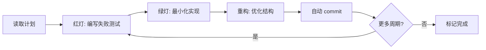

# SuperClaude v4 常用命令参考

> SuperClaude v4 是 Claude Code 的自动化工作流增强框架,支持 TDD 实现、Git 自动化、架构验收与代码审查。

---

## 核心命令分类

### 1. 任务分析命令

#### `/sc:analyze` - 任务上下文分析

**用途**:分析任务需求,生成实现计划,自动调用 MCP 工具收集上下文。

**基础语法**:
```bash
/sc:analyze --task <task-id> [选项]
```

**核心参数**:

| 参数 | 类型 | 默认值 | 说明 |
|------|------|--------|------|
| `--task` | string | 必需 | 任务 ID (如 1.1, 2.3) |
| `--mode` | string | orchestration | 运行模式 (token-efficiency/orchestration/business-panel) |
| `--focus` | string | architecture,security | 分析焦点领域 (逗号分隔) |
| `--mcp` | string | serena | 启用的 MCP 工具 (逗号分隔) |

**运行模式详解**:

| 模式 | 适用场景 | 主要优势 | 典型任务 |
|------|---------|---------|---------|
| **token-efficiency** | 大型 PRD/长代码文件 | 降低上下文占用 30-50% | PRD 30+ 页,单文件 >500 行 |
| **orchestration** | 需要串联多个 MCP 工具 | 优化工具调度效率 | Context7 → Serena → Playwright 流水线 |
| **business-panel** | 里程碑决策/ADR 权衡 | 多专家会诊口径 | ADR 批准,架构方案选型 |

**Focus 焦点领域详解**:

| 焦点 | 关注点 | 典型检查项 | 适用任务 |
|------|--------|-----------|---------|
| **architecture** | SOLID 原则、三层架构、ADR 合规 | 依赖注入、接口隔离、Core 层无 Godot 依赖 | 架构重构、新模块设计 |
| **security** | 安全基线 (ADR-0002) | 路径校验 (res://、user://)、输入验证、审计日志 | 文件操作、外链功能 |
| **performance** | 性能 SLO | P95 帧耗时 ≤16.6ms、启动时间 ≤3s、内存 ≤512MB | 性能优化任务 |
| **quality** | 代码质量 | 覆盖率 ≥90%、圈复杂度 ≤10、重复度 ≤3% | 质量改进任务 |
| **accessibility** | 可用性 | UI 可访问性、多语言支持、键盘导航 | UI/UX 任务 |
| **testing** | 测试策略 | TDD 红绿重构、边界用例、集成测试 | 测试补充任务 |

**MCP 工具组合 (黄金三角)**:

| MCP 工具 | 用途 | 适用场景 | 启用方式 |
|---------|------|---------|---------|
| **serena** | 符号级检索与安全编辑 | 现有功能扩展、重构任务、契约对齐 | `--mcp serena` (默认启用) |
| **context7** | 获取最新官方文档与 API 示例 | Godot/第三方库 API 查询 | `--mcp context7` |
| **playwright** | E2E 回归测试自动化 | Web UI 测试 (仅适用于 HTML5/Web 版本) | `--mcp playwright` |

**使用场景**:

##### 场景 1: 标准任务 (默认模式)

```bash
/sc:analyze --task 1.1 --focus architecture,security

# SuperClaude 自动执行:
# 1. 读取 tasks/1.1.md 中的任务描述
# 2. 读取 ADR-0002 (安全基线) 和 ADR-0004 (事件契约) 约束
# 3. 结合 Serena 查询的现有代码上下文
# 4. 生成实现计划 (包含测试用例占位、契约定义、实现步骤)
```

**预期输出示例**:
```markdown
## 实现计划

### 前置理解
- 现有 Guild 相关代码: GuildRepository.cs, IGuildService.cs
- 事件契约: GuildCreated, GuildUpdated (在 Contracts/Guild/)
- 安全约束: 所有路径验证 (ADR-0002)

### TDD 步骤
1. 红: 编写失败测试 `GuildCreationTests.cs`
   - 测试名称唯一性校验
   - 测试初始成员分配
   - 测试默认权限设置
2. 绿: 最小化实现 `GuildCreationService.cs`
3. 重构: 使用 Serena 优化 symbol 命名和接口

### 契约新增
- Event: GuildMemberJoined
- DTO: GuildCreationRequest

### 质量门禁
- 覆盖率 ≥90%
- ADR-0002 路径校验通过
```

##### 场景 2: Token-Efficiency 模式 (大文档场景)

```bash
/sc:analyze --mode token-efficiency --task 1.1 --focus architecture,security

# 适用于:
# - PRD 30+ 页
# - 单文件 >500 行
# - 上下文占用 >75%

# 优势:
# - 降低 token 占用 30-50%
# - 保持分析质量 ≥95%
```

##### 场景 3: Orchestration 模式 (多工具串联)

```bash
/sc:analyze --mode orchestration --task 1.1 --mcp context7,serena,playwright

# 自动执行工具链:
# 1. Context7: 查询 Godot 4.5 Signal API 最新文档
# 2. Serena: 查找现有 Signal 使用模式
# 3. 生成计划: 结合官方文档 + 项目实践
# (Playwright 仅在 HTML5/Web 版本时启用)
```

##### 场景 4: Business Panel 模式 (架构决策)

```bash
/sc:analyze --mode business-panel --task 2.5 --focus architecture

# 适用于:
# - ADR 批准 (新增/Supersede 现有 ADR)
# - 架构方案选型 (三层架构 vs 六边形架构)
# - 技术栈决策 (SQLite vs PostgreSQL)

# 输出:
# - 多专家视角 (架构师、安全专家、性能专家)
# - 权衡分析矩阵
# - 推荐决策 + 风险评估
```

---

### 2. TDD 实现命令

#### `/sc:build` - TDD 红绿重构实现

**用途**: 执行 TDD 循环 (红→绿→重构),支持专长旗标与覆盖率门禁。

**基础语法**:
```bash
/sc:build --task <task-id> --tdd [专长旗标] [选项]
```

**核心参数**:

| 参数 | 类型 | 默认值 | 说明 |
|------|------|--------|------|
| `--task` | string | 必需 | 任务 ID |
| `--tdd` | flag | false | 启用 TDD 模式 |
| `--coverage-gate` | int | 90 | 覆盖率门禁阈值 (%) |
| `--security` | flag | false | 启用安全专长代理 |
| `--frontend` | flag | false | 启用前端架构专长代理 |
| `--performance` | flag | false | 启用性能优化专长代理 |

**专长旗标详解**:

| 旗标 | 专长领域 | 适用任务 | 示例 |
|------|---------|---------|------|
| `--security` | 安全工程 | ADR-0002 路径校验实现 | 文件系统访问、权限验证 |
| `--frontend` | 前端架构 | Godot 场景/UI 任务 | 场景树设计、Signal 连接 |
| `--performance` | 性能优化 | 性能关键任务 | 帧率优化、算法优化 |

**TDD 执行流程**:



**使用场景**:

##### 场景 1: 安全敏感任务

```bash
/sc:build --task 1.1 --tdd --security --coverage-gate 90

# 专长代理自动检查:
# - 路径操作: 仅 res:// 和 user://
# - 输入验证: 白名单/黑名单过滤
# - 审计日志: 所有敏感操作记录
# - 异常处理: 失败路径测试覆盖

# 实际执行:
# 1. 红: 编写安全测试用例
# 2. 绿: 实现路径校验逻辑
# 3. 重构: 提取 PathValidator 接口
# 4. 自动 commit (含 ADR-0002 引用)
```

##### 场景 2: Godot 场景/UI 任务

```bash
/sc:build --task 2.3 --tdd --frontend --coverage-gate 85

# 专长代理自动处理:
# - 场景树结构: 节点层级设计
# - Signal 连接: 事件驱动模式
# - Theme/Skin: UI 样式统一
# - 响应式布局: 不同分辨率适配

# 实际执行:
# 1. 红: GdUnit4 场景测试 (节点可见性、Signal 发布)
# 2. 绿: 实现场景逻辑
# 3. 重构: 提取可复用组件
# 4. 自动 commit
```

##### 场景 3: 性能关键任务

```bash
/sc:build --task 3.5 --tdd --performance --coverage-gate 90

# 专长代理自动优化:
# - 算法复杂度: 从 O(n²) 优化到 O(n log n)
# - 内存分配: 对象池、预分配
# - 多线程: WorkerThreadPool 后台处理
# - 性能测试: P95 帧耗时 ≤16.6ms

# 实际执行:
# 1. 红: 性能测试用例 (P95 阈值断言)
# 2. 绿: 初步实现
# 3. 重构: 性能优化 (算法/多线程)
# 4. 验证 P95 达标
# 5. 自动 commit
```

##### 场景 4: 标准任务 (无专长旗标)

```bash
/sc:build --task 1.1 --tdd --coverage-gate 90

# 标准 TDD 流程:
# 1. 红: xUnit 单元测试 (核心逻辑)
# 2. 绿: 最小化实现 (仅满足测试)
# 3. 重构: 代码优化、命名改进
# 4. 覆盖率验证 (≥90%)
# 5. 自动 commit
```

**自动生成的 commit message 示例**:

```
feat(guild): add GuildCreationService

实现公会创建核心逻辑,包括:
- 名称唯一性校验
- 初始成员分配
- 默认权限设置

Task: #1.1
ADRs: ADR-0002, ADR-0006
Overlay: docs/architecture/overlays/PRD-guild/08/ACCEPTANCE_CHECKLIST.md

Co-Authored-By: Claude <noreply@anthropic.com>
```

---

### 3. 测试验证命令

#### `/sc:test` - 覆盖率与质量门禁验证

**用途**: 运行测试并验证覆盖率阈值,生成质量报告。

**基础语法**:
```bash
/sc:test [选项]
```

**核心参数**:

| 参数 | 类型 | 默认值 | 说明 |
|------|------|--------|------|
| `--coverage` | flag | true | 启用覆盖率收集 |
| `--threshold` | int | 90 | 覆盖率阈值 (%) |
| `--suite` | string | all | 测试套件 (unit/scene/all) |

**覆盖率门禁标准 (CLAUDE.md Section 6.2)**:

| 指标 | 门禁阈值 | 说明 |
|------|---------|------|
| Lines | ≥90% | 行覆盖率 |
| Branches | ≥85% | 分支覆盖率 |
| 新增代码 | 100% | 新代码必须有对应测试 |

**使用场景**:

##### 场景 1: 单元测试验证

```bash
/sc:test --suite unit --threshold 90

# 执行:
# 1. dotnet test --collect:"XPlat Code Coverage"
# 2. 解析 coverage.json
# 3. 验证 Lines ≥90%, Branches ≥85%
# 4. 输出报告

# 输出示例:
# ✅ 单元测试: 15/15 通过
# ✅ 覆盖率: 95% (gate: 90%)
# ✅ 无安全告警 (ADR-0002 路径校验通过)
```

##### 场景 2: 场景测试验证 (可选)

```bash
/sc:test --suite scene

# 执行:
# 1. GdUnit4 或自建 TestRunner (headless)
# 2. 验证节点可见性、Signals 连通
# 3. 资源路径正确性
# 4. 输出 JUnit/XML 报告

# 输出示例:
# ✅ 场景测试: 3/3 通过
# ✅ Signal 连通性验证通过
# ✅ 资源路径规范 (res:// 和 user://)
```

##### 场景 3: 完整验证

```bash
/sc:test --coverage --threshold 90

# 执行:
# 1. 单元测试 + 覆盖率
# 2. 场景测试 (如适用)
# 3. 安全烟测 (如涉及)
# 4. 性能烟测 (软门)
# 5. 综合质量报告

# 输出示例:
# ✅ 单元测试: 15/15 通过
# ✅ 覆盖率: 95% (gate: 90%)
# ✅ 场景测试: 3/3 通过
# ✅ 安全烟测: allow/deny/invalid 验证通过
# ⚠️  性能烟测: P95 = 18.2ms (软门 ≤16.6ms, 仅警告)
#
# 下一步建议:
# - 补充边界用例测试 (空输入、最大值、异常场景)
# - 性能优化建议: WorkerThreadPool 处理重逻辑
```

---

### 4. 代码审查命令

#### `/sc:review` - 生成代码审查报告

**用途**: 对已 staged 的代码变更生成审查报告,整合 Skills + Subagents 结果。

**基础语法**:
```bash
/sc:review --staged [选项]
```

**核心参数**:

| 参数 | 类型 | 默认值 | 说明 |
|------|------|--------|------|
| `--staged` | flag | true | 仅审查已 staged 的变更 |
| `--output` | string | review-notes.md | 报告输出路径 |

**审查维度**:

| 维度 | 检查工具 | 检查内容 |
|------|---------|---------|
| **TDD 模式** | Skills | 红→绿→重构序列、测试先于实现 |
| **命名规范** | Skills | PascalCase/camelCase 一致性 |
| **ADR 合规** | Subagent | ADR-0002/0004 实现正确性 |
| **安全审查** | Subagent | 路径校验、输入验证、审计日志 |
| **架构审查** | Subagent | 三层架构、Godot API 隔离 |

**使用场景**:

##### 场景 1: PR 创建前审查

```bash
/sc:review --staged

# 生成 review-notes.md:
## 代码审查摘要

### 质量门禁
- ✅ TDD 模式检查 (Skills)
- ✅ 命名规范检查 (Skills)
- ✅ ADR 合规审查 (Subagent)
- ✅ 安全审查 (Subagent)
- ⚠️  架构审查 (Subagent): 1 条优化建议

### 风险评估
- 安全风险: 低 (已遵循 ADR-0002 路径校验规范)
- 性能风险: 低 (单次操作 O(1) 查询)
- 技术债: 低 (1 条接口提取建议)

### 测试覆盖
- 单元测试: 95% (12/13 行)
- 场景测试: 待补充 GdUnit4 集成测试

### 建议
- 补充异常路径测试 (名称为空、超长)
- 添加并发创建的竞态测试
- 提取 GuildCreationService 接口 (可选, 架构优化)
```

##### 场景 2: 审查特定文件

```bash
git add Scripts/Core/Services/GuildService.cs
/sc:review --staged

# 仅审查 GuildService.cs 的变更
```

---

### 5. Git 自动化命令

#### `/sc:commit` - 自动生成符合规范的 commit message

**用途**: 根据 staged 变更和任务上下文,自动生成符合项目规范的 commit message。

**基础语法**:
```bash
/sc:commit [选项]
```

**核心参数**:

| 参数 | 类型 | 默认值 | 说明 |
|------|------|--------|------|
| `--task` | string | 自动提取 | 任务 ID (如 1.1) |
| `--adrs` | string | 自动提取 | 相关 ADR (逗号分隔) |
| `--overlay` | string | 自动提取 | Overlay 路径 |
| `--interactive` | flag | false | 交互式填写模板 |

**Commit Message 模板 (`.superclaude/commit-template.txt`)**:

```
<type>(<scope>): <description>

<body>

Task: {{task_id}}
ADRs: {{adr_refs}}
Overlay: {{overlay_file}}

Co-Authored-By: Claude <noreply@anthropic.com>
```

**字段说明**:

| 字段 | 说明 | 示例 |
|------|------|------|
| `type` | 提交类型 | feat/fix/refactor/test/docs/chore |
| `scope` | 影响范围 | guild/auth/ui/database/ci |
| `description` | 单行描述 (≤50字符) | implement member invitation system |
| `body` | 详细说明 (3-5 条列表) | 实现功能列表、关键技术决策、破坏性变更 |
| `Task` | Task Master 任务 ID | #1.1 |
| `ADRs` | 相关 ADR 引用 | ADR-0002, ADR-0004 |
| `Overlay` | 架构验收清单路径 | docs/architecture/overlays/PRD-guild/08/... |

**使用场景**:

##### 场景 1: 自动生成 (推荐)

```bash
/sc:commit

# SuperClaude 自动:
# 1. 分析 staged 变更
# 2. 识别 type/scope
# 3. 从 tasks.json 提取 Task ID/ADRs/Overlay
# 4. 生成规范 commit message
# 5. 执行 git commit

# 生成示例:
feat(guild): implement member invitation system

添加公会成员邀请功能,包括:
- 邀请码生成与验证 (7天有效期)
- 批量邀请支持 (最多50人)
- 邀请历史记录 (审计日志)

Task: #2.5
ADRs: ADR-0002, ADR-0004
Overlay: docs/architecture/overlays/PRD-guild/08/ACCEPTANCE_CHECKLIST.md

Co-Authored-By: Claude <noreply@anthropic.com>
```

##### 场景 2: 手动指定参数

```bash
/sc:commit --task 1.1 --adrs "ADR-0002,ADR-0004" --overlay "docs/architecture/overlays/PRD-guild/08/ACCEPTANCE_CHECKLIST.md"
```

##### 场景 3: 交互式填写

```bash
/sc:commit --interactive

# SuperClaude 引导填写:
# - Type: [feat/fix/refactor/test/docs/chore]
# - Scope: [guild/auth/ui/database/ci]
# - Description: ...
# - Body: ...
```

**最佳实践**:

1. **每个 TDD 周期一次 commit**: 红→绿→重构完成后立即提交
2. **描述要聚焦 "为什么"**: 不只说 "做了什么", 还要说 "为什么这样做"
3. **ADR 引用必需**: 每次 commit 至少引用 1 个 Accepted 的 ADR
4. **Task ID 格式统一**: 使用 `#1.1` 格式 (与 tasks.json 一致)
5. **Overlay 路径可选**: 仅在涉及架构验收时添加

**常见场景示例**:

```bash
# 场景 1: 新增功能
feat(guild): implement member invitation system

添加公会成员邀请功能,包括:
- 邀请码生成与验证 (7天有效期)
- 批量邀请支持 (最多50人)
- 邀请历史记录 (审计日志)

Task: #2.5
ADRs: ADR-0002, ADR-0004
Overlay: docs/architecture/overlays/PRD-guild/08/ACCEPTANCE_CHECKLIST.md

Co-Authored-By: Claude <noreply@anthropic.com>

# 场景 2: Bug 修复
fix(auth): prevent SQL injection in login validation

修复登录验证中的 SQL 注入漏洞:
- 使用参数化查询替代字符串拼接
- 添加输入长度限制 (username ≤50, password ≤72)
- 增加安全审计日志

Breaking Change: AuthService.ValidateCredentials 签名变更

Task: #3.2
ADRs: ADR-0002

Co-Authored-By: Claude <noreply@anthropic.com>

# 场景 3: 重构
refactor(database): extract connection pooling to adapter

将数据库连接池逻辑提取到适配器层:
- 创建 IDatabaseConnectionPool 接口
- 实现 SqliteConnectionPoolAdapter
- 从 GuildRepository 移除直接连接管理

Task: #4.1
ADRs: ADR-0006, ADR-0007

Co-Authored-By: Claude <noreply@anthropic.com>

# 场景 4: 测试补充
test(guild): add edge cases for member removal

补充公会成员移除的边界用例:
- 最后一个管理员不可移除
- 已退出成员不可再次移除
- 移除后触发 MemberRemoved 事件

Task: #1.3
ADRs: ADR-0004

Co-Authored-By: Claude <noreply@anthropic.com>
```

---

## 最佳实践与工作流

### 工作流 1: 标准 TDD 任务执行

```bash
# 步骤 1: 查看下一个待办任务
npx task-master next
# 输出: Task 1.1: 实现公会创建核心逻辑

# 步骤 2: 创建 feature branch
git checkout -b feature/task-1.1-guild-creation

# 步骤 3: 更新任务状态
npx task-master set-status 1.1 in-progress

# 步骤 4: Serena 前置检索 (可选但推荐)
# 在 Claude Code 对话中:
# find_symbol "Guild" --substring_matching=true --depth=1
# find_symbol "GuildCreated" --relative_path "Game.Core/Contracts/Guild/" --include_body=true

# 步骤 5: SuperClaude 分析任务
/sc:analyze --task 1.1 --focus architecture,security

# 步骤 6: SuperClaude TDD 实现
/sc:build --task 1.1 --tdd --coverage-gate 90

# 步骤 7: 验证覆盖率
/sc:test --coverage --threshold 90

# 步骤 8: 重复步骤 6-7 直到任务完成

# 步骤 9: 生成 review notes
/sc:review --staged

# 步骤 10: 推送分支并创建 PR
git push -u origin feature/task-1.1-guild-creation
gh pr create --title "Task 1.1: 实现公会创建核心逻辑" --body "..."

# 步骤 11: 更新任务状态
npx task-master set-status 1.1 review
```

### 工作流 2: 安全敏感任务 (ADR-0002 路径校验)

```bash
# 步骤 1-4: 同标准流程

# 步骤 5: 分析 (强调安全焦点)
/sc:analyze --task 2.1 --focus security,architecture

# 步骤 6: TDD 实现 (启用安全专长)
/sc:build --task 2.1 --tdd --security --coverage-gate 90

# SuperClaude 自动检查:
# - 路径操作: 仅 res:// 和 user://
# - 输入验证: 白名单/黑名单过滤
# - 审计日志: 所有敏感操作记录
# - 异常处理: 失败路径测试覆盖

# 步骤 7: 安全烟测验证
py -3 scripts/python/godot_tests.py --headless --suite security

# 步骤 8-11: 同标准流程
```

### 工作流 3: Godot 场景/UI 任务

```bash
# 步骤 1-4: 同标准流程

# 步骤 5: 分析 (前端架构焦点)
/sc:analyze --task 3.2 --focus architecture,accessibility

# 步骤 6: TDD 实现 (启用前端专长)
/sc:build --task 3.2 --tdd --frontend --coverage-gate 85

# SuperClaude 自动处理:
# - 场景树结构设计
# - Signal 连接模式
# - Theme/Skin 统一
# - 响应式布局

# 步骤 7: 场景测试验证
/sc:test --suite scene

# 步骤 8-11: 同标准流程
```

### 工作流 4: 性能优化任务

```bash
# 步骤 1-4: 同标准流程

# 步骤 5: 分析 (性能焦点)
/sc:analyze --task 4.1 --focus performance,architecture

# 步骤 6: TDD 实现 (启用性能专长)
/sc:build --task 4.1 --tdd --performance --coverage-gate 90

# SuperClaude 自动优化:
# - 算法复杂度分析
# - 内存分配优化
# - 多线程方案
# - 性能测试 (P95 阈值)

# 步骤 7: 性能烟测验证
py -3 scripts/python/perf_smoke.py --scene res://scenes/Main.tscn --samples 30 --threshold 200

# 步骤 8-11: 同标准流程
```

---

## 常见问题与排查

### 问题 1: `/sc:analyze` 命令卡住不返回

**症状**: 执行后显示 "running…" 但长时间无响应。

**排查步骤**:

```bash
# 1. 检查 MCP 服务器状态
claude mcp list

# 2. 禁用问题 MCP 进行测试
/sc:analyze --task 1.1 --no-mcp

# 3. 逐个启用 MCP 服务器, 定位问题源
/sc:analyze --task 1.1 --mcp serena
/sc:analyze --task 1.1 --mcp context7

# 4. 重启 Claude Code
# 清除缓存后重启
```

### 问题 2: 覆盖率不达标

**症状**: `/sc:test` 报告 Lines < 90% 或 Branches < 85%。

**解决方案**:

```bash
# 1. 查看覆盖率详细报告
dotnet test --collect:"XPlat Code Coverage"
reportgenerator -reports:"**/coverage.cobertura.xml" -targetdir:"logs/unit/coverage-report" -reporttypes:Html

# 2. 补充边界用例测试
# - 空输入、最大值、异常场景
# - 多线程竞态条件
# - 资源加载失败

# 3. 重新运行 TDD 周期
/sc:build --task 1.1 --tdd --coverage-gate 90
```

### 问题 3: Commit message 格式不符合规范

**症状**: commit 缺少 Task ID/ADRs/Overlay 引用。

**解决方案**:

```bash
# 1. 检查 commit template 配置
cat .superclaude/commit-template.txt

# 2. 手动指定参数
/sc:commit --task 1.1 --adrs "ADR-0002,ADR-0004" --overlay "docs/architecture/overlays/PRD-guild/08/ACCEPTANCE_CHECKLIST.md"

# 3. 使用交互式模式
/sc:commit --interactive
```

### 问题 4: MCP 工具配置问题

**症状**: MCP 工具无法正常工作, 或返回 "MCP server not found" 错误。

**解决方案**:

```bash
# 1. 检查 MCP 配置
cat ~/.claude/mcp/config.json  # macOS/Linux
type %USERPROFILE%\.claude\mcp\config.json  # Windows

# 2. 重新绑定 MCP 服务器
claude mcp remove --all
claude mcp add serena
claude mcp add context7

# 3. 验证 MCP 连接
# 在 Claude Code 对话中:
# @serena find_symbol "Guild"
# @context7 godot signals
```

---

## 快速参考卡

### 命令速查

| 需求 | 命令 |
|------|------|
| 分析任务上下文 | `/sc:analyze --task 1.1 --focus architecture,security` |
| TDD 实现 (标准) | `/sc:build --task 1.1 --tdd --coverage-gate 90` |
| TDD 实现 (安全) | `/sc:build --task 2.1 --tdd --security --coverage-gate 90` |
| TDD 实现 (前端) | `/sc:build --task 3.2 --tdd --frontend --coverage-gate 85` |
| TDD 实现 (性能) | `/sc:build --task 4.1 --tdd --performance --coverage-gate 90` |
| 验证覆盖率 | `/sc:test --coverage --threshold 90` |
| 生成审查报告 | `/sc:review --staged` |
| 自动 commit | `/sc:commit` |

### Focus 焦点速查

| 焦点 | 关注点 | 适用任务 |
|------|--------|---------|
| architecture | SOLID、三层架构、ADR 合规 | 架构重构、新模块设计 |
| security | 路径校验、输入验证、审计日志 | 文件操作、外链功能 |
| performance | P95 帧耗时、启动时间、内存 | 性能优化任务 |
| quality | 覆盖率、圈复杂度、重复度 | 质量改进任务 |
| accessibility | UI 可访问性、多语言、键盘导航 | UI/UX 任务 |
| testing | TDD 红绿重构、边界用例、集成测试 | 测试补充任务 |

### 专长旗标速查

| 旗标 | 专长领域 | 适用任务 |
|------|---------|---------|
| --security | 安全工程 | ADR-0002 路径校验实现 |
| --frontend | 前端架构 | Godot 场景/UI 任务 |
| --performance | 性能优化 | 性能关键任务 |

### MCP 工具速查

| MCP 工具 | 用途 | 启用方式 |
|---------|------|---------|
| serena | 符号级检索与安全编辑 | `--mcp serena` (默认) |
| context7 | 获取最新官方文档 | `--mcp context7` |
| playwright | E2E 回归测试 | `--mcp playwright` (仅 Web 版) |

---

## 与其他工具的配合

### 配合 Serena MCP

```bash
# Serena 前置检索 → SuperClaude 分析与实现

# 步骤 1: Serena 查找现有代码
# 在 Claude Code 对话中:
# find_symbol "Guild" --substring_matching=true --depth=1
# find_symbol "GuildCreated" --relative_path "Game.Core/Contracts/Guild/" --include_body=true

# 步骤 2: SuperClaude 分析 (已包含 Serena 注入的上下文)
/sc:analyze --task 1.1 --focus architecture,security

# SuperClaude 分析时已知:
# - ✅ 已存在 GuildService, 需扩展方法而非新建类
# - ✅ 事件命名遵循 core.guild.* 规范
# - ✅ 依赖注入模式已在 GuildRepository 中使用

# 步骤 3: SuperClaude 实现
/sc:build --task 1.1 --tdd --coverage-gate 90
```

### 配合 Task Master

```bash
# Task Master 识别任务 → SuperClaude 实现 → Task Master 更新状态

# 步骤 1: 查看下一个任务
npx task-master next
# 输出: Task 1.1: 实现公会创建核心逻辑

# 步骤 2: SuperClaude 分析与实现
/sc:analyze --task 1.1 --focus architecture,security
/sc:build --task 1.1 --tdd --coverage-gate 90

# 步骤 3: 更新任务状态
npx task-master set-status 1.1 done
```

### 配合 Context7 MCP

```bash
# Context7 获取最新文档 → SuperClaude 参考官方 API

# 步骤 1: 查询 Godot Signal 系统最新用法
# 在 Claude Code 对话中:
# @context7 godot signals c#

# 步骤 2: SuperClaude 分析 (Orchestration 模式自动调用 Context7)
/sc:analyze --mode orchestration --task 2.3 --mcp context7,serena

# SuperClaude 自动:
# 1. Context7: 查询 Godot 4.5 Signal API 最新文档
# 2. Serena: 查找现有 Signal 使用模式
# 3. 生成计划: 结合官方文档 + 项目实践
```

---

## 性能提示

1. **优先使用 orchestration 模式**: 适用于大多数场景, 自动优化工具调度
2. **大文档场景启用 token-efficiency**: PRD 30+ 页或单文件 >500 行时启用
3. **合理选择 focus 焦点**: 标准任务使用 architecture,security, 避免不必要的焦点
4. **专长旗标按需启用**: 仅在相关任务时启用 --security/--frontend/--performance
5. **MCP 工具最小化**: 默认仅启用 serena, 按需添加 context7/playwright

---

## 参考资源

- SuperClaude v4 GitHub: https://github.com/superclaude/superclaude
- Task Master 工作流: `docs/workflows/task-master-superclaude-integration.md`
- Serena MCP 命令参考: `docs/workflows/serena-mcp-command-reference.md`
- 项目 CLAUDE.md: 本仓库 SuperClaude 集成指引
- FLAGS.md: SuperClaude 旗标与模式说明 (`.claude/FLAGS.md`)
