# Task Master + SuperClaude 联合使用最佳实践

> **核心原则**: `.taskmaster/tasks/*.json` 作为任务事实来源 (SSoT)，Task Master 负责任务定义，SuperClaude 负责代码实现与 Git 自动化；Backlog 与架构口径仍以 PRD/Base/ADR 为 SSoT。

## 1. 架构概览

### 1.1 单向数据流

```
PRD 分片 → Task Master → .taskmaster/tasks/*.json → Serena (前置检索) → SuperClaude (实现+Git) → PR
  (需求)     (分解)       (SSoT)         (上下文)             (代码+自动化)    (交付)
                            ↑                                        ↓
                            └──────── 状态回写 (status/commits) ─────┘
```

### 1.2 职责分离

| 工具 | 职责 | 输入 | 输出 |
|------|------|------|------|
| **Task Master** | 需求分解 + 任务状态管理 | PRD.txt | .taskmaster/tasks/*.json (SSoT) |
| **Serena MCP** | 前置检索 + Symbol 重构 | Task ID + 查询条件 | 相关代码上下文 + 语义化编辑 |
| **SuperClaude** | TDD 实现 + Git 自动化 | .taskmaster/tasks/*.json + Serena 上下文 + ADR/CH | Code + Commit + PR + Review notes |
| **Subagents** | 深度审查 (ADR 合规/安全/架构) | Staged changes + ADR | 审查报告 + 风险评估 |
| **Skills** | 快速检查 (TDD 模式/命名规范) | Code patterns | 模式验证结果 |
| **task_workflow.py** | 编排器 (可选，当前仓库未提供，实现示例见下) | Task ID | Branch + Status update |

### 1.3 任务生命周期

```
pending → in_progress → review → completed
   ↓           ↓          ↓
 blocked ←─────┴──────────┘
```

- **pending**: Task Master 生成后的初始状态
- **in_progress**: SuperClaude 创建 feature branch 后
- **review**: PR 创建后，等待合并
- **completed**: PR merged
- **blocked**: 发现依赖未满足或技术债

#### blocked 状态详细处理流程

**触发条件**（任一满足即标记为 blocked）：

1. **架构验收失败**：`/acceptance-check` 返回 FAIL 项（CloudEvents 合规性、安全基线、性能 SLO、ADR 关联验证）
2. **ADR 状态不符**：任务引用的 ADR 不是 `Accepted` 状态（Proposed/Deprecated/Superseded）
3. **性能 SLO 超标**：帧耗时 P95 > 16.6ms、启动时间 > 3s、内存使用 > 512MB
4. **安全基线违规**：使用绝对路径（非 res:// 或 user://）、未验证外部输入、缺失审计日志

**处理原则**：

- **保留代码**：不回退已完成的功能实现
- **详细记录**：在 `.taskmaster/tasks/*.json` 中对应任务添加 `blockers` 字段，说明具体问题和文件行号
- **修复后重验**：问题解决后，必须重新执行 `/acceptance-check` 直到全部通过

**blockers 字段格式**：

```json
{
  "id": "1.1",
  "status": "blocked",
  "blockers": [
    "架构验收失败：事件命名不符合 ADR-0004（期望 core.guild.created，实际 GuildCreated）- Game.Core/Contracts/Guild/GuildCreated.cs:15",
    "性能 SLO 超标：帧耗时 P95 = 22.3ms（门禁 ≤ 16.6ms）- logs/perf/<YYYY-MM-DD>/summary.json"
  ]
}
```

**完整处理流程**：

```mermaid
graph TD
    A[功能验收 PASS] --> B[/acceptance-check task-id]
    B --> C{架构验收结果}
    C -->|全部 PASS| D[npx task-master set-status done]
    C -->|存在 FAIL| E[保留代码]
    E --> F[标记 blocked]
    F --> G[添加 blockers 字段]
    G --> H[根据报告修复]
    H --> B
```

**示例：功能通过但架构失败**

```bash
# 1. 开发者完成功能并自检通过
dotnet run  # ✅ 窗口正常显示，关键功能可操作

# 2. 执行架构验收
/acceptance-check 1.1

# 3. Subagents 返回报告
## 架构验收报告

### CloudEvents 合规性 ❌
- 文件：Game.Core/Contracts/Guild/GuildCreated.cs:15
- 问题：事件类型命名不符合 ADR-0004
- 期望：core.guild.created
- 实际：guild.created（缺少 domain prefix）

### 性能 SLO ✅
- 帧耗时 P95：14.2ms（门禁 ≤ 16.6ms）

# 4. 标记 blocked 并记录问题
npx task-master set-status 1.1 blocked
# 手动编辑 `.taskmaster/tasks/*.json` 中对应任务，添加 `blockers` 字段

# 5. 修复问题
# 修改 GuildCreated.cs:15
public const string EventType = "core.guild.created";  // 修正 domain prefix

# 6. 重新架构验收
/acceptance-check 1.1
## 架构验收报告
### CloudEvents 合规性 ✅
### 性能 SLO ✅
### 全部通过 ✅

# 7. 标记完成
npx task-master set-status 1.1 done
```

---

## 2. 前置准备

### 2.1 工具安装

```bash
# Task Master (已安装，使用 OpenAI provider)
npx task-master models  # 验证 API key 配置

# SuperClaude (需要安装)
# 根据 SuperClaude 官方文档安装

# GitHub CLI (用于创建 PR)
winget install GitHub.cli
gh auth login

# Python 依赖 (用于自动化脚本)
py -3 -m pip install jsonschema
```

### 2.2 Taskmaster 任务 Schema 扩展

> 说明：在 sanguo 中，Taskmaster 任务存放于 `.taskmaster/tasks/*.json`（如 tasks_back.json、tasks_gameplay.json、tasks_longterm.json）；下文以 tasks.json 字段示例表示单条任务记录的典型结构，具体字段命名以 `.taskmaster/tasks/*.json` 为准。

Task Master 默认字段（概念示例）：
```json
{
  "id": "1.1",
  "title": "任务标题",
  "description": "详细描述",
  "status": "pending",
  "priority": "high",
  "dependencies": ["1.0"],
  "adrRefs": ["ADR-0002"],
  "archRefs": ["CH01", "CH05"],
  "overlay": "docs/architecture/overlays/PRD-guild/08/..."
}
```

SuperClaude 回写字段（手动或脚本添加）：
```json
{
  "gitBranch": "feature/task-1.1-guild-creation",
  "commits": [
    {
      "sha": "abc123",
      "message": "feat(guild): add GuildCreationService",
      "timestamp": "2025-01-23T10:30:00Z"
    }
  ],
  "prUrl": "https://github.com/user/repo/pull/42",
  "testRefs": ["Tests/Core/Guild/GuildCreationTests.cs"],
  "blockers": ["等待 ADR-0007 批准"],
  "notes": "需要先完成数据库迁移脚本"
}
```

### 2.3 SuperClaude v4 模式与配置

SuperClaude v4 提供三种运行模式,根据任务特征选择合适的模式可以显著提升效率:

#### 模式选择指南

| 模式 | 适用场景 | 主要优势 | 典型任务 |
|------|---------|---------|---------|
| **Token-Efficiency** | 大型 PRD/长代码文件 | 降低上下文占用 30-50% | PRD 30+ 页,单文件 >500 行 |
| **Orchestration** | 需要串联多个 MCP 工具 | 优化工具调度效率 | Context7 → Serena → Playwright 流水线 |
| **Business Panel** | 里程碑决策/ADR 权衡 | 多专家会诊口径 | ADR 批准,架构方案选型 |

#### 专长旗标说明

`/sc:build` 支持专长旗标来启用领域专长代理:

| 旗标 | 专长领域 | 适用任务 | 示例 |
|------|---------|---------|------|
| `--security` | 安全工程 | ADR-0002 路径校验实现 | 文件系统访问,权限验证 |
| `--frontend` | 前端架构 | Godot 场景/UI 任务 | 场景树设计,Signal 连接 |
| `--performance` | 性能优化 | 性能关键任务 | 帧率优化,算法优化 |

#### MCP 工具扩展配置

SuperClaude v4 推荐的"黄金三角" MCP 工具组合:

1. **Serena MCP** (已配置)
   - 用途: 符号级检索与安全编辑(跨文件重命名/引用追踪)
   - 场景: 现有功能扩展,重构任务,契约对齐

2. **Context7 MCP** (推荐配置)
   - 用途: 获取最新官方文档与 API 示例
   - 场景: Godot/Cocos API 查询,库用法学习
   - 配置: 详见 Phase 3.15

3. **Playwright MCP** (可选，主要面向 Web/Electron 子项目)
   - 用途: E2E 回归测试自动化（仅当项目存在 HTML5/Web/Electron 前端时适用），默认 Godot+C# 模板的 E2E 由 GdUnit4/headless Godot 承担。
   - 场景: Web UI 测试、Electron 包装应用的回归验证（sanguo 默认不开启）。
   - 配置: 如需启用，需在项目层单独配置 Playwright 与 MCP 集成，不属于模板必备能力。

---

## 2.4 Stage 0: 一次性准备工作（立即执行）

在开始日常开发循环前，需要完成以下一次性配置任务，确保工作流基础设施就绪。

#### 🔴 高优先级（本周完成）

##### ✅ 1. 批量更新 overlay 字段

创建自动化脚本将任务与架构验收清单关联：

```bash
# 创建脚本（如不存在）
# 脚本功能：
# - 扫描 docs/architecture/overlays/<PRD-ID>/08/ 目录
# - 自动匹配 `.taskmaster/tasks/*.json` 中的任务与对应的 ACCEPTANCE_CHECKLIST.md
# - 填充 overlay 字段为对应路径

# 当前仓库尚未提供自动填充 overlay 字段的脚本，可通过 task_links_validate.py 校验任务与文档回链：
py -3 scripts/python/task_links_validate.py
```

**产出示例**：
```json
{
  "id": "1.1",
  "title": "实现公会创建核心逻辑",
  "overlay": "docs/architecture/overlays/PRD-guild/08/ACCEPTANCE_CHECKLIST.md"
}
```

##### ✅ 2. 创建 Subagents 提示模板

定义架构验收执行逻辑：

**文件路径**：`.claude/commands/acceptance-check.md`

**模板内容**（精简版，完整版见 Section 3.15.1）：
```markdown
---
name: acceptance-check
description: 执行架构级验收检查（Subagents）
---

# Acceptance Check (Architecture Verification)

## Usage
/acceptance-check <task-id>

## Workflow
1. 读取 `.taskmaster/tasks/*.json` 中对应 task 的 overlay 字段
2. 加载对应的 ACCEPTANCE_CHECKLIST.md（50+ 条检查）
3. 执行架构级验收（ADR-0004 合规性、安全基线、性能 SLO、ADR 关联）
4. 生成验收报告，标注通过/失败项及具体文件行号
```

**测试模板可用性**：
```bash
# 在 Claude Code 对话中执行
/acceptance-check 1.1
# 应返回架构验收报告
```

##### ✅ 3. 确立 SuperClaude 提交规范

定义 Git commit 消息格式，确保 Task ID、ADR、Overlay 引用统一：

**文件路径**：`.superclaude/commit-template.txt`

**模板内容**：
```
<type>(<scope>): <description>

Task: T-{{task_id}}
ADRs: {{adr_refs}}
Overlay: {{overlay_file}}

Co-Authored-By: Claude <noreply@anthropic.com>
```

**使用示例**：
```bash
# SuperClaude 自动生成的 commit message
feat(guild): add GuildCreationService

Task: T-1.1
ADRs: ADR-0002, ADR-0004
Overlay: docs/architecture/overlays/PRD-guild/08/ACCEPTANCE_CHECKLIST.md

Co-Authored-By: Claude <noreply@anthropic.com>
```

**注意**：当前 SuperClaude 需要手动添加 Task ID 引用（未来版本可能支持自动提取）。

#### 🟡 中优先级（本月完成）

##### 🔄 4. 试运行第一个任务（完整演示）

选择简单任务（如实现 Godot 窗口初始化或基础场景加载）完整走一遍三阶段流程，验证工作流可用性。

**前置条件检查清单**：

- [ ] overlay 字段已批量更新（步骤 1 完成）
- [ ] Subagents 提示模板已创建（.claude/commands/acceptance-check.md 存在）
- [ ] SuperClaude 提交模板已配置（.superclaude/commit-template.txt 存在）
- [ ] ADR-0002（安全基线）与 ADR-0004（事件契约）已就绪
- [ ] 本地环境已配置：.NET 8 SDK、Godot 4.5、Python 3.8+

---

**阶段 1：获取任务并准备分支**

```bash
# 1.1 查看下一个待办任务
npx task-master next

# 预期输出示例：
# Next task to work on:
#   ID: 1.1
#   Title: 实现窗口初始化与启动流程
#   Priority: high
#   Dependencies: [] (all satisfied)
#   ADRs: ADR-0002（安全基线），ADR-0004（事件契约）
#   Overlay: docs/architecture/overlays/PRD-window/08/ACCEPTANCE_CHECKLIST.md

# 1.2 创建功能分支
git checkout -b feature/task-1.1-window-init

# 1.3 更新任务状态为 in-progress
npx task-master set-status 1.1 in-progress

# 1.4 验证 overlay 字段已填充
# 打开 .taskmaster/tasks/tasks_back.json，确认任务 1.1 包含 overlay 字段
# 如缺失，可手动补充 .taskmaster/tasks/*.json 中的 overlay/overlay_refs 字段，并使用 `py -3 scripts/python/task_links_validate.py` 校验回链（本仓库未提供自动批量填充 overlay 的脚本）。
```

---

**阶段 2：TDD 实现功能（红绿重构循环）**

```bash
# 2.1 阅读任务需求与 ADR 口径
# - 任务描述：实现 Godot 窗口初始化，包括窗口大小、标题、图标设置
# - ADR-0002 安全基线：仅使用 res:// 和 user:// 路径
# - ADR-0004 事件契约：窗口状态变更需触发 core.window.* 事件

# 2.2 编写失败测试（红灯阶段）
# 在 Tests/Core/Window/WindowInitTests.cs 创建测试用例：
# - 测试窗口默认大小为 1280x720
# - 测试窗口标题从配置文件读取
# - 测试图标路径为 res://Assets/icon.png

# 运行测试（预期失败）
dotnet test Tests/Core/Window/WindowInitTests.cs

# 预期输出：
# Test Failed: WindowInit_ShouldSetDefaultSize
#   Expected: 1280x720
#   Actual: 800x600

# 2.3 最小化实现（绿灯阶段）
# 在 Scripts/Core/Services/WindowService.cs 实现窗口初始化逻辑
# 使用 Godot DisplayServer API 设置窗口属性

# 运行测试（预期通过）
dotnet test Tests/Core/Window/WindowInitTests.cs

# 预期输出：
# Test Passed: WindowInit_ShouldSetDefaultSize
# Test Passed: WindowInit_ShouldSetTitleFromConfig
# Test Passed: WindowInit_ShouldSetIconFromRes

# 2.4 覆盖率验证（门禁口径：Lines ≥90%，Branches ≥85%）
dotnet test --collect:"XPlat Code Coverage"

# 预期输出：
# Code Coverage Summary:
#   Lines: 95% (19/20)
#   Branches: 88% (7/8)
#   Status: PASS

# 2.5 场景集成测试（可选，如涉及 Godot 节点）
# 在本模板中，建议使用 run_gdunit.py 驱动 GdUnit4 场景测试，示例：
py -3 scripts/python/run_gdunit.py --prewarm --godot-bin "%GODOT_BIN%" --project Tests.Godot --add tests/Scenes --timeout-sec 300

# 预期输出：
# GdUnit4 Test Results:
#   Tests Run: 3
#   Passed: 3
#   Failed: 0

# 2.6 记录进展
npx task-master update-subtask --id=1.1 --prompt="实现窗口初始化，单元测试覆盖率 95%，场景冒烟测试通过"

# 2.7 Git 自动化提交（SuperClaude）
superclaude commit

# SuperClaude 自动生成的 commit message 示例：
# feat(window): implement window initialization service
#
# 实现窗口初始化核心逻辑，包括：
# - 默认窗口大小设置（1280x720）
# - 配置文件标题读取
# - 图标资源加载（res:// 路径遵循 ADR-0002）
#
# Task: #1.1
# ADRs: ADR-0002, ADR-0004
# Overlay: docs/architecture/overlays/PRD-window/08/ACCEPTANCE_CHECKLIST.md
#
# Co-Authored-By: Claude <noreply@anthropic.com>
```

---

**阶段 3：架构验收（Subagents 自动化检查）**

```bash
# 3.1 执行架构验收
# 在 Claude Code 对话中运行：
/acceptance-check 1.1

# Subagents 执行流程：
# 1. 读取 `.taskmaster/tasks/*.json` 找到任务 1.1
# 2. 提取 overlay 字段：docs/architecture/overlays/PRD-window/08/ACCEPTANCE_CHECKLIST.md
# 3. 加载验收清单（50+ 条检查项）
# 4. 执行架构级检查
# 5. 生成详细报告（含文件行号）

# 3.2 预期输出（全部通过场景）
# 架构验收报告

# ADR-0002 安全基线
# - 仅使用 res:// 和 user:// 路径
# - 无绝对路径引用
# - 文件位置：Scripts/Core/Services/WindowService.cs:15

# ADR-0004 事件契约合规性
# - 事件命名：core.window.initialized
# - 契约位置：Game.Core/Contracts/Window/WindowInitialized.cs
# - 包含 XML 文档注释

# 性能 SLO
# - 启动时间：2.1s（门禁 ≤ 3s）
# - 帧耗时 P95：12.3ms（门禁 ≤ 16.6ms）

# 总结
# - 通过：50 项
# - 失败：0 项
# - 验收结果：PASS

# 3.3 标记任务完成
npx task-master set-status 1.1 done

# 3.4 预期输出（失败场景示例）
# 架构验收报告

# ADR-0004 事件契约合规性
# - 事件命名不符合规范
# - 期望：core.window.initialized
# - 实际：window.initialized（缺少 domain prefix）
# - 文件位置：Game.Core/Contracts/Window/WindowInitialized.cs:15

# 性能 SLO
# - 启动时间：3.8s（门禁 ≤ 3s）
# - 超标原因：资源加载未异步化

# 总结
# - 通过：48 项
# - 失败：2 项
# - 验收结果：FAIL

# 3.5 处理失败场景
# 保留代码（不回退）
npx task-master set-status 1.1 blocked

# 手动编辑 `.taskmaster/tasks/*.json` 中对应任务，添加 `blockers` 字段：
# {
#   "id": "1.1",
#   "status": "blocked",
#   "blockers": [
#     "架构验收失败：事件命名不符合 ADR-0004（期望 core.window.initialized，实际 window.initialized）- Game.Core/Contracts/Window/WindowInitialized.cs:15",
#     "性能 SLO 超标：启动时间 3.8s（门禁 ≤ 3s）- 建议异步化资源加载"
#   ]
# }

# 3.6 修复后重新验收
# 修改 WindowInitialized.cs:15
# public const string EventType = "core.window.initialized";  // 修正 domain prefix

# 优化资源加载逻辑（异步化）

# 重新执行架构验收
/acceptance-check 1.1

# 确认全部通过后
npx task-master set-status 1.1 done
```

---

**常见问题与排查**

**问题 1：overlay 字段缺失**
- 症状：/acceptance-check 报错"找不到 overlay 路径"
- 解决：当前仓库未提供自动批量填充 overlay 的脚本，可手动在 `.taskmaster/tasks/*.json` 中补充 overlay/overlay_refs 字段，并运行 `py -3 scripts/python/task_links_validate.py` 校验回链

**问题 2：架构验收报错"ACCEPTANCE_CHECKLIST.md 不存在"**
- 症状：overlay 字段指向的文件不存在
- 解决：检查 docs/architecture/overlays/<PRD-ID>/08/ 目录，确保 ACCEPTANCE_CHECKLIST.md 已创建

**问题 3：覆盖率不达标**
- 症状：dotnet test 报告 Lines < 90% 或 Branches < 85%
- 解决：补充边界用例测试（如空输入、最大值、异常场景）

**问题 4：Subagents 报告"事件命名不符合规范"**
- 症状：事件类型缺少 domain prefix
- 解决：参考 ADR-0004，确保命名格式为 ${DOMAIN_PREFIX}.<entity>.<action>

**问题 5：性能 SLO 超标**
- 症状：启动时间 > 3s 或帧耗时 P95 > 16.6ms
- 解决：
  - 启动优化：异步加载资源、延迟初始化非关键模块
  - 帧耗时优化：WorkerThreadPool 处理重逻辑、减少主线程阻塞

---

**成功标准验收清单**

- [ ] 任务状态已更新为 done
- [ ] 单元测试全部通过且覆盖率达标（Lines ≥90%，Branches ≥85%）
- [ ] 场景冒烟测试通过（如涉及 Godot 节点）
- [ ] 架构验收全部通过（/acceptance-check 返回 PASS）
- [ ] Git commit 已生成且包含 Task ID、ADR 和 Overlay 引用
- [ ] 代码已推送到功能分支
- [ ] 试运行中发现的问题已记录（更新文档或创建 Issue）

---

**后续行动**

1. **记录优化点**：在试运行过程中记录遇到的问题和改进建议
2. **更新文档**：根据实际执行情况调整工作流文档
3. **修复脚本 Bug**：如发现自动化脚本问题，立即修复
4. **补充验收检查项**：如发现 ACCEPTANCE_CHECKLIST.md 遗漏检查项，补充
5. **团队培训**：分享试运行经验，培训团队成员使用新工作流

##### 🔄 5. 优化工作流

根据试运行结果调整流程：
- 更新文档中的步骤说明
- 修复脚本中的 bug
- 补充缺失的验收检查项
- 培训团队成员使用新工作流

#### 🟢 低优先级（按需执行）

##### ⏸️ 6. 自动化增强（需要开发插件）

以下功能暂不优先实现，可在工作流成熟后按需添加：

- SuperClaude 自动提取 Task ID（需要开发插件）
- Subagents 结果自动写入任务（需要 API 集成）
- CI 集成架构验收（需要配置 GitHub Actions）

📈 预期收益

开发效率：减少返工，一次做对，架构问题在开发阶段就被发现

代码质量：架构级自动验收，不漏检（CloudEvents/Security/SLO/ADR）

团队协作：统一流程，标准化产出，降低沟通成本

🔑 核心洞察

Task Master 和 BMAD 不是竞争关系而是互补关系：

功能验收（开发自检）+ 架构验收（质量门禁）= 双重保障机制

通过 overlay 字段建立关联，避免复制粘贴导致的口径漂移

SuperClaude + Subagents + Task Master = 完整的开发→评审→验收闭环

---

## 3. 工作流步骤

### Phase 1: 需求准备 (Task Master)

**3.1 合并 PRD 分片到单文件**

```bash
# Windows (PowerShell)
Get-Content docs\prd\prd_chunks\*.md | Out-File -Encoding utf8 .taskmaster\docs\prd.txt

# 或使用 Python
py -3 -c "import pathlib; pathlib.Path('.taskmaster/docs/prd.txt').write_text(''.join(p.read_text(encoding='utf-8') for p in sorted(pathlib.Path('docs/prd/prd_chunks').glob('*.md'))), encoding='utf-8')"
```

**3.2 生成任务 (调整 `-n` 参数控制任务数量)**

```bash
npx task-master parse-prd .taskmaster/docs/prd.txt -n 30
```

**3.3 校验 ADR/CH 回链**

```bash
py -3 scripts/python/task_links_validate.py
```

如果校验失败，手动编辑 `.taskmaster/tasks/tasks_back.json` 补充 `adrRefs` 和 `archRefs`。

**3.3.1 批量更新 overlay 字段（推荐）**

`overlay` 字段用于关联任务与架构验收清单（ACCEPTANCE_CHECKLIST.md），支持 Subagents 自动化架构验收。

**自动化脚本：**

```bash
# 批量更新 .taskmaster/tasks/*.json 中各任务的 overlay 字段
py -3 scripts/python/link_tasks_to_overlays.py

# 脚本功能：
# 1. 扫描 docs/architecture/overlays/<PRD-ID>/08/ 目录
# 2. 匹配任务与对应的 ACCEPTANCE_CHECKLIST.md
# 3. 自动填充 overlay 字段
```

**overlay 字段格式：**

```json
{
  "id": "1.1",
  "overlay": "docs/architecture/overlays/PRD-guild/08/ACCEPTANCE_CHECKLIST.md"
}
```

**验证 overlay 链接：**

```bash
py -3 scripts/python/validate_task_overlays.py
# 检查 overlay 路径是否存在
# 检查 ACCEPTANCE_CHECKLIST.md 格式是否正确
```

**注意事项：**
- overlay 字段是架构验收的关键输入，必须指向有效的 ACCEPTANCE_CHECKLIST.md
- ACCEPTANCE_CHECKLIST 应包含 50+ 条架构级检查（CloudEvents 合规性、安全基线、性能 SLO、ADR 关联等）
- 每个 PRD overlay 子目录（08/）应维护独立的验收清单

**3.4 生成任务文件 (可选，便于查看)**

```bash
npx task-master generate
# 产出：tasks/1.1.md, tasks/1.2.md, ...
```

**3.4.1 契约先行执行规范（强制）**

在开始任何 Task 实现前，必须完成契约定义与人工确认，确保接口/事件/DTO 符合 ADR-0004 和项目规范。

**契约定义流程：**

**步骤 0：使用 MCP 辅助契约检索（Context7 / Serena 等）**

在识别契约需求之前，优先用 MCP 工具收集上下文，避免“重复造轮子”或破坏既有契约：

- 使用 **Context7 MCP** 检索代码与文档：
  - 典型查询对象：`Game.Core`、`Game.Core/Contracts/**`、`docs/adr/ADR-0004-*`、Overlay 08；
  - 目标：确认是否已有同名或语义相近的事件/DTO/接口定义；
  - 示例（在 Claude Code 中）：`@context7 search "GuildCreated EventType"`。
- 使用 **Serena MCP**（如已配置）在仓库中搜索符号：
  - 例如查找已有的 `GuildCreated` 类型、`IGuildService` 接口、`EventType` 常量等；
  - 目标：让新契约与现有命名/字段保持一致。
- 如涉及外部协议（OpenAPI/HTTP/第三方 SDK），可按需启用对应 MCP：
  - 只将协议片段作为契约模板输入，不直接生成实现代码。

 > 约束：MCP 只用于“找资料”和“补充上下文”，契约文件的最终内容仍以 `Game.Core/Contracts/**` 中的人工确认版本为 SSoT，并需经过步骤 3 和步骤 5 的审查与文档更新。

```mermaid
graph LR
    A[读取 Task 需求] --> B[识别契约需求]
    B --> C[生成契约模板]
    C --> D[人工审查确认]
    D --> E{通过?}
    E -->|是| F[落盘到 Contracts/]
    E -->|否| C
    F --> G[开始实现]
```



**步骤 1：识别契约需求**

在开始实现前，明确需要定义的契约类型：
- **领域事件**：跨模块通信的事件（如 `GuildCreated`, `MemberJoined`）
- **数据传输对象 (DTO)**：API 请求/响应、服务间数据交换
- **接口契约**：服务接口、仓储接口、适配器接口

**步骤 2：应用契约模板（CLAUDE.md Section 6.1）**

使用统一契约模板创建 C# 文件，放置于 `Game.Core/Contracts/<Module>/`：

```csharp
namespace Game.Core.Contracts.<Module>;

/// <summary>
/// Domain event: ${DOMAIN_PREFIX}.<entity>.<action>
/// 说明：<事件用途描述>
/// </summary>
/// <remarks>
/// 参考：ADR-0004（事件契约）、Overlay 08
/// </remarks>
public sealed record <EventName>(
    string <Field1>,
    string <Field2>,
    DateTimeOffset Timestamp
)
{
    /// <summary>
    /// CloudEvents 1.0 type 字段（必填）
    /// </summary>
    public const string EventType = "${DOMAIN_PREFIX}.<entity>.<action>";
}
```

**步骤 3：人工确认检查清单**

在落盘契约文件前，必须确认以下要点：
- [ ] 命名遵循 ADR-0004 规范（`core.*.*`, `ui.menu.*`, `screen.*.*`）
- [ ] 包含 XML 文档注释（`<summary>`, `<remarks>` 引用 ADR）
- [ ] 定义 `EventType` 常量（CloudEvents 1.0 type 字段）
- [ ] 不依赖 Godot API（保持纯 C#，可单测）
- [ ] 字段类型明确（避免 `object`, `dynamic`）
- [ ] 已在 Overlay 08 文档中记录此契约

**步骤 4：落盘位置（SSoT）**

契约文件必须且只能放置在：
```
Game.Core/Contracts/<Module>/<EventName>.cs
```

例如：
- `Game.Core/Contracts/Guild/GuildCreated.cs`
- `Game.Core/Contracts/Guild/GuildMemberJoined.cs`
- `Game.Core/Contracts/Guild/IGuildService.cs`

**步骤 5：更新 Overlay 08 文档**

在 `docs/architecture/overlays/<PRD-ID>/08/<模块>.md` 中记录新增契约：

```markdown
## 契约定义

### 事件
- **GuildCreated** (`core.guild.created`)
  - 触发时机：公会创建成功后
  - 字段：`GuildId`, `CreatorId`, `GuildName`, `CreatedAt`
  - 契约位置：`Game.Core/Contracts/Guild/GuildCreated.cs`

### DTO
- **CreateGuildRequest**
  - 用途：创建公会 API 请求
  - 字段：`GuildName`, `Description`, `MaxMembers`
  - 契约位置：`Game.Core/Contracts/Guild/CreateGuildRequest.cs`
```

**步骤 6：生成占位测试用例**

为契约生成基础测试用例（TDD 红灯），确保契约可编译：

```csharp
// Game.Core.Tests/Domain/GuildContractsTests.cs
using FluentAssertions;
using Game.Core.Contracts.Guild;
using Xunit;

public class GuildContractsTests
{
    [Fact]
    public void GuildCreated_should_have_correct_event_type()
    {
        GuildCreated.EventType.Should().Be("core.guild.created");
    }

    [Fact]
    public void GuildCreated_should_accept_valid_fields()
    {
        var evt = new GuildCreated("g1", "u1", "TestGuild", DateTimeOffset.UtcNow);
        evt.GuildId.Should().Be("g1");
        evt.CreatorId.Should().Be("u1");
    }
}
```

**门禁与验证：**
- **Pre-commit Hook**：检查 `Contracts/` 目录变更时，必须有对应 Overlay 08 文档更新
- **PR 模板**：需勾选"已更新契约文档"复选框
- **CI 校验**：`py -3 scripts/python/validate_contracts.py` 检查契约与文档一致性

**注意事项：**
- 契约定义完成前，**禁止开始实现代码**
- 契约变更需 PR review，确保不破坏现有消费者
- 临时/草稿契约需标注 `[Obsolete("Draft contract, subject to change")]`

**外圈质量门禁（结构层校验 vs 行为层 TDD）**

在 sanguo 中，契约与事件的质量保障分为两圈：

- **内圈（行为层 TDD）**：
  - 使用 xUnit/GdUnit4 直接针对业务行为与状态机编写测试（例如 `GameTurnSystemTests`, `EventEngineTests`, `GameLoopContractsTests`）。
  - 这些测试决定代码设计与重构方向，是 GM/NG 任务实施时**必须优先保证**的“红–绿–重构”基础。
- **外圈（结构层质量门禁）**：
  - 使用专用 Python 脚本检查契约与文档的一致性和命名规范，例如：
    - `scripts/python/validate_contracts.py`：验证 Overlay 08 中声明的契约路径是否存在并指向正确的 C# 文件。
    - `scripts/python/check_guild_contracts.py`：检查 Guild 契约命名空间是否为 `Game.Core.Contracts.Guild`，`EventType` 是否为 `core.guild.*` 前缀。
    - （规划中）`check_gameloop_contracts.py`：检查 GameLoop 契约命名空间是否为 `Game.Core.Contracts.GameLoop`，`EventType` 是否为 `core.game_turn.*` 前缀，并与 ADR/Overlay 约定一致。
  - 这些脚本不直接验证“逻辑是否正确”，而是保证：命名、位置、EventType 前缀和文档回链不漂移。

**建议的落地时机与门禁级别：**

- 在首批契约与核心逻辑稳定前：
  - 优先让 xUnit/GdUnit4 测试覆盖关键行为（内圈 TDD）。
  - 结构校验脚本可以先在本地手动运行，作为开发者自检工具，而不是 CI 硬门禁。
- 当某个领域模块（如 Guild、GameLoop）进入“稳定阶段”后：
  - 为该模块补充/完善对应的结构校验脚本（如 `check_guild_contracts.py`、`check_gameloop_contracts.py`）。
  - 在 `windows-quality-gate.yml` 中以**软门禁**方式接入：失败会生成报告与工件，但不会立即阻断合并。
- 当 ADR-0005/相关 Base 章节明确要求该模块的契约视为“架构 SSoT”时：
  - 再考虑把相关脚本升级为硬门禁（CI 失败即阻止合并），但应当在任务描述和 PR 说明中明确这一变更，以免影响日常开发节奏。

通过这种“内圈 TDD + 外圈结构门禁”的分层方式，Task Master + SuperClaude 工作流可以：

- 在实现阶段聚焦业务行为与可玩性（由单元/场景测试驱动）。
- 在架构与长期维护阶段，靠结构校验脚本防止契约和文档慢慢偏离 ADR/Overlay 约定。

#### 当前 sanguo 实现状态（Guild 示例）

- Guild 领域事件套装已落地，并符合 ADR-0004 的 `core.<entity>.<action>` 约定：
  - `core.guild.created` → `Game.Core/Contracts/Guild/GuildCreated.cs`
  - `core.guild.member.joined` → `Game.Core/Contracts/Guild/GuildMemberJoined.cs`
  - `core.guild.member.left` → `Game.Core/Contracts/Guild/GuildMemberLeft.cs`
  - `core.guild.disbanded` → `Game.Core/Contracts/Guild/GuildDisbanded.cs`
  - `core.guild.member.role_changed` → `Game.Core/Contracts/Guild/GuildMemberRoleChanged.cs`
- 契约测试：
  - `Game.Core.Tests/Domain/GuildContractsTests.cs` 已创建，使用 xUnit + FluentAssertions 校验上述事件的 `EventType` 常量和关键字段。
- 自动化校验：
  - `scripts/python/validate_contracts.py` 检查 Overlay 08 中的契约路径是否指向存在的 C# 契约，并已在 `windows-quality-gate.yml` 中以软门禁方式运行。
  - `scripts/python/check_guild_contracts.py` 检查 Guild 契约文件是否存在、命名空间是否为 `Game.Core.Contracts.Guild`，以及 `EventType` 是否为预期的 `core.guild.*` 值。
- 同步更新约定：
  - `08-Contracts-Guild-Manager-Events.md` 中记录了 Guild 主要事件契约，并明确要求：新增或调整 `Game.Core/Contracts/Guild/**` 下的 C# 契约时，必须同步更新 `GuildContractsTests.cs` 与 `check_guild_contracts.py`，并通过 `validate_contracts.py` 重新校验 Overlay ↔ Contracts 回链。

---

### Phase 2: 前置检索与实现 (Serena + SuperClaude)

**3.5 查看下一个待办任务**

```bash
npx task-master next
```

输出示例：
```
Next task to work on:
  ID: 1.1
  Title: 实现公会创建核心逻辑
  Priority: high
  Dependencies: [] (all satisfied)
  ADRs: ADR-0002, ADR-0006
  Chapters: CH01, CH05
```

**3.6 创建 Feature Branch**

```bash
# 命名规范：feature/task-{id}-{slug}
git checkout -b feature/task-1.1-guild-creation
```

**3.7 更新任务状态为 in_progress**

```bash
npx task-master set-status 1.1 in-progress
```

**3.8 Serena 前置检索与依赖注入（推荐）**

**目的**：使用 Serena MCP 搜索库内依赖，自动将搜索结果注入会话上下文，避免重复定义和契约漂移。

**查询时机**：在 `/sc:analyze` 之前或期间执行（Orchestration 模式会自动调用）

**依赖搜索与注入流程**：

```mermaid
graph LR
    A[读取 Task 描述] --> B[识别关键实体]
    B --> C[Serena 搜索现有 Symbols]
    C --> D[结果注入会话上下文]
    D --> E[/sc:analyze 生成实现计划]
```

**典型查询序列**（在 Claude Code 对话中）：

```bash
# 1. 查找相关 symbols（如已存在的 Guild 相关代码）
find_symbol "Guild" --substring_matching=true --depth=1
# 返回：GuildService.cs, GuildRepository.cs, IGuild.cs
# 自动注入：现有 Guild 相关类的签名和方法列表

# 2. 查找接口定义（了解现有契约）
search_for_pattern "public.*interface.*IGuild" --paths_include_glob "Game.Core/**/*.cs"
# 返回：IGuildService, IGuildRepository 接口定义
# 自动注入：接口方法签名，避免重复定义

# 3. 查找事件契约（了解事件系统约定，参考 ADR-0004）
find_symbol "GuildCreated" --relative_path "Game.Core/Contracts/Guild/"
# 返回：GuildCreated 事件的 CloudEvents 结构
# 自动注入：事件命名规范（core.guild.created）和字段定义

# 4. 查找依赖引用（了解已有模块如何使用）
find_referencing_symbols "IGuildRepository" --relative_path "Game.Core/Repositories/GuildRepository.cs"
# 返回：所有引用 IGuildRepository 的代码位置
# 自动注入：依赖注入模式和使用示例
```

**Serena 自动注入到会话的内容**：
- **现有 Symbols**：类名、方法签名、接口定义
- **契约结构**：事件类型、DTO 字段、命名规范
- **依赖关系**：谁调用了谁、依赖注入模式
- **代码示例**：现有实现的代码片段

**使用场景与收益**：

| 场景 | Serena 查询 | 注入内容 | 收益 |
|------|------------|---------|------|
| 现有功能扩展 | `find_symbol "Guild"` | 现有类和接口 | 避免重复定义 |
| 契约对齐 | `find_symbol "GuildCreated"` | 事件结构和命名规范 | 遵循 ADR-0004 |
| 重构任务 | `rename_symbol` | 跨文件引用位置 | 安全重命名 |
| 架构理解 | `find_referencing_symbols` | 依赖链和调用关系 | 理解模块边界 |

**与 /sc:analyze 的配合**：
- **手动模式**：先在 Claude Code 对话中执行 Serena 查询，再运行 `/sc:analyze`
- **Orchestration 模式**：`/sc:analyze --mode orchestration --mcp serena` 自动执行依赖搜索

**示例：Task 1.1（公会创建）前置检索**

```bash
# 步骤 1：查找现有 Guild 相关代码
find_symbol "Guild" --substring_matching=true --depth=1

# Serena 返回并注入：
# - GuildService.cs（已有服务类）
# - IGuildRepository.cs（已有仓储接口）
# - GuildCreated.cs（已有事件契约）

# 步骤 2：查找事件命名规范（参考 ADR-0004）
find_symbol "GuildCreated" --relative_path "Game.Core/Contracts/Guild/"

# Serena 注入：
# namespace Game.Core.Contracts.Guild;
# public sealed record GuildCreated(
#     string Id,
#     string Source = "core.guild",
#     string Type = "core.guild.created",
#     DateTimeOffset Time
# );

# 步骤 3：运行 /sc:analyze（已包含 Serena 注入的上下文）
/sc:analyze --task 1.1 --focus architecture,security

# SuperClaude 分析时已知：
# - ✅ 已存在 GuildService，需扩展方法而非新建类
# - ✅ 事件命名遵循 core.guild.* 规范
# - ✅ 依赖注入模式已在 GuildRepository 中使用
```

**注意事项**：
- Serena 查询结果会**自动保存到会话上下文**，后续 `/sc:build` 可直接使用
- 如果 Serena 未找到相关代码，说明是**全新功能**，需从零定义契约
- 在 Orchestration 模式下，Serena 查询与 Context7 文档查询会**并行执行**

**3.9 /sc:analyze 分析上下文(SuperClaude v4)**

**选择合适的模式**:

| 任务特征 | 推荐模式 | 命令示例 |
|---------|---------|---------|
| PRD 30+ 页,长代码文件 | Token-Efficiency | `/sc:analyze --mode token-efficiency --task 1.1` |
| 需要串联 Context7/Serena/Playwright | Orchestration | `/sc:analyze --mode orchestration --task 1.1 --mcp context7,serena` |
| 标准任务(默认) | 标准模式 | `/sc:analyze --task 1.1 --focus architecture,security` |

**示例**:

```bash
# Token-Efficiency 模式(大文档场景)
/sc:analyze --mode token-efficiency --task 1.1 --focus architecture,security

# Orchestration 模式(多工具串联)
/sc:analyze --mode orchestration --task 1.1 --mcp context7,serena,playwright
```

SuperClaude 分析内容:
- 读取 tasks/1.1.md 中的任务描述
- 读取 ADR-0002(安全基线)和 ADR-0006(数据存储)约束
- 读取 CH01(目标与约束)和 CH05(数据模型)架构规范
- 结合 Serena 查询的现有代码上下文
- (Orchestration 模式)自动调用 Context7 查询 Godot API
- 生成实现计划(包含测试用例占位、契约定义、实现步骤)

输出示例：
```markdown
## 实现计划

### 前置理解
- 现有 Guild 相关代码：GuildRepository.cs, IGuildService.cs
- 事件契约：GuildCreated, GuildUpdated (在 Contracts/Guild/)
- 安全约束：所有路径验证（ADR-0002）

### TDD 步骤
1. 红：编写失败测试 `GuildCreationTests.cs`
   - 测试名称唯一性校验
   - 测试初始成员分配
   - 测试默认权限设置
2. 绿：最小化实现 `GuildCreationService.cs`
3. 重构：使用 Serena 优化 symbol 命名和接口

### 契约新增
- Event: GuildMemberJoined
- DTO: GuildCreationRequest

### 质量门禁
- 覆盖率 ≥90%
- ADR-0002 路径校验通过
```

**3.10 /sc:build TDD 实现(SuperClaude + 专长旗标)**

**根据任务类型选择专长旗标**:

| 任务类型 | 推荐旗标 | 命令示例 |
|---------|---------|---------|
| 安全敏感任务 | `--security` | `/sc:build --task 1.1 --tdd --security --coverage-gate 90` |
| Godot 场景/UI | `--frontend` | `/sc:build --task 2.3 --tdd --frontend --coverage-gate 85` |
| 性能关键任务 | `--performance` | `/sc:build --task 3.5 --tdd --performance --coverage-gate 90` |
| 标准任务 | 无旗标 | `/sc:build --task 1.1 --tdd --coverage-gate 90` |

**示例**:

```bash
# 安全敏感任务(如 ADR-0002 路径校验实现)
/sc:build --task 1.1 --tdd --security --coverage-gate 90

# Godot 场景任务(如公会 HUD 实现)
/sc:build --task 2.3 --tdd --frontend --coverage-gate 85

# 性能关键任务(如帧率优化)
/sc:build --task 3.5 --tdd --performance --coverage-gate 90
```

SuperClaude 执行 TDD 循环:
1. **红**: 根据 /sc:analyze 的计划,编写失败测试(xUnit)
   - `Tests/Core/Guild/GuildCreationTests.cs`
   - 使用 FluentAssertions + NSubstitute
2. **绿**: 编写最小化实现
   - `Game.Core/Services/GuildCreationService.cs`
   - `Game.Core/Contracts/Guild/GuildMemberJoined.cs`
3. **重构**: (可选)使用 Serena 进行 symbol-level 优化
   - 重命名不清晰的变量/方法
   - 提取重复逻辑到接口
4. **自动 commit**: 每个 TDD 周期自动生成 commit(含 ADR/CH/Task refs)

SuperClaude 自动生成的 commit message 示例：
```
feat(guild): add GuildCreationService

实现公会创建核心逻辑，包括：
- 名称唯一性校验
- 初始成员分配
- 默认权限设置

Refs: ADR-0002, ADR-0006, CH01, CH05
Task: #1.1

Co-Authored-By: Claude <noreply@anthropic.com>
```

**3.10.1 SuperClaude 提交模板配置**

为确保所有 commit 消息格式统一，SuperClaude 使用以下模板规范（参见 Section 2.4.3）：

**模板文件位置**：`.superclaude/commit-template.txt`

**模板内容**（完整版）：

```
<type>(<scope>): <description>

<body>

Task: {{task_id}}
ADRs: {{adr_refs}}
Overlay: {{overlay_file}}

Co-Authored-By: Claude <noreply@anthropic.com>
```

**字段说明**：

- **type**：提交类型（feat/fix/refactor/test/docs/chore）
- **scope**：影响范围（guild/auth/ui/database/ci）
- **description**：简洁的单行描述（≤50字符）
- **body**：详细说明，包含：
  - 实现功能列表（3-5条，使用-标记）
  - 关键技术决策说明
  - 破坏性变更警告（如有）
- **Task**：Task Master 任务 ID（如 1.1, 2.3）
- **ADRs**：相关 ADR 引用（如 ADR-0002, ADR-0004）
- **Overlay**：架构验收清单路径（如有）

**使用方式**：

```bash
# 方式 1: SuperClaude 自动生成（推荐）
/sc:commit

# 方式 2: 手动指定模板变量
/sc:commit --task 1.1 --adrs "ADR-0002,ADR-0004" --overlay "docs/architecture/overlays/PRD-guild/08/ACCEPTANCE_CHECKLIST.md"

# 方式 3: 交互式填写（适用于复杂场景）
superclaude commit --interactive
```

**最佳实践**：

1. **每个 TDD 周期一次 commit**：红→绿→重构完成后立即提交
2. **描述要聚焦"为什么"**：不只说"做了什么"，还要说"为什么这样做"
3. **ADR 引用必需**：每次 commit 至少引用1个 Accepted 的 ADR
4. **Task ID 格式统一**：使用 `#1.1` 格式（与 `.taskmaster/tasks/*.json` 中的示例一致）
5. **Overlay 路径可选**：仅在涉及架构验收时添加

**常见场景示例**：

```bash
# 场景 1: 新增功能
feat(guild): implement member invitation system

添加公会成员邀请功能，包括：
- 邀请码生成与验证（7天有效期）
- 批量邀请支持（最多50人）
- 邀请历史记录（审计日志）

Task: #2.5
ADRs: ADR-0002, ADR-0004
Overlay: docs/architecture/overlays/PRD-guild/08/ACCEPTANCE_CHECKLIST.md

Co-Authored-By: Claude <noreply@anthropic.com>

# 场景 2: Bug 修复
fix(auth): prevent SQL injection in login validation

修复登录验证中的 SQL 注入漏洞：
- 使用参数化查询替代字符串拼接
- 添加输入长度限制（username ≤50, password ≤72）
- 增加安全审计日志

Breaking Change: AuthService.ValidateCredentials 签名变更

Task: #3.2
ADRs: ADR-0002

Co-Authored-By: Claude <noreply@anthropic.com>

# 场景 3: 重构
refactor(database): extract connection pooling to adapter

将数据库连接池逻辑提取到适配器层：
- 创建 IDatabaseConnectionPool 接口
- 实现 SqliteConnectionPoolAdapter
- 从 GuildRepository 移除直接连接管理

Task: #4.1
ADRs: ADR-0006, ADR-0007

Co-Authored-By: Claude <noreply@anthropic.com>

# 场景 4: 测试补充
test(guild): add edge cases for member removal

补充公会成员移除的边界用例：
- 最后一个管理员不可移除
- 已退出成员不可再次移除
- 移除后触发 MemberRemoved 事件

Task: #1.3
ADRs: ADR-0004

Co-Authored-By: Claude <noreply@anthropic.com>
```

**质量检查清单**（commit 前自检）：

- [ ] 类型和范围准确（feat/fix/refactor/test）
- [ ] 描述清晰且 ≤50 字符
- [ ] Body 包含实现细节（3-5 条列表）
- [ ] Task ID 与 `.taskmaster/tasks/*.json` 中记录一致
- [ ] 至少引用 1 个 Accepted 的 ADR
- [ ] 破坏性变更明确标注
- [ ] 所有测试通过且覆盖率达标

**注意事项**：

- **当前限制**：SuperClaude 需要手动添加 Task ID（自动提取功能在未来版本）
- **ADR 验证**：commit 前应验证引用的 ADR 状态为 Accepted（可用 `py -3 scripts/python/validate_adr_refs.py` 校验）
- **Overlay 同步**：如 overlay 路径变更，需同步更新 tasks.json 中的 overlay 字段

**3.11 /sc:test 验证覆盖率（SuperClaude）**

```bash
/sc:test --coverage --threshold 90
```

输出示例：
```
✅ 单元测试: 15/15 通过
✅ 覆盖率: 95% (gate: 90%)
✅ 无安全告警（ADR-0002 路径校验通过）
✅ 已自动 commit: abc123f

下一步建议：
- 补充 GdUnit4 场景测试（可选）
- 继续下一个 TDD 周期或准备 PR
```

**3.11.1 本地验证工作流（推荐）**

在每个 TDD 周期完成后，建议在本地运行完整的质量门禁验证，确保代码符合项目标准。

**验证命令（Windows）：**

```bash
# 1. 单元测试 + 覆盖率收集
dotnet test --collect:"XPlat Code Coverage"

# 2. 覆盖率报告生成（可选，可视化查看）
dotnet tool install --global dotnet-reportgenerator-globaltool
reportgenerator -reports:"**/coverage.cobertura.xml" -targetdir:"logs/unit/coverage-report" -reporttypes:Html

# 3. 覆盖率门禁校验（Python 脚本）
$env:COVERAGE_LINES_MIN = "90"
$env:COVERAGE_BRANCHES_MIN = "85"
py -3 scripts/python/run_dotnet.py --solution Game.sln --configuration Debug

# 4. 场景/集成测试（可选，如果改动涉及 Godot 场景）
# 本模板中无 godot_tests.py，E2E/场景冒烟建议使用 run_gdunit.py 或 smoke_headless.py：
py -3 scripts/python/run_gdunit.py --prewarm --godot-bin "%GODOT_BIN%" --project Tests.Godot --add tests/Scenes --timeout-sec 300
```

**验证阶段建议：**
- **每个 TDD 周期后**：运行 `dotnet test` 确保测试通过
- **准备 commit 前**：运行完整覆盖率验证（steps 1-3）
- **准备 PR 前**：运行全套验证（steps 1-4）+ 安全审计

**覆盖率门禁标准（CLAUDE.md Section 6.2）：**
- 行覆盖率 (Lines) ≥ 90%
- 分支覆盖率 (Branches) ≥ 85%
- 新增代码必须有对应测试用例

**产出位置（CLAUDE.md Section 6.3）：**
- 测试报告：`logs/unit/<YYYY-MM-DD>/`
- 覆盖率数据：`logs/unit/<YYYY-MM-DD>/coverage.json`
- HTML 报告：`logs/unit/coverage-report/index.html`

**注意事项：**
- SuperClaude 的 `/sc:test` 命令会自动运行上述验证
- 本地验证失败时，修复后重新运行 TDD 周期
- 覆盖率不达标的代码**禁止 commit**

**3.12 重复步骤 3.10-3.11 直到任务完成**

增量提交，保持每个 commit 可编译、可测试。SuperClaude 会在每个 TDD 周期后自动 commit。

---

### Phase 3: 质量审查与 PR (SuperClaude + Subagents/Skills)

**3.13 快速质量检查（Skills）**

使用 Claude Skills 进行快速模式验证：

```bash
# TDD 模式检查
@test-driven-development skill --check
# 验证: 是否有红→绿→重构的 commit 序列
# 验证: 测试是否先于实现代码提交

# 命名规范检查
@systematic-debugging skill --naming
# 验证: 类名/方法名/变量名是否符合 C# 约定
# 验证: 测试命名是否清晰（Given_When_Then 或 Should_）
```

输出示例：
```
✅ TDD 模式: 3 个 red→green→refactor 周期
✅ 命名规范: 100% 符合 PascalCase/camelCase 约定
⚠️  建议: GuildCreationTests.cs:45 测试名可更明确
```

**3.14 深度审查（Subagents）**

使用 Claude Subagents 进行深度代码审查（ADR 合规、安全、架构）：

```bash
# ADR 合规审查
@code-reviewer subagent --focus adr-compliance
# 检查: ADR-0002（路径校验）是否正确实现
# 检查: ADR-0006（数据存储）是否使用 SQLite

# 安全审查
@security-auditor subagent --baseline ADR-0002
# 检查: 是否有未验证的路径操作
# 检查: 是否有 SQL 注入风险
# 检查: 是否记录了安全审计日志

# 架构审查
@architect-reviewer subagent --context CH01,CH05
# 检查: 是否遵循三层架构（Core/Adapters/Scenes）
# 检查: 是否有不当的 Godot API 依赖（在 Core 层）
# 检查: 事件契约是否正确放置在 Contracts/
```

输出示例：
```markdown
## Subagent 审查报告

### ADR 合规性 ✅
- ADR-0002 路径校验: 100% 实现
- ADR-0006 SQLite 使用: 符合规范

### 安全评估 ✅
- 无未验证路径操作
- 无 SQL 注入风险
- 审计日志完整

### 架构评估 ⚠️
- 三层架构: 符合规范
- Godot API 隔离: 符合规范
- 建议: GuildCreationService.cs:67 可提取接口

### 风险评分: 0.2 (低风险)
```

**3.14.1 双重验收体系说明（架构保障机制）**

本项目采用**双重验收体系**，确保任务同时满足功能需求和架构标准：

| 验收类型 | 执行者 | 检查内容 | 通过标准 | 产出 |
|---------|--------|---------|---------|------|
| **功能级验收** | 开发者自检 | Task Master acceptance（3-6 条）<br/>如：运行 `dotnet run` 可见窗口<br/>如：关键 Signals 正常触发 | 简单、快速、可视化 | 开发者确认清单 |
| **架构级验收** | Subagents 自动 | ACCEPTANCE_CHECKLIST（50+ 条）<br/>如：ADR-0004 事件命名合规性<br/>如：Godot 安全基线（res:// 和 user://）<br/>如：性能 SLO（P95 ≤ 16.6ms）<br/>如：ADR 关联验证 | 自动化、详细报告 | 验收报告 + 文件行号 |

**冲突处理规则**：

1. **功能验收 PASS + 架构验收 FAIL** → **以架构验收为准**
   - 保留代码（不回退）
   - 标记任务为 `blocked`
   - 在 tasks.json 添加 `blockers` 字段说明具体架构问题
   - 修复后重新执行架构验收（`/acceptance-check`）

2. **两者都 PASS** → 任务可标记为 `done`

3. **功能验收 FAIL** → 不触发架构验收，直接修复功能问题

**blocked 状态触发条件**：
- 架构验收报告中存在 `FAIL` 项
- ADR 引用的 ADR 不是 `Accepted` 状态
- 性能 SLO 超标（如帧耗时 P95 > 16.6ms）
- 安全基线违规（如使用绝对路径而非 res:// 或 user://）

**blocked 状态处理流程**：

```mermaid
graph TD
    A[功能验收 PASS] --> B[/acceptance-check T-xxxx]
    B --> C{架构验收}
    C -->|全部 PASS| D[set-status done]
    C -->|存在 FAIL| E[保留代码]
    E --> F[标记 blocked]
    F --> G[添加 blockers 字段]
    G --> H[根据报告修复]
    H --> B
```

**blockers 字段格式**：

```json
{
  "id": "1.1",
  "status": "blocked",
  "blockers": [
    "架构验收失败：事件命名不符合 ADR-0004（期望 core.guild.created，实际 GuildCreated）",
    "性能 SLO 超标：帧耗时 P95 = 22.3ms（门禁 ≤ 16.6ms）"
  ]
}
```

**示例：功能通过但架构失败的处理**

```bash
# 1. 开发者完成功能并自检通过
dotnet run  # ✅ 窗口正常显示，关键功能可操作

# 2. 执行架构验收
/acceptance-check 1.1

# 3. Subagents 返回报告
## 架构验收报告

### CloudEvents 合规性 ❌
- 文件：Game.Core/Contracts/Guild/GuildCreated.cs:15
- 问题：事件类型命名不符合 ADR-0004
- 期望：core.guild.created
- 实际：guild.created（缺少 domain prefix）

### 性能 SLO ✅
- 帧耗时 P95：14.2ms（门禁 ≤ 16.6ms）

# 4. 标记 blocked 并记录问题
npx task-master set-status 1.1 blocked
# 手动编辑 `.taskmaster/tasks/*.json` 中对应任务，添加 `blockers` 字段

# 5. 修复问题
# 修改 GuildCreated.cs:15
public const string EventType = "core.guild.created";  // 修正 domain prefix

# 6. 重新架构验收
/acceptance-check 1.1
## 架构验收报告
### CloudEvents 合规性 ✅
### 性能 SLO ✅
### 全部通过 ✅

# 7. 标记完成
npx task-master set-status 1.1 done
```

**3.15 SuperClaude 生成 Review Notes**

```bash
superclaude review --staged
```

产出 `review-notes.md`（整合 Skills + Subagents 的结果）：
```markdown
## 代码审查摘要

### 质量门禁
- ✅ TDD 模式检查（Skills）
- ✅ 命名规范检查（Skills）
- ✅ ADR 合规审查（Subagent）
- ✅ 安全审查（Subagent）
- ⚠️  架构审查（Subagent）：1 条优化建议

### 风险评估
- 安全风险：低（已遵循 ADR-0002 路径校验规范）
- 性能风险：低（单次操作 O(1) 查询）
- 技术债：低（1 条接口提取建议）

### 测试覆盖
- 单元测试：95% (12/13 行)
- 场景测试：待补充 GdUnit4 集成测试

### 建议
- 补充异常路径测试（名称为空、超长）
- 添加并发创建的竞态测试
- 提取 GuildCreationService 接口(可选,架构优化)
```

**3.15.1 Subagents 架构验收命令（/acceptance-check）**

`/acceptance-check` 是 Subagents 执行架构级验收的入口命令，通过读取任务的 `overlay` 字段加载 ACCEPTANCE_CHECKLIST.md 并执行 50+ 条架构检查。

**命令定义位置**：`.claude/commands/acceptance-check.md`

**命令模板内容**：

```markdown
---
name: acceptance-check
description: 执行架构级验收检查（Subagents）
---

# Acceptance Check (Architecture Verification)

执行 Subagents 架构验收，基于任务的 overlay 字段加载 ACCEPTANCE_CHECKLIST.md。

## Usage

/acceptance-check <task-id>

## Workflow

1. 读取 `.taskmaster/tasks/*.json` 中对应 task 的 overlay 字段
2. 加载对应的 ACCEPTANCE_CHECKLIST.md
3. 执行架构级检查清单（50+ 条）：
   - ADR-0004 事件契约合规性（命名规范、CloudEvents 字段）
   - Godot 安全基线（res:// 和 user:// 路径使用）
   - 性能 SLO（帧耗时 P95 ≤ 16.6ms）
   - TypeScript 契约文件验证（Game.Core/Contracts/**）
   - ADR 关联验证（引用的 ADR 是否 Accepted 状态）
4. 生成验收报告，标注通过/失败项及具体文件行号

## Output Format

```markdown
## 架构验收报告

### ADR-0004 事件契约合规性
- ✅ 事件命名：core.guild.created (符合 ${DOMAIN_PREFIX}.<entity>.<action>)
- ✅ 契约位置：Game.Core/Contracts/Guild/GuildCreated.cs
- ❌ CloudEvents 字段缺失：Type 字段未定义

### Godot 安全基线（ADR-0002）
- ✅ 仅使用 res:// 和 user:// 路径
- ✅ 无绝对路径引用

### 性能 SLO
- ✅ 帧耗时 P95：14.2ms（门禁 ≤ 16.6ms）

### ADR 关联验证
- ✅ 任务引用的 ADR-0002, ADR-0004 均为 Accepted 状态

### 总结
- 通过：4 项
- 失败：1 项（CloudEvents 字段缺失）
- **验收结果：FAIL**（需修复后重新验收）
```

## Implementation Details

- 使用 Subagents read + analyze 模式
- 优先检查 ADR Accepted 状态（读取 docs/adr/ 目录）
- 性能 SLO 检查：解析 logs/perf/ 目录的 summary.json
- 事件契约检查：扫描 Game.Core/Contracts/** 目录
- 路径检查：grep 扫描 Scripts/** 查找非 res:// 和 user:// 的文件系统调用
```

**命令使用示例**：

```bash
# 在 Claude Code 对话中执行
/acceptance-check 1.1

# Subagents 自动执行以下流程：
# 1. 读取 `.taskmaster/tasks/*.json` 找到任务 1.1
# 2. 提取 overlay 字段：docs/architecture/overlays/PRD-guild/08/ACCEPTANCE_CHECKLIST.md
# 3. 加载验收清单（50+ 条检查项）
# 4. 执行架构级检查
# 5. 生成详细报告（含文件行号）
```

**验收清单示例（ACCEPTANCE_CHECKLIST.md 结构）**：

```markdown
# Architecture Acceptance Checklist

## ADR-0004 事件契约合规性
- [ ] 事件命名遵循 ${DOMAIN_PREFIX}.<entity>.<action>
- [ ] 契约文件位于 Game.Core/Contracts/<Module>/
- [ ] 包含 XML 文档注释（<summary>, <remarks>）
- [ ] 定义 EventType 常量（CloudEvents type 字段）
- [ ] 不依赖 Godot API（纯 C#）

## ADR-0002 安全基线
- [ ] 仅使用 res:// 和 user:// 路径
- [ ] 无绝对路径引用（C:\, /home/, etc.）
- [ ] 文件操作前验证路径
- [ ] 记录安全审计日志

## 性能 SLO
- [ ] 帧耗时 P95 ≤ 16.6ms（60fps 门禁）
- [ ] 启动时间 ≤ 3s
- [ ] 内存使用 ≤ 512MB

## ADR 关联验证
- [ ] 任务引用的所有 ADR 均为 Accepted 状态
- [ ] ADR 文件存在且格式正确
```

**注意事项**：
- 架构验收**必须在功能验收通过后**执行
- 验收失败不回退代码，标记任务为 `blocked` 并添加 `blockers` 字段
- 修复后必须重新执行 `/acceptance-check` 直到全部通过
- ACCEPTANCE_CHECKLIST.md 应与 overlay 目录（08/）同步维护

**3.16 Context7 MCP 集成(可选,推荐)**

使用 Context7 MCP 获取最新 Godot 官方文档与 API 示例:

```bash
# 在 Claude Code 对话中使用 Context7
# 查询 Godot Signal 系统最新用法
@context7 godot signals c#

# 查询 Godot Node 生命周期方法
@context7 godot _Ready _Process _PhysicsProcess

# 查询 GdUnit4 测试框架
@context7 gdunit4 scene testing
```

**使用场景**:
- API 用法不确定时,获取官方文档与示例
- 学习新 Godot 特性或第三方库用法
- 确认 API 签名与最佳实践

**配置 Context7 MCP**:
```bash
# 在 Claude Code 中启用 Context7 MCP
# 详见 SuperClaude v4 安装清单(Phase 6)
claude mcp add context7
```

**3.17 Playwright MCP 集成(可选)**

**⚠️ 重要提示**：本项目为 **Windows Desktop 游戏**（ADR-0011），默认导出为原生 `.exe`。
Playwright 仅在以下情况有用：
- 项目有 **HTML5 Web 版本**计划
- 需要测试 **Electron 包装**的桌面版

如果项目只做原生 Windows 游戏，**可跳过此 MCP 配置**。

---

使用 Playwright MCP 进行 E2E 回归测试(适用于 Godot 导出的 HTML5 版本或 Electron 包装):

```bash
# 在 Claude Code 对话中使用 Playwright
@playwright test
# 运行所有 E2E 测试

@playwright test tests/e2e/guild-creation.spec.ts
# 运行特定测试文件

@playwright codegen
# 录制新的 E2E 测试用例
```

**使用场景**:
- Godot HTML5 导出版本的 E2E 测试
- 关键用户流程的回归测试
- UI 交互逻辑验证

**配置 Playwright MCP**:
```bash
# 在 Claude Code 中启用 Playwright MCP
# 详见 SuperClaude v4 安装清单(Phase 6)
claude mcp add playwright
```

**3.18 推送分支并创建 PR**

```bash
git push -u origin feature/task-1.1-guild-creation

gh pr create \
  --title "Task 1.1: 实现公会创建核心逻辑" \
  --body "$(cat <<'EOF'
## 任务说明
实现公会创建的核心业务逻辑。

## ADR/CH 引用
- ADR-0002: 安全基线（路径校验）
- ADR-0006: 数据存储（SQLite）
- CH01: 目标与约束
- CH05: 数据模型

## 测试引用
- [x] Tests/Core/Guild/GuildCreationTests.cs (xUnit, 95% 覆盖)
- [ ] Tests/Scenes/Guild/GuildCreationSceneTests.gd (GdUnit4, 待补充)

## 质量门禁
- [x] dotnet test 通过
- [x] 覆盖率 ≥90%
- [x] ADR 回链校验通过
- [ ] GdUnit4 集成测试（后续补充）

Refs: #1.1

🤖 Generated with SuperClaude
EOF
)"
```

**3.17 更新任务状态为 review**

```bash
npx task-master set-status 1.1 review
```

手动编辑 `.taskmaster/tasks/tasks_back.json`，添加 `prUrl` 字段：
```json
{
  "id": "1.1",
  "status": "review",
  "prUrl": "https://github.com/user/repo/pull/42"
}
```

**3.18 PR 合并后，标记为 completed**

```bash
npx task-master set-status 1.1 completed
```

---

### Phase 4: MCP 工具选择决策（为什么只用 Serena）

**背景**：在设计本工作流时，曾评估了 3 种代码上下文 MCP：
1. **claude-context**：基于 OpenAI embeddings + Zilliz Cloud 向量数据库（$9/月）
2. **code-index-mcp**：基于 tree-sitter AST 的本地索引（免费，但不支持 C#）
3. **Serena MCP**：基于 LSP 的语义索引（免费，原生 C# 支持）

**评估结论：Serena 已足够，无需 claude-context**

| 维度 | claude-context | Serena MCP | 差异 |
|------|---------------|------------|------|
| **Token 减少** | 28-40% | 10-15%（通过精准 symbol 查询） | claude-context 更高效 |
| **召回质量** | 语义相似度（跨文件模糊匹配） | 精确 symbol 匹配 + 引用追踪 | claude-context 更适合探索 |
| **成本** | $9/月（OpenAI API + Zilliz） + $10/月（Claude） = $19/月 | $0（本地）+ $10/月（Claude） = $10/月 | claude-context 贵 90% |
| **时间节省** | 已知任务：0%（Serena 同样精准）<br>探索任务：67% | 已知任务：同样快<br>探索任务：需多次迭代 | 仅探索任务有差异 |
| **C# 支持** | 通用（依赖 embeddings） | 原生 LSP（类型感知） | Serena 对 C# 更准确 |

**当前项目实际情况**：
- **已知任务占比 80%**：103 个任务来自 PRD，需求明确，Serena 的精准查询足够
  - 示例：实现公会创建 → `find_symbol "IGuild"` → 立即找到接口
- **探索任务占比 10%**：偶尔需要"找所有类似的错误处理模式"
  - 即使用 Serena 多查几次，也只多花 2-3 分钟
- **ROI 计算**：$9/月 成本 vs. 节省 10% 任务的 67% 时间 = **负收益 -$59/月**

**何时考虑 claude-context**：
- ✅ 遗留代码重构项目（需要大量"找相似实现"）
- ✅ 代码考古（理解陌生代码库）
- ✅ 跨仓库模式分析（如"整个组织如何处理认证"）
- ❌ 当前项目（需求明确、结构清晰、已有 ADR/CH 文档）

**推荐工作流（仅 Serena）**：
1. **明确任务**（80%）：`find_symbol` → `find_referencing_symbols` → 精准上下文
2. **模糊探索**（10%）：`search_for_pattern` 配合正则 → 多次迭代也只慢 2-3 分钟
3. **新领域学习**（10%）：直接读 ADR/CH 文档 → 比 MCP 更权威

**结论**：当前项目暂不安装 claude-context，投资回报率为负。

---

## 4. 自动化脚本 (可选)

为了减少手动操作，可以创建 `scripts/python/task_workflow.py` 编排器（当前仓库未实现，以下命令为设计示例）：

### 4.1 脚本功能

```bash
# 查看下一个任务（考虑依赖）
py -3 scripts/python/task_workflow.py next

# 开始任务（创建 branch + 更新状态）
py -3 scripts/python/task_workflow.py start 1.1

# 提交代码（调用 SuperClaude + 记录 commit SHA）
py -3 scripts/python/task_workflow.py commit 1.1

# 完成任务（创建 PR + 更新状态）
py -3 scripts/python/task_workflow.py finish 1.1

# 标记完成（PR merged 后）
py -3 scripts/python/task_workflow.py complete 1.1

# 标记阻塞
py -3 scripts/python/task_workflow.py block 1.1 "等待 ADR-0007 批准"
```

### 4.2 脚本实现要点

**依赖检查**：
```python
def can_start(task_id: str) -> bool:
    task = get_task(task_id)
    for dep_id in task.get("dependencies", []):
        dep_task = get_task(dep_id)
        if dep_task["status"] != "completed":
            return False
    return True
```

**Branch 命名**：
```python
def create_branch(task_id: str):
    task = get_task(task_id)
    slug = task["title"].lower().replace(" ", "-")[:30]
    branch = f"feature/task-{task_id}-{slug}"
    subprocess.run(["git", "checkout", "-b", branch], check=True)
    return branch
```

**Commit 记录**：
```python
def record_commit(task_id: str):
    # 获取最新 commit SHA
    sha = subprocess.check_output(["git", "rev-parse", "HEAD"]).decode().strip()
    message = subprocess.check_output(["git", "log", "-1", "--format=%B"]).decode().strip()

    # 写入 tasks.json
    task = get_task(task_id)
    if "commits" not in task:
        task["commits"] = []
    task["commits"].append({
        "sha": sha,
        "message": message,
        "timestamp": datetime.now().isoformat()
    })
    save_tasks()
```

**PR 创建**：
```python
def create_pr(task_id: str):
    task = get_task(task_id)
    title = f"Task {task_id}: {task['title']}"

    # 生成 PR body
    body = f"""
## 任务说明
{task['description']}

## ADR/CH 引用
{', '.join(task['adrRefs'])} | {', '.join(task['archRefs'])}

## 测试引用
{chr(10).join(f"- [ ] {ref}" for ref in task.get('testRefs', []))}

Refs: #{task_id}
    """.strip()

    # 调用 gh CLI
    result = subprocess.run(
        ["gh", "pr", "create", "--title", title, "--body", body],
        capture_output=True, text=True, check=True
    )

    # 解析 PR URL
    pr_url = result.stdout.strip().split("\n")[-1]
    task["prUrl"] = pr_url
    save_tasks()
```

---

## 5. 常见问题

### Q1: 如何处理任务依赖？

**场景**：任务 1.2 依赖任务 1.1 完成。

**解决方案**：
1. Task Master 自动在 `dependencies` 字段记录依赖关系
2. 使用 `npx task-master next` 时自动跳过依赖未满足的任务
3. 脚本 `task_workflow.py next` 会自动检查依赖状态

**手动处理**：
```bash
# 查看任务 1.2 的依赖
cat .taskmaster/tasks/tasks_back.json | jq '.tasks[] | select(.id=="1.2") | .dependencies'
# 输出: ["1.1"]

# 查看任务 1.1 的状态
npx task-master get-task 1.1
# 如果 status != "completed"，则不能开始 1.2
```

### Q2: 如何处理 blocked 任务？

**场景**：任务 2.3 需要等待 ADR-0010 批准。

**解决方案**：
```bash
# 标记为 blocked
npx task-master set-status 2.3 blocked

# 手动编辑 .taskmaster/tasks/*.json 中对应任务，添加原因
{
  "id": "2.3",
  "status": "blocked",
  "blockers": ["等待 ADR-0010 (国际化策略) 批准"],
  "notes": "需要确认多语言资源文件格式"
}
```

**解除阻塞**：
```bash
# ADR-0010 批准后
npx task-master set-status 2.3 pending

# 删除 blockers 字段
# (手动编辑 tasks.json 或使用 jq)
```

### Q3: PR 模板如何生成？

**方案 1**：使用 `gh pr create --body "..."`（见 3.12）

**方案 2**：使用 `.github/PULL_REQUEST_TEMPLATE.md`

创建模板文件：
```markdown
## 任务说明
<!-- 从 tasks.json 复制 description -->

## ADR/CH 引用
<!-- 自动填充：ADR-0002, CH01 -->

## 测试引用
- [ ] Tests/Core/...
- [ ] Tests/Scenes/...

## 质量门禁
- [ ] dotnet test 通过
- [ ] 覆盖率 ≥90%
- [ ] ADR 回链校验通过
- [ ] GdUnit4 集成测试通过

Refs: #<TASK_ID>
```

**自动化填充**：
```python
def fill_pr_template(task_id: str) -> str:
    task = get_task(task_id)
    template = Path(".github/PULL_REQUEST_TEMPLATE.md").read_text()

    # 替换占位符
    body = template.replace("<TASK_ID>", task_id)
    body = body.replace("<!-- 从 tasks.json 复制 description -->", task["description"])
    body = body.replace("<!-- 自动填充：ADR-0002, CH01 -->",
                       f"{', '.join(task['adrRefs'])} | {', '.join(task['archRefs'])}")
    return body
```

### Q4: 如何批量执行任务？

**场景**：有 5 个独立任务（无依赖关系），想并行处理。

**方案**：使用 Git worktree + 多个 Claude Code 会话

```bash
# 主分支保持在 main
git worktree add ../sanguo-task-1.1 -b feature/task-1.1
git worktree add ../sanguo-task-1.2 -b feature/task-1.2

# 在不同终端/IDE 实例中分别处理
# Terminal 1: cd ../sanguo-task-1.1 && code .
# Terminal 2: cd ../sanguo-task-1.2 && code .
```

**注意**：SQLite 数据库文件冲突，建议测试时使用内存数据库。

---

## 6. 进阶技巧

### 6.1 自动化测试集成

在 `superclaude commit` 之前，自动运行测试：

```bash
# .git/hooks/pre-commit (需要 chmod +x)
#!/usr/bin/env python3
import subprocess
import sys

def run_tests():
    # 运行单元测试
    result = subprocess.run(["dotnet", "test"], capture_output=True)
    if result.returncode != 0:
        print("❌ 单元测试失败，拒绝提交")
        print(result.stderr.decode())
        return False

    # 运行覆盖率门禁
    result = subprocess.run([
        "dotnet", "test", "--collect:XPlat Code Coverage"
    ], capture_output=True)
    # 解析 coverage.json，检查是否 ≥90%
    # ...

    return True

if __name__ == "__main__":
    if not run_tests():
        sys.exit(1)
```

### 6.2 Release 管理

使用 SuperClaude 自动生成 CHANGELOG：

```bash
# 生成 v0.2.0 的 changelog
superclaude changelog --from v0.1.0 --to HEAD

# 输出到 CHANGELOG.md
superclaude changelog --from v0.1.0 --to HEAD >> CHANGELOG.md
```

自动聚合 `.taskmaster/tasks/*.json` 中 status=completed 的任务：

```python
def generate_release_notes(version: str) -> str:
    tasks = get_all_tasks()
    completed = [t for t in tasks if t["status"] == "completed"]

    notes = f"# Release {version}\n\n"
    for task in completed:
        notes += f"- **{task['id']}**: {task['title']}\n"
        if "prUrl" in task:
            notes += f"  - PR: {task['prUrl']}\n"
        notes += f"  - ADRs: {', '.join(task['adrRefs'])}\n\n"

    return notes
```

### 6.3 任务复盘与度量

从 `.taskmaster/tasks/*.json` 提取度量数据：

```python
def analyze_velocity():
    tasks = get_all_tasks()
    completed = [t for t in tasks if t["status"] == "completed"]

    # 计算完成率
    completion_rate = len(completed) / len(tasks) * 100

    # 计算平均 commit 数
    avg_commits = sum(len(t.get("commits", [])) for t in completed) / len(completed)

    # 按优先级分组
    by_priority = {}
    for task in tasks:
        priority = task.get("priority", "medium")
        if priority not in by_priority:
            by_priority[priority] = {"total": 0, "completed": 0}
        by_priority[priority]["total"] += 1
        if task["status"] == "completed":
            by_priority[priority]["completed"] += 1

    print(f"完成率: {completion_rate:.1f}%")
    print(f"平均每任务 commit 数: {avg_commits:.1f}")
    print("\n按优先级统计:")
    for p, stats in by_priority.items():
        rate = stats["completed"] / stats["total"] * 100
        print(f"  {p}: {stats['completed']}/{stats['total']} ({rate:.1f}%)")
```

---

## 7. 完整示例：从 PRD 到交付

```bash
# ========== Phase 1: 任务准备 ==========
# 1. 合并 PRD
Get-Content docs\prd\prd_chunks\*.md | Out-File -Encoding utf8 .taskmaster\docs\prd.txt

# 2. 生成任务
npx task-master parse-prd .taskmaster\docs\prd.txt -n 30

# 3. 校验
py -3 scripts\python\task_links_validate.py

# 4. 生成任务文件
npx task-master generate


# ========== Phase 2: 前置检索与实现 ==========
# 5. 查看下一个任务
npx task-master next
# 输出: Task 1.1: 实现公会创建核心逻辑

# 6. 开始任务
git checkout -b feature/task-1.1-guild-creation
npx task-master set-status 1.1 in-progress

# 7. Serena 前置检索（在 Claude Code 对话中）
# find_symbol "Guild" --substring_matching=true --depth=1
# search_for_pattern "public.*interface.*IGuild"
# find_symbol "GuildCreated" --relative_path "Game.Core/Contracts/Guild/"

# 8. SuperClaude 分析 + 实现（TDD）
/sc:analyze --task 1.1 --focus architecture,security
/sc:build --task 1.1 --tdd --coverage-gate 90
/sc:test --coverage --threshold 90
# SuperClaude 自动生成 commit:
# feat(guild): add GuildCreationService
# Refs: ADR-0002, ADR-0006, CH01, CH05
# Task: #1.1

# 9. 重复 8 直到完成（每个 TDD 周期自动 commit）


# ========== Phase 3: 质量审查与 PR ==========
# 10. 快速质量检查（Skills）
@test-driven-development skill --check
@systematic-debugging skill --naming

# 11. 深度审查（Subagents）
@code-reviewer subagent --focus adr-compliance
@security-auditor subagent --baseline ADR-0002
@architect-reviewer subagent --context CH01,CH05

# 12. 生成 review notes
superclaude review --staged

# 13. 创建 PR
git push -u origin feature/task-1.1-guild-creation
gh pr create --title "Task 1.1: 实现公会创建核心逻辑" --body "..."

# 14. 更新状态
npx task-master set-status 1.1 review

# 15. PR 合并后
npx task-master set-status 1.1 completed
```

---

## 5. SuperClaude v4 常见问题与排查

### 5.1 命令发现/补全异常

**症状**：在 Claude Code 输入框中，`/sc:analyze`、`/sc:build` 等命令无法自动补全或不被识别。

**原因**：
- Claude Code 版本过旧，未支持 SuperClaude v4 命令发现机制
- SuperClaude v4 安装路径不在 Claude Code 的配置目录读取范围内
- `.claude/commands/sc/` 目录权限问题或路径配置错误

**解决方案**：
1. **升级 Claude Code**：确保使用最新版本（>= 修复命令发现的版本）
   ```bash
   # 检查当前版本
   claude --version

   # 升级到最新版
   # Windows: 重新下载安装包
   # macOS/Linux: brew upgrade claude-code 或重新安装
   ```

2. **检查安装路径**：
   ```bash
   # 检查 SuperClaude v4 命令目录是否存在
   ls ~/.claude/commands/sc/

   # Windows:
   dir %USERPROFILE%\.claude\commands\sc\
   ```

3. **验证命令可用性**：
   - 重启 Claude Code
   - 在输入框输入 `/` 查看命令列表
   - 如果 `/sc:*` 命令出现，说明安装成功

### 5.2 命令卡住不返回

**症状**：执行 `/sc:analyze` 或 `/sc:build` 后，界面显示 "running…" 但长时间无响应。

**原因**：
- MCP 服务器返回超时或网络问题
- 初次安装后的缓存未完全初始化
- 某个 MCP 工具（如 Context7）的 API 调用失败

**排查步骤**：
1. **检查 MCP 服务器状态**：
   ```bash
   # 查看已启用的 MCP 服务器
   claude mcp list

   # 检查 MCP 日志
   # 日志路径：~/.claude/mcp/logs/
   ```

2. **禁用问题 MCP 进行测试**：
   ```bash
   # 临时禁用所有 MCP 服务器
   /sc:analyze --task 1.1 --no-mcp

   # 逐个启用 MCP 服务器，定位问题源
   /sc:analyze --task 1.1 --mcp serena
   /sc:analyze --task 1.1 --mcp context7
   ```

3. **从最小仓库复现**：
   - 创建一个最小测试项目
   - 只包含单个任务和必要文件
   - 如果最小仓库正常，说明是项目规模或特定文件导致的问题

4. **重启 Claude Code**：
   - 清除缓存后重启
   - 重新加载项目

### 5.3 /sc:help 命令不存在

**现状**：SuperClaude v4 当前版本可能不包含 `/sc:help` 命令。

**替代方案**：
1. **在项目 CLAUDE.md 中维护命令清单**：
   ```markdown
   ## SuperClaude v4 命令参考

   - `/sc:analyze` - 分析任务上下文，生成实现计划
   - `/sc:build` - 执行 TDD 实现，支持专长旗标
   - `/sc:test` - 验证覆盖率和质量门禁
   - `/sc:review` - 生成代码审查报告
   - `/sc:commit` - 自动生成符合规范的 commit message
   ```

2. **参考官方文档**：
   - 查看 SuperClaude GitHub 仓库的 README
   - 查看 `.claude/commands/sc/` 目录下的命令定义文件

### 5.4 MCP 配置问题

**症状**：MCP 工具无法正常工作，或返回 "MCP server not found" 错误。

**解决方案**：
1. **检查 MCP 配置文件**：
   ```bash
   # 查看 MCP 配置
   cat ~/.claude/mcp/config.json

   # Windows:
   type %USERPROFILE%\.claude\mcp\config.json
   ```

2. **重新绑定 MCP 服务器**：
   ```bash
   # 移除所有 MCP 配置
   claude mcp remove --all

   # 重新添加 MCP 服务器
   claude mcp add serena
   claude mcp add context7
   claude mcp add playwright
   ```

3. **验证 MCP 连接**：
   ```bash
   # 测试 Serena MCP
   @serena find_symbol "Guild"

   # 测试 Context7 MCP
   @context7 godot signals
   ```

---

## 6. SuperClaude v4 安装与升级清单

### 6.1 从 SuperClaude v3 升级到 v4

**前提条件**：
- Python 3.8+ (使用 pipx 安装)
- Claude Code CLI (最新版本)
- Git (用于管理项目配置)

**升级步骤**：

1. **清理 v3 残留配置**：
   ```bash
   # 备份现有配置
   cp -r ~/.claude ~/.claude.backup

   # 移除 v3 安装（如果使用 pipx）
   pipx uninstall superclaude

   # 清理 v3 JSON 配置文件
   rm ~/.claude/superclaude.json
   ```

2. **安装 SuperClaude v4**：
   ```bash
   # 使用 pipx 安装（推荐）
   pipx install SuperClaude

   # 初始化 v4 配置
   SuperClaude install
   ```

3. **更新 Claude Code**：
   ```bash
   # 确保 Claude Code >= 修复命令发现的版本
   claude --version

   # 如果版本过旧，重新安装最新版
   # Windows: 下载最新安装包
   # macOS: brew upgrade claude-code
   # Linux: 根据安装方式更新
   ```

### 6.2 配置 MCP 工具（黄金三角）

按优先级顺序启用 MCP 服务器：

1. **Serena MCP** (必需，符号级检索)：
   ```bash
   claude mcp add serena

   # 验证安装
   @serena list_memories
   ```

2. **Context7 MCP** (推荐，官方文档查询)：
   ```bash
   claude mcp add context7

   # 验证安装
   @context7 godot node
   ```

3. **Playwright MCP** (可选，E2E 测试)：
   ```bash
   claude mcp add playwright

   # 验证安装
   @playwright test --help
   ```

**其他 MCP 工具**（按需添加）：
- Magic MCP: `claude mcp add magic` (UI 组件生成)
- Sequential MCP: `claude mcp add sequential` (复杂分析)
- Morphllm MCP: `claude mcp add morphllm` (批量代码转换)

### 6.3 配置 v4 运行模式

在项目 `.claude/settings.json` 或全局配置中设置默认模式：

```json
{
  "superclaude": {
    "defaultMode": "orchestration",
    "tokenEfficiency": {
      "enabled": true,
      "threshold": 0.75
    },
    "mcp": {
      "enabled": ["serena", "context7", "playwright"],
      "default": ["serena"]
    }
  }
}
```

**模式选择建议**：
- **默认模式**：Orchestration（适用于大多数场景）
- **大文档/大仓库**：Token-Efficiency（PRD 30+ 页，代码文件 >500 行）
- **架构决策**：Business Panel（ADR 批准，方案选型）

### 6.4 执行循环验证

测试完整工作流是否正常：

```bash
# 1. 查看下一个任务
npx task-master next

# 2. 分析任务上下文
/sc:analyze --task 1.1 --focus architecture,security

# 3. TDD 实现（带专长旗标）
/sc:build --task 1.1 --tdd --security --coverage-gate 90

# 4. 质量审查
@test-driven-development skill --check
@security-auditor subagent --baseline ADR-0002

# 5. E2E 回归测试
@playwright test tests/e2e/smoke.spec.ts

# 6. 生成 commit 和 PR
superclaude commit
superclaude review --staged
```

### 6.5 验证清单

安装和升级完成后，确认以下项目：

- [ ] SuperClaude v4 版本正确：`SuperClaude --version`
- [ ] Claude Code 可识别 `/sc:*` 命令
- [ ] Serena MCP 连接正常：`@serena list_memories`
- [ ] Context7 MCP 连接正常：`@context7 godot` 返回结果
- [ ] Playwright MCP 连接正常（如已安装）：`@playwright test --help`
- [ ] 默认模式配置正确：检查 `.claude/settings.json`
- [ ] 可以正常运行完整工作流（分析 → 实现 → 测试 → 审查）

### 6.6 故障恢复

如果升级后出现问题：

1. **恢复配置备份**：
   ```bash
   rm -rf ~/.claude
   cp -r ~/.claude.backup ~/.claude
   ```

2. **重新安装 v4**：
   ```bash
   pipx uninstall SuperClaude
   pipx install SuperClaude
   SuperClaude install
   ```

3. **检查日志**：
   ```bash
   # SuperClaude 日志
   tail -f ~/.claude/superclaude/logs/latest.log

   # MCP 日志
   tail -f ~/.claude/mcp/logs/*.log
   ```

---

## 7. 额外资源

- **官方仓库 README**：[SuperClaude GitHub](https://github.com/superclaude/superclaude)（包含 "What's New in V4"、安装与升级须知、模式说明、MCP 配置）
- **ClaudeLog SuperClaude 页面**：第三方梳理，包含特性、命令类目、安装方式
- **相关 Issue 与社区讨论**：
  - 命令卡住问题：[GitHub Issue #XXX]
  - 命令发现修复：[GitHub PR #YYY]
  - 社区讨论：[Reddit r/ClaudeCode]

---

## 8. 检查清单

### 任务开始前
- [ ] `git status` 确认工作区干净
- [ ] `git branch` 确认在 main 分支
- [ ] `npx task-master next` 确认任务依赖满足
- [ ] 任务的 ADR/CH 引用已阅读

### 实现过程中
- [ ] Serena 前置检索（可选但推荐）
- [ ] /sc:analyze 分析任务上下文
- [ ] /sc:build 执行 TDD 循环（红→绿→重构）
- [ ] 每个 TDD 周期 SuperClaude 自动 commit
- [ ] Commit message 包含 ADR/CH/Task refs
- [ ] /sc:test 验证覆盖率 ≥90%

### PR 创建前
- [ ] Skills 快速质量检查（TDD 模式、命名规范）
- [ ] Subagents 深度审查（ADR 合规、安全、架构）
- [ ] `superclaude review --staged` 生成 review notes
- [ ] `py -3 scripts/python/task_links_validate.py` 通过
- [ ] PR body 包含 ADR/CH refs 和 Test-Refs

### PR 合并后
- [ ] `npx task-master set-status <id> completed`
- [ ] 删除本地 feature branch
- [ ] 更新 `.taskmaster/tasks/*.json` 中对应任务的 `prUrl` 字段

---

## 9. 参考资料

- Task Master 文档：[README.md](../../.taskmaster/README.md)
- SuperClaude 使用指南：(根据实际安装路径补充)
- ADR 目录：[docs/adr/](../adr/)
- 测试框架指南：[docs/testing-framework.md](../testing-framework.md)
- 项目 Rulebook: [CLAUDE.md](../../CLAUDE.md)

## 10. Node / Web 生态说明（可选附加）

- 在 sanguo 模板中，**主线工具链** 是：`.taskmaster/tasks/*.json` + Python 脚本 + dotnet/xUnit + GdUnit4，用于驱动 PRD/Base/ADR 约束下的 Godot+C# 游戏开发。
- 文档中出现的 Node / npm / Playwright MCP 等内容，默认视为 **仅在存在 Web/HTML5/Electron 子项目时启用的可选能力**，不是本仓库的硬依赖。
- 如果当前项目只构建原生 Windows Godot 游戏，可以暂时忽略所有 Node/Vitest/Playwright 相关命令与脚本，不影响 T2 场景和核心回合循环的实现与验证。
- 当你未来引入 Web/Electron 前端、需要前端专用 E2E/可用性测试时，可以参考文档中的 Node/Vitest/Playwright 段落，将其视为在 sanguo 之上的“额外层”，并保持 ADR/任务回链与现有 Godot+C# 工具链一致。
